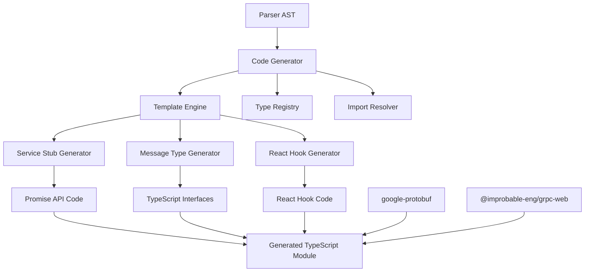

# Design Document

## Overview

Code Generator는 Parser가 생성한 Protobuf AST를 받아서 타입 안전한 TypeScript 코드를 생성하는 핵심 컴포넌트입니다. Generator는 gRPC 서비스 스텁, 메시지 타입 정의, React Hook 통합 코드를 생성하며, `google-protobuf` 라이브러리와 `@improbable-eng/grpc-web`를 활용한 런타임 직렬화/역직렬화를 지원합니다. 생성된 코드는 Promise API와 React Hook API 두 가지 사용 패턴을 모두 지원합니다.

## Architecture

### High-Level Architecture



### Project Structure

```
packages/generator/
├── src/
│   ├── core/
│   │   ├── Generator.ts           # Main generator interface
│   │   ├── CodeBuilder.ts         # Code building utilities
│   │   └── TemplateEngine.ts      # Template processing
│   ├── generators/
│   │   ├── ServiceGenerator.ts    # Service stub generation
│   │   ├── MessageGenerator.ts    # Message type generation
│   │   ├── ReactHookGenerator.ts  # React hook generation
│   │   └── TypeGenerator.ts       # Common type utilities
│   ├── templates/
│   │   ├── service.hbs           # Service stub templates
│   │   ├── message.hbs           # Message type templates
│   │   └── hooks.hbs             # React hook templates
│   ├── utils/
│   │   ├── TypeMapper.ts         # Proto to TS type mapping
│   │   ├── NameResolver.ts       # Name resolution utilities
│   │   └── ImportManager.ts      # Import statement management
│   └── index.ts                  # Main export
├── tests/
│   ├── fixtures/                 # Test proto files and expected outputs
│   ├── generators/               # Generator unit tests
│   └── integration/              # End-to-end tests
└── package.json
```

### Component Layers

1. **Core Layer**: 메인 Generator 인터페이스와 코드 빌딩 유틸리티
2. **Generator Layer**: 각 타입별 코드 생성기 (Service, Message, React Hook)
3. **Template Layer**: Handlebars 기반 코드 템플릿
4. **Utility Layer**: 타입 매핑, 네임 해결, Import 관리

## Components and Interfaces

### Core Generator Components

#### 1. Generator
```typescript
interface Generator {
  generateCode(ast: ProtoFile, options: GeneratorOptions): GeneratedCode
  generateServiceStub(service: ServiceDefinition): string
  generateMessageTypes(messages: MessageDefinition[]): string
  generateReactHooks(services: ServiceDefinition[]): string
}

interface GeneratorOptions {
  outputFormat: 'esm' | 'cjs'
  includeReactHooks: boolean
  optimizeForSize: boolean
  customTemplates?: Record<string, string>
}

interface GeneratedCode {
  code: string
  imports: ImportStatement[]
  exports: ExportStatement[]
  sourceMap?: string
}
```

#### 2. ServiceGenerator
```typescript
interface ServiceGenerator {
  generateStub(service: ServiceDefinition, options: ServiceOptions): ServiceStubCode
  generateMethod(method: MethodDefinition): MethodCode
  generateStreamingMethod(method: MethodDefinition): StreamingMethodCode
}

interface ServiceStubCode {
  className: string
  methods: MethodCode[]
  imports: string[]
  dependencies: string[]
}

interface MethodCode {
  name: string
  signature: string
  implementation: string
  documentation: string
}
```

#### 3. MessageGenerator
```typescript
interface MessageGenerator {
  generateInterface(message: MessageDefinition): TypeScriptInterface
  generateClass(message: MessageDefinition): TypeScriptClass
  generateSerializer(message: MessageDefinition): SerializerCode
}

interface TypeScriptInterface {
  name: string
  properties: PropertyDefinition[]
  nestedTypes: TypeScriptInterface[]
  documentation: string
}

interface SerializerCode {
  serializeMethod: string
  deserializeMethod: string
  dependencies: string[]
}
```

#### 4. ReactHookGenerator
```typescript
interface ReactHookGenerator {
  generateHookStub(service: ServiceDefinition): ReactHookStubCode
  generateHook(method: MethodDefinition): ReactHookCode
  generateSuspenseHook(method: MethodDefinition): SuspenseHookCode
}

interface ReactHookStubCode {
  className: string
  hooks: ReactHookCode[]
  imports: string[]
}

interface ReactHookCode {
  hookName: string
  signature: string
  implementation: string
  returnType: string
}
```

## Data Models

### Code Generation Models

#### GeneratedModule
```typescript
interface GeneratedModule {
  imports: ImportStatement[]
  types: TypeDefinition[]
  classes: ClassDefinition[]
  exports: ExportStatement[]
  sourceMap?: SourceMapData
}

interface ImportStatement {
  source: string
  imports: string[]
  isDefault: boolean
  isNamespace: boolean
}

interface ExportStatement {
  name: string
  type: 'class' | 'interface' | 'type' | 'const'
  isDefault: boolean
}
```

#### TypeDefinition
```typescript
interface TypeDefinition {
  name: string
  kind: 'interface' | 'type' | 'enum'
  properties?: PropertyDefinition[]
  values?: EnumValueDefinition[]
  generics?: string[]
  documentation: string
}

interface PropertyDefinition {
  name: string
  type: string
  optional: boolean
  readonly: boolean
  documentation: string
}
```

#### ClassDefinition
```typescript
interface ClassDefinition {
  name: string
  extends?: string
  implements?: string[]
  constructor: ConstructorDefinition
  methods: MethodDefinition[]
  properties: PropertyDefinition[]
  documentation: string
}

interface ConstructorDefinition {
  parameters: ParameterDefinition[]
  implementation: string
}

interface MethodDefinition {
  name: string
  parameters: ParameterDefinition[]
  returnType: string
  implementation: string
  isAsync: boolean
  isStatic: boolean
  documentation: string
}
```

## Code Generation Strategy

### Service Stub Generation

#### Promise API Pattern
```typescript
// Generated service stub example
export class GreetingStub {
  constructor(private client: Client) {}
  
  async greeting(request: GreetingRequest): Promise<GreetingResponse> {
    const serialized = GreetingRequest.encode(request).finish()
    const response = await this.client.unaryCall(
      '/greeting.Greeting/Greeting',
      serialized
    )
    return GreetingResponse.decode(response)
  }
}
```

#### React Hook API Pattern
```typescript
// Generated React hook stub example
export class GreetingHookStub {
  constructor(private client: Client) {}
  
  useGreeting(request: GreetingRequest): GreetingResponse {
    const [data, setData] = useState<GreetingResponse>()
    const [error, setError] = useState<Error>()
    
    if (!data && !error) {
      throw this.greeting(request)
        .then(setData)
        .catch(setError)
    }
    
    if (error) throw error
    return data!
  }
}
```

### Message Type Generation

#### Interface Generation
```typescript
// Generated message interface
export interface GreetingRequest {
  name: string
}

export interface GreetingResponse {
  message: string
}
```

#### Serialization Code Generation
```typescript
// Generated serialization utilities
export namespace GreetingRequest {
  export function encode(message: GreetingRequest): Uint8Array {
    const writer = new protobuf.Writer()
    if (message.name) {
      writer.uint32(10).string(message.name)
    }
    return writer.finish()
  }
  
  export function decode(input: Uint8Array): GreetingRequest {
    const reader = new protobuf.Reader(input)
    const message: GreetingRequest = { name: '' }
    
    while (reader.pos < reader.len) {
      const tag = reader.uint32()
      switch (tag >>> 3) {
        case 1:
          message.name = reader.string()
          break
        default:
          reader.skipType(tag & 7)
          break
      }
    }
    return message
  }
}
```

## Template System

### Handlebars Templates

#### Service Template Structure
```handlebars
{{#each services}}
export class {{name}}Stub {
  constructor(private client: Client) {}
  
  {{#each methods}}
  {{#if isStreaming}}
  {{> streamingMethod}}
  {{else}}
  {{> unaryMethod}}
  {{/if}}
  {{/each}}
}

{{#if includeReactHooks}}
export class {{name}}HookStub {
  constructor(private client: Client) {}
  
  {{#each methods}}
  {{> reactHook}}
  {{/each}}
}
{{/if}}
{{/each}}
```

#### Message Template Structure
```handlebars
{{#each messages}}
export interface {{name}} {
  {{#each fields}}
  {{name}}{{#if optional}}?{{/if}}: {{type}}{{#if repeated}}[]{{/if}}
  {{/each}}
}

export namespace {{name}} {
  export function encode(message: {{name}}): Uint8Array {
    {{> encodeImplementation}}
  }
  
  export function decode(input: Uint8Array): {{name}} {
    {{> decodeImplementation}}
  }
}
{{/each}}
```

## Error Handling

### Generation Error Types

```typescript
interface GenerationError {
  type: 'template' | 'type-mapping' | 'validation' | 'dependency'
  message: string
  location?: ASTLocation
  severity: 'error' | 'warning'
  suggestions?: string[]
}
```

### Error Handling Strategy

1. **Template Errors**: Handlebars 템플릿 처리 오류
   - 템플릿 문법 오류
   - 누락된 데이터 바인딩
   - 순환 참조

2. **Type Mapping Errors**: Proto 타입을 TypeScript 타입으로 매핑 실패
   - 지원하지 않는 타입
   - 순환 타입 참조
   - 네임스페이스 충돌

3. **Validation Errors**: 생성된 코드 검증 실패
   - TypeScript 컴파일 오류
   - 런타임 오류 가능성
   - 타입 안전성 위반

## Testing Strategy

### Unit Testing

#### Generator Core Tests
```typescript
describe('Generator', () => {
  test('should generate service stub from AST', () => {
    const ast = createServiceAST('Greeting', [
      { name: 'SayHello', input: 'HelloRequest', output: 'HelloReply' }
    ])
    const result = generator.generateServiceStub(ast.services[0])
    expect(result).toContain('class GreetingStub')
    expect(result).toContain('async sayHello(')
  })
})
```

#### Template Engine Tests
```typescript
describe('TemplateEngine', () => {
  test('should process service template correctly', () => {
    const data = { name: 'Greeting', methods: [{ name: 'sayHello' }] }
    const result = templateEngine.render('service', data)
    expect(result).toContain('export class GreetingStub')
  })
})
```

### Integration Testing

#### End-to-End Generation Tests
```typescript
describe('E2E Generation', () => {
  test('should generate working code from proto file', async () => {
    const protoContent = `
      service Greeting {
        rpc SayHello (HelloRequest) returns (HelloReply);
      }
    `
    const ast = await parser.parseContent(protoContent)
    const code = generator.generateCode(ast)
    
    // Compile generated code
    const compiled = await compileTypeScript(code.code)
    expect(compiled.errors).toHaveLength(0)
    
    // Test runtime behavior
    const module = await importGeneratedModule(compiled.output)
    expect(module.GreetingStub).toBeDefined()
  })
})
```

### Performance Testing

#### Code Generation Benchmarks
```typescript
describe('Performance', () => {
  test('should generate code for large proto within time limit', () => {
    const largeAST = createLargeProtoAST(100) // 100 services
    const startTime = Date.now()
    const result = generator.generateCode(largeAST)
    const duration = Date.now() - startTime
    expect(duration).toBeLessThan(10000) // 10초 이내
    expect(result.code.length).toBeGreaterThan(0)
  })
})
```

## Implementation Phases

### Phase 1: Core Infrastructure
- Generator 인터페이스 및 기본 구조 구현
- Template Engine 설정 (Handlebars)
- 기본 타입 매핑 시스템

### Phase 2: Service Generation
- 서비스 스텁 생성기 구현
- Promise API 코드 생성
- 기본 RPC 메서드 지원

### Phase 3: Message Generation
- 메시지 인터페이스 생성
- google-protobuf 직렬화 코드 생성
- 중첩 타입 및 enum 지원

### Phase 4: React Integration
- React Hook 생성기 구현
- Suspense 호환 Hook 생성
- Error Boundary 통합

### Phase 5: Advanced Features
- 스트리밍 RPC 지원
- 커스텀 옵션 처리
- Import 의존성 해결

### Phase 6: Optimization & Testing
- 코드 최적화 및 Tree-shaking 지원
- 포괄적인 테스트 스위트
- 성능 벤치마크 및 최적화
