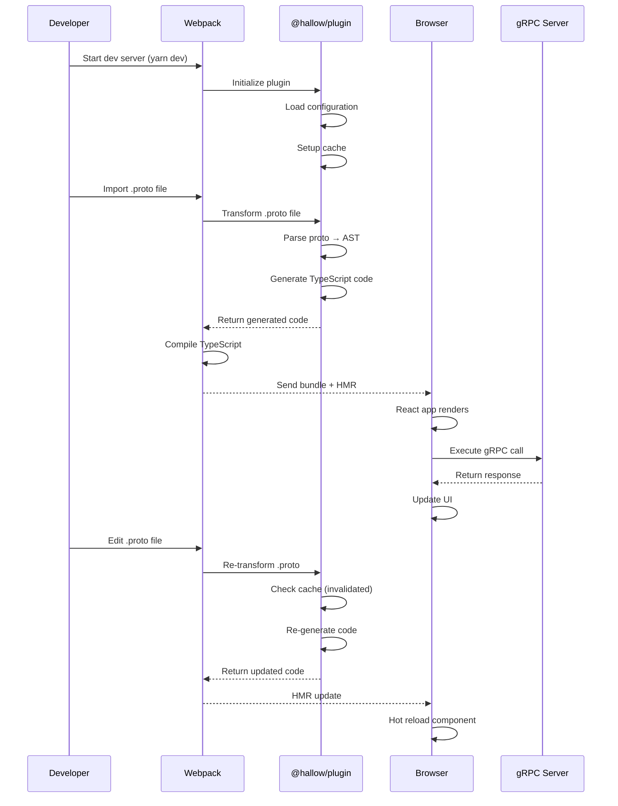
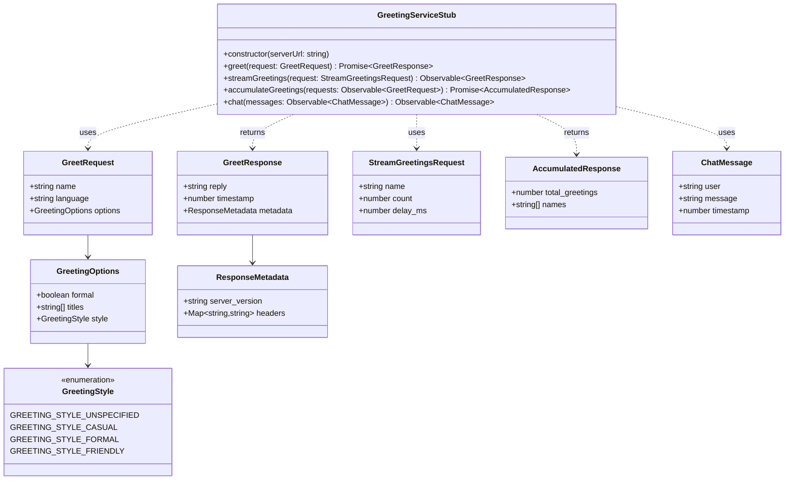
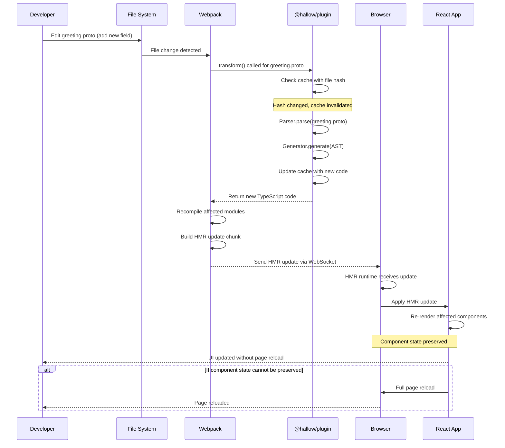
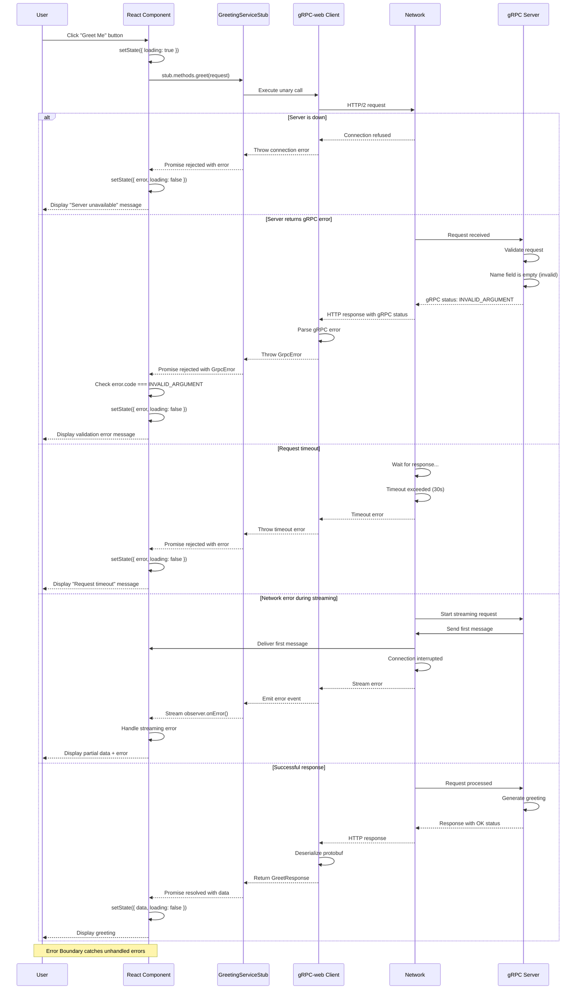

# Design Document: Example Webpack Package

## Overview

The `example-webpack` package serves as a comprehensive reference implementation demonstrating the integration of Hallow gRPC with Webpack 5. This package showcases best practices for building production-ready gRPC-web applications with TypeScript, React 18, and the Hallow plugin ecosystem.

### Design Goals

1. **Educational Reference**: Provide a complete, production-quality example that developers can learn from and use as a template
2. **Feature Completeness**: Demonstrate all three API patterns (Promise, Hook, Suspense) with real gRPC server integration
3. **Production Readiness**: Include proper error handling, testing, optimization, and deployment configurations
4. **Developer Experience**: Enable fast development cycles with HMR, type safety, and clear error messages
5. **Cross-Platform**: Ensure compatibility across Windows, macOS, and Linux environments

### Design Scope

**In Scope:**
- Complete Webpack 5 configuration with development and production modes
- Integration with @hallow/plugin using unplugin webpack adapter
- TypeScript configuration with proto import support
- React 18 application demonstrating all API patterns
- Node.js gRPC server with gRPC-web protocol support
- Hot module replacement and React Fast Refresh
- Production build optimization and code splitting
- Comprehensive documentation and examples

**Out of Scope:**
- Server-side rendering (SSR) or static site generation (SSG)
- Mobile application examples
- Advanced Webpack features like Module Federation
- CI/CD pipeline configuration (covered in separate documentation)

## Architecture Design

### System Architecture Diagram

```mermaid
graph TB
    subgraph "Development Environment"
        DEV[Developer] --> |Edit Code| IDE[VS Code/IDE]
        IDE --> |TypeScript| TS[.ts/.tsx files]
        IDE --> |Proto Files| PROTO[.proto files]
    end

    subgraph "Webpack Build Pipeline"
        TS --> WEBPACK[Webpack Dev Server]
        PROTO --> PLUGIN[@hallow/plugin]
        PLUGIN --> |Transform| PARSER[@hallow/parser]
        PARSER --> |AST| GEN[@hallow/generator]
        GEN --> |Generated TS| WEBPACK
        WEBPACK --> |Bundle| HMR[HMR Runtime]
        WEBPACK --> |ts-loader| TSC[TypeScript Compiler]
        TSC --> |Compiled JS| WEBPACK
    end

    subgraph "Browser Runtime"
        HMR --> |Hot Update| BROWSER[Browser]
        BROWSER --> |Render| REACT[React 18 App]
        REACT --> |useGrpc| HOOKS[@hallow/react]
        HOOKS --> |gRPC Call| CLIENT[gRPC-web Client]
    end

    subgraph "Server Runtime"
        CLIENT --> |HTTP/2| PROXY[Envoy Proxy/Dev Proxy]
        PROXY --> |gRPC| SERVER[Node.js gRPC Server]
        SERVER --> |Response| PROXY
        PROXY --> |gRPC-web Response| CLIENT
    end

    style WEBPACK fill:#4299e1,stroke:#2b6cb0,color:#fff
    style PLUGIN fill:#48bb78,stroke:#2f855a,color:#fff
    style REACT fill:#61dafb,stroke:#0088cc,color:#000
    style SERVER fill:#ed8936,stroke:#c05621,color:#fff
```

### Data Flow Diagram



## Component Design

### Component A: Webpack Configuration System

**Responsibilities:**
- Configure Webpack for development and production modes
- Integrate the @hallow/plugin with proper options
- Setup TypeScript compilation pipeline
- Configure HMR and React Fast Refresh
- Manage asset optimization and code splitting

**Interfaces:**

```typescript
// webpack.common.js
interface WebpackCommonConfig {
  entry: string;
  output: OutputConfig;
  resolve: ResolveConfig;
  module: ModuleConfig;
  plugins: Plugin[];
}

// webpack.dev.js
interface WebpackDevConfig extends WebpackCommonConfig {
  mode: 'development';
  devtool: 'eval-source-map';
  devServer: DevServerConfig;
}

// webpack.prod.js
interface WebpackProdConfig extends WebpackCommonConfig {
  mode: 'production';
  devtool: 'source-map';
  optimization: OptimizationConfig;
}

interface DevServerConfig {
  port: number;
  hot: boolean;
  open: boolean;
  historyApiFallback: boolean;
  proxy: ProxyConfig[];
}

interface ProxyConfig {
  context: string[];
  target: string;
  changeOrigin: boolean;
}
```

**Dependencies:**
- webpack (^5.90.0)
- webpack-dev-server (^4.15.0)
- webpack-cli (^5.1.0)
- webpack-merge (^5.10.0)
- @hallow/plugin
- ts-loader or babel-loader
- html-webpack-plugin
- dotenv-webpack (for environment variables)

**Key Methods:**

```typescript
// Create base configuration
function createBaseConfig(env: 'development' | 'production'): WebpackConfig {
  return {
    entry: './src/index.tsx',
    output: {
      path: path.resolve(__dirname, 'dist'),
      filename: env === 'production' ? '[name].[contenthash].js' : '[name].js',
      clean: true,
    },
    resolve: {
      extensions: ['.ts', '.tsx', '.js', '.jsx', '.proto'],
      alias: {
        '@': path.resolve(__dirname, 'src'),
      },
    },
    module: {
      rules: [
        {
          test: /\.tsx?$/,
          use: 'ts-loader',
          exclude: /node_modules/,
        },
        {
          test: /\.css$/,
          use: ['style-loader', 'css-loader'],
        },
      ],
    },
  };
}

// Setup Hallow plugin
function setupHallowPlugin(options: PluginOptions): WebpackPlugin {
  const { webpack: hallow } = require('@hallow/plugin');

  return hallow({
    protoRoot: path.resolve(__dirname, 'proto'),
    generateReactHooks: true,
    generateSuspenseHooks: true,
    sourceMaps: true,
    cacheDir: '.hallow-cache',
    enablePersistentCache: true,
    verbose: process.env.DEBUG === 'true',
  });
}
```

### Component B: Proto File Management System

**Responsibilities:**
- Define gRPC service interfaces in proto3 syntax
- Demonstrate various protobuf features (nested messages, enums, repeated fields)
- Provide example RPC methods (unary, server streaming, client streaming, bidirectional)
- Support hot reloading during development

**Interfaces:**

```protobuf
// proto/greeting.proto
syntax = "proto3";

package greeting.v1;

service GreetingService {
  // Unary RPC - single request, single response
  rpc Greet(GreetRequest) returns (GreetResponse);

  // Server streaming - single request, stream of responses
  rpc StreamGreetings(StreamGreetingsRequest) returns (stream GreetResponse);

  // Client streaming - stream of requests, single response
  rpc AccumulateGreetings(stream GreetRequest) returns (AccumulatedResponse);

  // Bidirectional streaming
  rpc Chat(stream ChatMessage) returns (stream ChatMessage);
}

message GreetRequest {
  string name = 1;
  string language = 2;
  GreetingOptions options = 3;
}

message GreetResponse {
  string reply = 1;
  int64 timestamp = 2;
  ResponseMetadata metadata = 3;
}

message GreetingOptions {
  bool formal = 1;
  repeated string titles = 2;
  GreetingStyle style = 3;
}

enum GreetingStyle {
  GREETING_STYLE_UNSPECIFIED = 0;
  GREETING_STYLE_CASUAL = 1;
  GREETING_STYLE_FORMAL = 2;
  GREETING_STYLE_FRIENDLY = 3;
}

message ResponseMetadata {
  string server_version = 1;
  map<string, string> headers = 2;
}

message StreamGreetingsRequest {
  string name = 1;
  int32 count = 2;
  int32 delay_ms = 3;
}

message AccumulatedResponse {
  int32 total_greetings = 1;
  repeated string names = 2;
}

message ChatMessage {
  string user = 1;
  string message = 2;
  int64 timestamp = 3;
}
```

**Dependencies:**
- None (pure proto3 definition)

**Proto File Structure:**

```
proto/
├── greeting.proto        # Main service definition
├── common/
│   ├── types.proto      # Shared message types
│   └── errors.proto     # Error definitions
└── google/
    └── protobuf/
        └── timestamp.proto  # Well-known types
```

### Component C: TypeScript Configuration System

**Responsibilities:**
- Configure TypeScript compiler for React and proto imports
- Enable strict type checking
- Provide path aliases for clean imports
- Generate type declarations for proto imports

**Interfaces:**

```typescript
// tsconfig.json
interface TSConfig {
  compilerOptions: CompilerOptions;
  include: string[];
  exclude: string[];
}

interface CompilerOptions {
  target: 'ES2020';
  module: 'ESNext';
  moduleResolution: 'bundler';
  lib: string[];
  jsx: 'react-jsx';
  strict: boolean;
  esModuleInterop: boolean;
  skipLibCheck: boolean;
  resolveJsonModule: boolean;
  allowSyntheticDefaultImports: boolean;
  forceConsistentCasingInFileNames: boolean;
  paths: Record<string, string[]>;
  types: string[];
}
```

**Configuration:**

```json
{
  "compilerOptions": {
    "target": "ES2020",
    "module": "ESNext",
    "moduleResolution": "bundler",
    "lib": ["ES2020", "DOM", "DOM.Iterable"],
    "jsx": "react-jsx",
    "strict": true,
    "esModuleInterop": true,
    "skipLibCheck": true,
    "resolveJsonModule": true,
    "allowSyntheticDefaultImports": true,
    "forceConsistentCasingInFileNames": true,
    "paths": {
      "@/*": ["./src/*"],
      "*.proto": ["./proto/*"]
    },
    "types": ["node", "jest", "webpack-env"]
  },
  "include": ["src/**/*", "proto/**/*.proto"],
  "exclude": ["node_modules", "dist", "**/*.spec.ts"]
}
```

**Type Declaration File:**

```typescript
// src/types/proto.d.ts
declare module '*.proto' {
  import { ITransportAdapter, MethodDescriptor } from '@hallow/generator/adapters';

  // Generated stub class interface
  export class ServiceStub<TAdapter extends ITransportAdapter = ITransportAdapter> {
    constructor(serverUrl: string, adapter?: TAdapter);

    methods: {
      [methodName: string]: (request: any) => Promise<any>;
    };
  }

  // Allow any proto import
  const content: any;
  export default content;
}
```

**Dependencies:**
- typescript (^5.3.0)
- @types/node
- @types/react
- @types/react-dom

### Component D: gRPC Server Implementation

**Responsibilities:**
- Implement gRPC services defined in proto files
- Support gRPC-web protocol via Envoy proxy or @grpc/grpc-js-web
- Provide realistic mock data for testing
- Handle errors with proper gRPC status codes
- Support CORS for development server
- Enable request/response logging

**Interfaces:**

```typescript
// server/src/services/greeting.service.ts
interface IGreetingService {
  greet(call: ServerUnaryCall<GreetRequest>, callback: sendUnaryData<GreetResponse>): void;
  streamGreetings(call: ServerWritableStream<StreamGreetingsRequest, GreetResponse>): void;
  accumulateGreetings(call: ServerReadableStream<GreetRequest>, callback: sendUnaryData<AccumulatedResponse>): void;
  chat(call: ServerDuplexStream<ChatMessage, ChatMessage>): void;
}

// server/src/server.ts
interface ServerConfig {
  host: string;
  port: number;
  enableCors: boolean;
  enableLogging: boolean;
  protoPath: string;
}

// server/src/middleware/logger.ts
interface RequestLogger {
  logRequest(method: string, request: any): void;
  logResponse(method: string, response: any): void;
  logError(method: string, error: Error): void;
}

// server/src/middleware/error-handler.ts
interface ErrorHandler {
  handleError(error: Error): { code: grpc.StatusCode; message: string; details?: any };
}
```

**Key Implementation:**

```typescript
// server/src/services/greeting.service.ts
import * as grpc from '@grpc/grpc-js';
import { GreetRequest, GreetResponse, StreamGreetingsRequest } from '../generated/greeting';

export class GreetingService implements IGreetingService {
  greet(
    call: grpc.ServerUnaryCall<GreetRequest, GreetResponse>,
    callback: grpc.sendUnaryData<GreetResponse>
  ): void {
    const { name, language, options } = call.request;

    // Validate input
    if (!name) {
      return callback({
        code: grpc.status.INVALID_ARGUMENT,
        message: 'Name is required',
      });
    }

    // Generate greeting based on language
    const greetings: Record<string, string> = {
      en: options?.formal ? `Good day, ${name}` : `Hello, ${name}!`,
      es: options?.formal ? `Buenos días, ${name}` : `¡Hola, ${name}!`,
      fr: options?.formal ? `Bonjour, ${name}` : `Salut, ${name}!`,
    };

    const reply = greetings[language || 'en'] || greetings.en;

    callback(null, {
      reply,
      timestamp: Date.now(),
      metadata: {
        server_version: '1.0.0',
        headers: { 'content-type': 'application/grpc-web' },
      },
    });
  }

  streamGreetings(call: grpc.ServerWritableStream<StreamGreetingsRequest, GreetResponse>): void {
    const { name, count, delay_ms } = call.request;

    let sent = 0;
    const interval = setInterval(() => {
      if (sent >= count) {
        clearInterval(interval);
        call.end();
        return;
      }

      call.write({
        reply: `Greeting #${sent + 1} to ${name}!`,
        timestamp: Date.now(),
        metadata: {
          server_version: '1.0.0',
          headers: {},
        },
      });

      sent++;
    }, delay_ms || 1000);

    // Handle client cancellation
    call.on('cancelled', () => {
      clearInterval(interval);
    });
  }

  accumulateGreetings(
    call: grpc.ServerReadableStream<GreetRequest, AccumulatedResponse>,
    callback: grpc.sendUnaryData<AccumulatedResponse>
  ): void {
    const names: string[] = [];

    call.on('data', (request: GreetRequest) => {
      names.push(request.name);
    });

    call.on('end', () => {
      callback(null, {
        total_greetings: names.length,
        names,
      });
    });

    call.on('error', (error) => {
      callback({
        code: grpc.status.INTERNAL,
        message: error.message,
      });
    });
  }

  chat(call: grpc.ServerDuplexStream<ChatMessage, ChatMessage>): void {
    call.on('data', (message: ChatMessage) => {
      // Echo back with server timestamp
      call.write({
        ...message,
        timestamp: Date.now(),
      });
    });

    call.on('end', () => {
      call.end();
    });
  }
}

// server/src/server.ts
import * as grpc from '@grpc/grpc-js';
import * as protoLoader from '@grpc/proto-loader';
import { GreetingService } from './services/greeting.service';
import { createLogger } from './middleware/logger';
import { createErrorHandler } from './middleware/error-handler';

export async function createServer(config: ServerConfig): Promise<grpc.Server> {
  const logger = createLogger();
  const errorHandler = createErrorHandler();

  // Load proto definition
  const packageDefinition = await protoLoader.load(config.protoPath, {
    keepCase: true,
    longs: String,
    enums: String,
    defaults: true,
    oneofs: true,
  });

  const protoDescriptor = grpc.loadPackageDefinition(packageDefinition) as any;

  // Create server
  const server = new grpc.Server({
    'grpc.max_receive_message_length': 4 * 1024 * 1024, // 4MB
    'grpc.max_send_message_length': 4 * 1024 * 1024,
  });

  // Add service implementation
  server.addService(
    protoDescriptor.greeting.v1.GreetingService.service,
    new GreetingService()
  );

  // Bind server
  return new Promise((resolve, reject) => {
    server.bindAsync(
      `${config.host}:${config.port}`,
      grpc.ServerCredentials.createInsecure(),
      (error, port) => {
        if (error) {
          reject(error);
        } else {
          server.start();
          logger.logRequest('SERVER', { message: `Server started on port ${port}` });
          resolve(server);
        }
      }
    );
  });
}
```

**Dependencies:**
- @grpc/grpc-js (^1.14.0)
- @grpc/proto-loader (^0.8.0)
- typescript (^5.3.0)
- @types/node

**Server Structure:**

```
server/
├── src/
│   ├── index.ts                 # Entry point
│   ├── server.ts                # Server setup
│   ├── services/
│   │   └── greeting.service.ts  # Service implementation
│   ├── middleware/
│   │   ├── logger.ts            # Request logging
│   │   └── error-handler.ts     # Error handling
│   └── config/
│       └── server.config.ts     # Configuration
├── proto/                       # Symlink to ../proto
├── package.json
└── tsconfig.json
```

### Component E: React Application Architecture

**Responsibilities:**
- Provide main application shell with routing
- Implement three demonstration components (Promise, Hook, Suspense)
- Handle global state and error boundaries
- Provide navigation between examples
- Style components with modern CSS/CSS-in-JS

**Interfaces:**

```typescript
// src/App.tsx
interface AppProps {}

interface AppState {
  currentTab: 'promise' | 'hook' | 'suspense';
}

// src/components/PromiseExample.tsx
interface PromiseExampleProps {
  serverUrl: string;
}

interface PromiseExampleState {
  loading: boolean;
  data: GreetResponse | null;
  error: Error | null;
}

// src/components/HookExample.tsx
interface HookExampleProps {
  serverUrl: string;
}

// src/components/SuspenseExample.tsx
interface SuspenseExampleProps {
  serverUrl: string;
}

// src/components/ErrorBoundary.tsx
interface ErrorBoundaryProps {
  children: React.ReactNode;
  fallback?: (error: Error) => React.ReactNode;
}

interface ErrorBoundaryState {
  hasError: boolean;
  error: Error | null;
}

// src/components/Navigation.tsx
interface NavigationProps {
  currentTab: string;
  onTabChange: (tab: string) => void;
  tabs: TabConfig[];
}

interface TabConfig {
  id: string;
  label: string;
  description: string;
}
```

**Key Components:**

```typescript
// src/App.tsx
import React, { useState } from 'react';
import { Navigation } from './components/Navigation';
import { PromiseExample } from './components/PromiseExample';
import { HookExample } from './components/HookExample';
import { SuspenseExample } from './components/SuspenseExample';
import { ErrorBoundary } from './components/ErrorBoundary';
import './App.css';

const SERVER_URL = process.env.GRPC_SERVER_URL || 'http://localhost:3000';

const TABS = [
  {
    id: 'promise',
    label: 'Promise API',
    description: 'Imperative data fetching with async/await',
  },
  {
    id: 'hook',
    label: 'Hook API',
    description: 'Declarative data fetching with useGrpc',
  },
  {
    id: 'suspense',
    label: 'Suspense API',
    description: 'Concurrent rendering with useSuspenseGrpc',
  },
];

export function App() {
  const [currentTab, setCurrentTab] = useState<string>('promise');

  return (
    <div className="app">
      <header className="app-header">
        <h1>Hallow gRPC - Webpack Example</h1>
        <p>Demonstrating gRPC-web integration with Webpack 5</p>
      </header>

      <Navigation
        currentTab={currentTab}
        onTabChange={setCurrentTab}
        tabs={TABS}
      />

      <main className="app-main">
        <ErrorBoundary>
          {currentTab === 'promise' && <PromiseExample serverUrl={SERVER_URL} />}
          {currentTab === 'hook' && <HookExample serverUrl={SERVER_URL} />}
          {currentTab === 'suspense' && <SuspenseExample serverUrl={SERVER_URL} />}
        </ErrorBoundary>
      </main>

      <footer className="app-footer">
        <p>Built with Hallow gRPC • Webpack 5 • React 18</p>
      </footer>
    </div>
  );
}

// src/components/PromiseExample.tsx
import React, { useState } from 'react';
import { GreetingServiceStub } from '../proto/greeting.proto';

export function PromiseExample({ serverUrl }: PromiseExampleProps) {
  const [loading, setLoading] = useState(false);
  const [data, setData] = useState<GreetResponse | null>(null);
  const [error, setError] = useState<Error | null>(null);
  const [name, setName] = useState('World');

  const handleGreet = async () => {
    setLoading(true);
    setError(null);

    try {
      const stub = new GreetingServiceStub(serverUrl);
      const response = await stub.methods.greet({
        name,
        language: 'en',
        options: { formal: false, titles: [], style: 'GREETING_STYLE_CASUAL' },
      });

      setData(response);
    } catch (err) {
      setError(err as Error);
    } finally {
      setLoading(false);
    }
  };

  return (
    <div className="example-container">
      <div className="example-header">
        <h2>Promise API Example</h2>
        <p>Uses async/await for imperative data fetching</p>
      </div>

      <div className="example-controls">
        <input
          type="text"
          value={name}
          onChange={(e) => setName(e.target.value)}
          placeholder="Enter your name"
          disabled={loading}
        />
        <button onClick={handleGreet} disabled={loading}>
          {loading ? 'Greeting...' : 'Greet Me'}
        </button>
      </div>

      {loading && <div className="loading">Loading...</div>}

      {error && (
        <div className="error">
          <h3>Error</h3>
          <p>{error.message}</p>
        </div>
      )}

      {data && (
        <div className="result">
          <h3>Response</h3>
          <p className="greeting">{data.reply}</p>
          <p className="metadata">
            Timestamp: {new Date(data.timestamp).toLocaleString()}
          </p>
          <p className="metadata">
            Server Version: {data.metadata?.server_version}
          </p>
        </div>
      )}

      <div className="code-example">
        <h3>Code Example</h3>
        <pre>
          <code>{`const stub = new GreetingServiceStub(serverUrl);
const response = await stub.methods.greet({
  name: 'World',
  language: 'en',
  options: { formal: false }
});
console.log(response.reply);`}</code>
        </pre>
      </div>
    </div>
  );
}

// src/components/HookExample.tsx
import React, { useState } from 'react';
import { useGrpc } from '@hallow/react';
import { GreetingServiceStub } from '../proto/greeting.proto';

export function HookExample({ serverUrl }: HookExampleProps) {
  const [name, setName] = useState('World');
  const [triggerFetch, setTriggerFetch] = useState(0);

  const { data, loading, error } = useGrpc({
    serverUrl,
    method: (stub: GreetingServiceStub) => stub.methods.greet({
      name,
      language: 'en',
      options: { formal: false, titles: [], style: 'GREETING_STYLE_CASUAL' },
    }),
    // Re-fetch when triggerFetch changes
    deps: [triggerFetch],
  });

  const handleRefetch = () => {
    setTriggerFetch((prev) => prev + 1);
  };

  return (
    <div className="example-container">
      <div className="example-header">
        <h2>Hook API Example</h2>
        <p>Uses useGrpc hook for declarative data fetching</p>
      </div>

      <div className="example-controls">
        <input
          type="text"
          value={name}
          onChange={(e) => setName(e.target.value)}
          placeholder="Enter your name"
        />
        <button onClick={handleRefetch} disabled={loading}>
          {loading ? 'Greeting...' : 'Greet Me'}
        </button>
      </div>

      {loading && <div className="loading">Loading...</div>}

      {error && (
        <div className="error">
          <h3>Error</h3>
          <p>{error.message}</p>
        </div>
      )}

      {data && (
        <div className="result">
          <h3>Response</h3>
          <p className="greeting">{data.reply}</p>
          <p className="metadata">
            Timestamp: {new Date(data.timestamp).toLocaleString()}
          </p>
        </div>
      )}

      <div className="code-example">
        <h3>Code Example</h3>
        <pre>
          <code>{`const { data, loading, error } = useGrpc({
  serverUrl,
  method: (stub) => stub.methods.greet({
    name: 'World',
    language: 'en'
  })
});

if (loading) return <div>Loading...</div>;
if (error) return <div>Error: {error.message}</div>;
return <div>{data.reply}</div>;`}</code>
        </pre>
      </div>
    </div>
  );
}

// src/components/SuspenseExample.tsx
import React, { useState, Suspense } from 'react';
import { useSuspenseGrpc } from '@hallow/react';
import { GreetingServiceStub } from '../proto/greeting.proto';

function SuspenseContent({ serverUrl, name }: { serverUrl: string; name: string }) {
  const data = useSuspenseGrpc({
    serverUrl,
    method: (stub: GreetingServiceStub) => stub.methods.greet({
      name,
      language: 'en',
      options: { formal: false, titles: [], style: 'GREETING_STYLE_CASUAL' },
    }),
  });

  return (
    <div className="result">
      <h3>Response</h3>
      <p className="greeting">{data.reply}</p>
      <p className="metadata">
        Timestamp: {new Date(data.timestamp).toLocaleString()}
      </p>
    </div>
  );
}

export function SuspenseExample({ serverUrl }: SuspenseExampleProps) {
  const [name, setName] = useState('World');
  const [showResult, setShowResult] = useState(false);

  const handleGreet = () => {
    setShowResult(true);
  };

  return (
    <div className="example-container">
      <div className="example-header">
        <h2>Suspense API Example</h2>
        <p>Uses useSuspenseGrpc with React Suspense for concurrent rendering</p>
      </div>

      <div className="example-controls">
        <input
          type="text"
          value={name}
          onChange={(e) => {
            setName(e.target.value);
            setShowResult(false);
          }}
          placeholder="Enter your name"
        />
        <button onClick={handleGreet}>
          Greet Me
        </button>
      </div>

      {showResult && (
        <Suspense fallback={<div className="loading">Loading...</div>}>
          <SuspenseContent serverUrl={serverUrl} name={name} />
        </Suspense>
      )}

      <div className="code-example">
        <h3>Code Example</h3>
        <pre>
          <code>{`function GreetingComponent({ serverUrl, name }) {
  const data = useSuspenseGrpc({
    serverUrl,
    method: (stub) => stub.methods.greet({ name })
  });

  // No loading state needed!
  return <div>{data.reply}</div>;
}

// Wrap with Suspense in parent
<Suspense fallback={<Loading />}>
  <GreetingComponent serverUrl={url} name={name} />
</Suspense>`}</code>
        </pre>
      </div>
    </div>
  );
}

// src/components/ErrorBoundary.tsx
import React, { Component, ErrorInfo } from 'react';

export class ErrorBoundary extends Component<ErrorBoundaryProps, ErrorBoundaryState> {
  constructor(props: ErrorBoundaryProps) {
    super(props);
    this.state = { hasError: false, error: null };
  }

  static getDerivedStateFromError(error: Error): ErrorBoundaryState {
    return { hasError: true, error };
  }

  componentDidCatch(error: Error, errorInfo: ErrorInfo) {
    console.error('ErrorBoundary caught an error:', error, errorInfo);
  }

  render() {
    if (this.state.hasError) {
      if (this.props.fallback) {
        return this.props.fallback(this.state.error!);
      }

      return (
        <div className="error-boundary">
          <h2>Something went wrong</h2>
          <details>
            <summary>Error details</summary>
            <pre>{this.state.error?.message}</pre>
            <pre>{this.state.error?.stack}</pre>
          </details>
          <button onClick={() => this.setState({ hasError: false, error: null })}>
            Try again
          </button>
        </div>
      );
    }

    return this.props.children;
  }
}
```

**Dependencies:**
- react (^18.2.0)
- react-dom (^18.2.0)
- @hallow/react
- @hallow/plugin (for proto imports)

**Application Structure:**

```
src/
├── index.tsx                    # Entry point
├── App.tsx                      # Main app component
├── App.css                      # Global styles
├── components/
│   ├── PromiseExample.tsx       # Promise API demo
│   ├── HookExample.tsx          # Hook API demo
│   ├── SuspenseExample.tsx      # Suspense API demo
│   ├── Navigation.tsx           # Tab navigation
│   ├── ErrorBoundary.tsx        # Error boundary
│   └── StreamingExample.tsx     # Streaming demo (bonus)
├── proto/                       # Proto files
│   └── greeting.proto
├── types/
│   └── proto.d.ts              # Type declarations
└── utils/
    └── grpc-client.ts          # Client utilities
```

## Data Model

### Core Data Structures

```typescript
// Proto Message Types (Generated from .proto files)

/**
 * Request message for Greet RPC
 */
interface GreetRequest {
  name: string;
  language: string;
  options?: GreetingOptions;
}

/**
 * Response message for Greet RPC
 */
interface GreetResponse {
  reply: string;
  timestamp: number;
  metadata?: ResponseMetadata;
}

/**
 * Greeting options for customizing the greeting
 */
interface GreetingOptions {
  formal: boolean;
  titles: string[];
  style: GreetingStyle;
}

/**
 * Enum for greeting styles
 */
enum GreetingStyle {
  GREETING_STYLE_UNSPECIFIED = 0,
  GREETING_STYLE_CASUAL = 1,
  GREETING_STYLE_FORMAL = 2,
  GREETING_STYLE_FRIENDLY = 3,
}

/**
 * Metadata about the response
 */
interface ResponseMetadata {
  server_version: string;
  headers: Record<string, string>;
}

/**
 * Request for streaming greetings
 */
interface StreamGreetingsRequest {
  name: string;
  count: number;
  delay_ms: number;
}

/**
 * Response for accumulated greetings
 */
interface AccumulatedResponse {
  total_greetings: number;
  names: string[];
}

/**
 * Chat message for bidirectional streaming
 */
interface ChatMessage {
  user: string;
  message: string;
  timestamp: number;
}

// Application State Types

/**
 * Application-level state
 */
interface AppState {
  currentTab: 'promise' | 'hook' | 'suspense';
  serverUrl: string;
  theme: 'light' | 'dark';
}

/**
 * Promise example component state
 */
interface PromiseExampleState {
  loading: boolean;
  data: GreetResponse | null;
  error: Error | null;
  inputName: string;
}

/**
 * Hook example result from useGrpc
 */
interface UseGrpcResult<TResponse> {
  data: TResponse | undefined;
  loading: boolean;
  error: Error | undefined;
  refetch: () => void;
}

/**
 * Server configuration
 */
interface ServerConfig {
  host: string;
  port: number;
  enableCors: boolean;
  enableLogging: boolean;
  protoPath: string;
}

/**
 * Webpack plugin configuration
 */
interface HallowPluginConfig {
  protoRoot: string;
  generateReactHooks: boolean;
  generateSuspenseHooks: boolean;
  sourceMaps: boolean;
  cacheDir: string;
  enablePersistentCache: boolean;
  verbose: boolean;
}

/**
 * Environment variables
 */
interface EnvironmentConfig {
  NODE_ENV: 'development' | 'production';
  GRPC_SERVER_URL: string;
  GRPC_SERVER_PORT: number;
  DEV_SERVER_PORT: number;
  DEBUG: boolean;
}
```

### Data Model Diagram



## Business Process

### Process 1: Development Workflow - Starting Development Server

This process demonstrates the complete flow from starting the development environment to seeing live updates in the browser.

```mermaid
flowchart TD
    A[Developer runs 'yarn dev'] --> B[Package manager starts concurrent processes]
    B --> C[Start Webpack Dev Server]
    B --> D[Start gRPC Server]

    C --> E[Webpack initializes plugins]
    E --> F[@hallow/plugin initialized]
    F --> G[Plugin loads configuration from webpack.config.js]
    G --> H{Configuration valid?}

    H -->|No| I[Plugin throws validation error]
    I --> J[Webpack displays error overlay]

    H -->|Yes| K[Plugin sets up cache manager]
    K --> L[Plugin creates proto resolver]
    L --> M[Plugin initializes dependency graph]

    M --> N[Webpack starts compilation]
    N --> O[Process entry point: src/index.tsx]

    O --> P{Encounters .proto import?}
    P -->|Yes| Q[Plugin.transform hook called]
    Q --> R[Resolver resolves proto file path]
    R --> S{Proto file found?}

    S -->|No| T[Throw resolution error with search paths]
    T --> J

    S -->|Yes| U{Check cache for proto file}
    U -->|Cache hit| V[Return cached generated code]
    U -->|Cache miss| W[Parser parses proto file to AST]

    W --> X{Parse successful?}
    X -->|No| Y[Format parse error with snippet]
    Y --> J

    X -->|Yes| Z[Generator generates TypeScript code]
    Z --> AA[Add generated code to cache]
    AA --> AB[Return generated code to Webpack]

    V --> AB
    AB --> AC[ts-loader compiles TypeScript]
    AC --> AD[Bundle JavaScript modules]

    P -->|No| AC

    AD --> AE[Generate bundle with source maps]
    AE --> AF[Webpack Dev Server serves bundle]
    AF --> AG[Open browser automatically]
    AG --> AH[Browser loads application]
    AH --> AI[React app renders]

    D --> AJ[gRPC Server loads proto definitions]
    AJ --> AK[Server starts listening on port 3000]
    AK --> AL[Server registers service handlers]
    AL --> AM[Enable CORS middleware]
    AM --> AN[Enable request logging]
    AN --> AO[Server ready]

    AI --> AP{User interacts with UI}
    AP --> AQ[User clicks 'Greet Me' button]
    AQ --> AR[React component calls gRPC method]
    AR --> AS[GreetingServiceStub.methods.greet called]
    AS --> AT[gRPC-web client sends HTTP/2 request]
    AT --> AU[Webpack Dev Server proxies request to :3000]
    AU --> AV[gRPC Server receives request]
    AV --> AW[Service handler processes request]
    AW --> AX[Validate request parameters]
    AX --> AY{Parameters valid?}

    AY -->|No| AZ[Return gRPC error with INVALID_ARGUMENT]
    AZ --> BA[Client receives error]
    BA --> BB[React component displays error]

    AY -->|Yes| BC[Generate greeting response]
    BC --> BD[Log request/response]
    BD --> BE[Return gRPC response]
    BE --> BF[Client receives response]
    BF --> BG[React component updates state]
    BG --> BH[UI displays greeting]

    style F fill:#48bb78,stroke:#2f855a,color:#fff
    style AK fill:#ed8936,stroke:#c05621,color:#fff
    style BH fill:#61dafb,stroke:#0088cc,color:#000
```

### Process 2: Hot Module Replacement - Proto File Update

This process shows how changes to proto files trigger regeneration and hot updates without full page reload.



### Process 3: Production Build and Optimization

This process demonstrates the production build pipeline with optimization strategies.

```mermaid
flowchart TD
    A[Developer runs 'yarn build'] --> B[Webpack starts in production mode]
    B --> C[Set NODE_ENV=production]
    C --> D[Load webpack.prod.js configuration]

    D --> E[Initialize @hallow/plugin with production options]
    E --> F{enablePersistentCache?}
    F -->|Yes| G[Load cache from disk]
    F -->|No| H[Start with empty cache]

    G --> I[Process all entry points]
    H --> I

    I --> J[Transform .proto files]
    J --> K[Generate optimized TypeScript code]
    K --> L{optimization.minify enabled?}
    L -->|Yes| M[Minify generated code]
    L -->|No| N[Keep readable code]

    M --> O[Compile TypeScript with ts-loader]
    N --> O

    O --> P[Bundle all modules]
    P --> Q[Code splitting: vendor chunk]
    Q --> R[Code splitting: runtime chunk]
    R --> S[Code splitting: main chunk]

    S --> T[Apply Terser minification]
    T --> U[Tree shaking unused exports]
    U --> V[Generate content hashes for files]

    V --> W[Output bundle.js with hash]
    W --> X[Output vendor.js with hash]
    X --> Y[Output runtime.js with hash]

    Y --> Z[Generate source maps]
    Z --> AA[Copy static assets]
    AA --> AB[Generate index.html with hashed refs]

    AB --> AC[Write all files to dist/]
    AC --> AD[Display bundle statistics]
    AD --> AE{Bundle size check}

    AE -->|Size OK| AF[Build successful]
    AE -->|Size warning| AG[Display size warning]
    AG --> AF

    AF --> AH[Save cache to disk]
    AH --> AI[Build complete]

    style E fill:#48bb78,stroke:#2f855a,color:#fff
    style AF fill:#38b2ac,stroke:#2c7a7b,color:#fff
```



### Process 4: Error Handling - gRPC Call Failure

This process demonstrates the error handling flow when a gRPC call fails.



### Process 5: Testing - Component with gRPC Mock

This process demonstrates how to test React components that use gRPC with mocked responses.

```mermaid
flowchart TD
    A[Jest test suite starts] --> B[Import test file]
    B --> C[Setup test environment]
    C --> D[Create mock gRPC stub]

    D --> E[Define mock responses]
    E --> F[Mock GreetingServiceStub constructor]
    F --> G[Mock stub.methods.greet implementation]

    G --> H[Render component with Testing Library]
    H --> I[@testing-library/react renders component]
    I --> J[Component mounts]

    J --> K{Test type?}

    K -->|Promise API test| L[Find 'Greet Me' button]
    L --> M[user.click greet button]
    M --> N[Component calls stub.methods.greet]
    N --> O{Mock configured?}

    O -->|Success mock| P[Return mocked GreetResponse]
    P --> Q[waitFor response to render]
    Q --> R[Assert greeting text is displayed]
    R --> S[Assert no error is shown]

    O -->|Error mock| T[Throw mocked error]
    T --> U[waitFor error to render]
    U --> V[Assert error message is displayed]
    V --> W[Assert greeting is not shown]

    K -->|Hook API test| X[Component renders with useGrpc]
    X --> Y[Hook executes immediately]
    Y --> Z[Assert loading state is true]
    Z --> AA[Wait for hook to resolve]
    AA --> AB[Assert data is displayed]
    AB --> AC[Assert loading state is false]

    K -->|Suspense API test| AD[Wrap component in Suspense]
    AD --> AE[Component renders with useSuspenseGrpc]
    AE --> AF[Hook suspends rendering]
    AF --> AG[Suspense shows fallback]
    AG --> AH[Assert fallback is displayed]
    AH --> AI[Wait for promise to resolve]
    AI --> AJ[Component resumes rendering]
    AJ --> AK[Assert data is displayed]
    AK --> AL[Assert fallback is not shown]

    S --> AM[Test passes]
    W --> AM
    AC --> AM
    AL --> AM

    AM --> AN{More tests?}
    AN -->|Yes| B
    AN -->|No| AO[Generate coverage report]
    AO --> AP[Display test results]

    style AM fill:#48bb78,stroke:#2f855a,color:#fff
    style AP fill:#38b2ac,stroke:#2c7a7b,color:#fff
```

## Error Handling Strategy

### Error Categories and Handling

#### 1. Build-Time Errors

**Proto Parse Errors:**
```typescript
// Error when proto syntax is invalid
class ProtoParseError extends Error {
  filePath: string;
  line: number;
  column: number;
  snippet: string;

  constructor(message: string, location: SourceLocation, source: string) {
    super(message);
    this.name = 'ProtoParseError';
    this.filePath = location.filePath;
    this.line = location.line;
    this.column = location.column;
    this.snippet = this.extractSnippet(source, location);
  }

  toString(): string {
    return `
Proto Parse Error: ${this.message}
  at ${this.filePath}:${this.line}:${this.column}

${this.snippet}

Suggestion: Check proto3 syntax specification
    `.trim();
  }
}
```

**Resolution Errors:**
```typescript
// Error when proto import cannot be resolved
class ProtoResolutionError extends Error {
  importPath: string;
  fromFile: string;
  searchPaths: string[];

  constructor(importPath: string, fromFile: string, searchPaths: string[]) {
    super(`Cannot resolve proto import: ${importPath}`);
    this.name = 'ProtoResolutionError';
    this.importPath = importPath;
    this.fromFile = fromFile;
    this.searchPaths = searchPaths;
  }

  toString(): string {
    return `
Proto Resolution Error: Cannot resolve '${this.importPath}'
  imported from ${this.fromFile}

Searched paths:
${this.searchPaths.map((p) => `  - ${p}`).join('\n')}

Suggestions:
  - Verify the import path is correct
  - Check protoRoot configuration in webpack config
  - Add missing path to importPaths option
    `.trim();
  }
}
```

**Webpack Configuration Errors:**
```typescript
// Validation for plugin options
function validatePluginOptions(options: PluginOptions): ValidationResult {
  const errors: ValidationError[] = [];
  const warnings: ValidationWarning[] = [];

  // Validate protoRoot exists
  if (options.protoRoot && !fs.existsSync(options.protoRoot)) {
    errors.push({
      field: 'protoRoot',
      message: `Directory does not exist: ${options.protoRoot}`,
      suggestion: 'Create the directory or update the path',
    });
  }

  // Validate cache size
  if (options.maxCacheSize && options.maxCacheSize <= 0) {
    errors.push({
      field: 'maxCacheSize',
      message: 'Must be a positive number',
      suggestion: 'Try: maxCacheSize: 100',
    });
  }

  // Warning for performance threshold
  if (options.performanceThreshold && options.performanceThreshold < 100) {
    warnings.push({
      field: 'performanceThreshold',
      message: 'Very low threshold may cause excessive warnings',
      suggestion: 'Consider using at least 500ms',
    });
  }

  return {
    valid: errors.length === 0,
    errors,
    warnings,
  };
}
```

#### 2. Runtime Errors

**gRPC Connection Errors:**
```typescript
// Handle connection failures gracefully
async function handleGrpcCall<TRequest, TResponse>(
  call: () => Promise<TResponse>
): Promise<{ data?: TResponse; error?: GrpcError }> {
  try {
    const data = await call();
    return { data };
  } catch (error) {
    if (isGrpcError(error)) {
      // gRPC-specific error handling
      return {
        error: {
          code: error.code,
          message: error.message,
          details: error.metadata,
        },
      };
    } else if (isNetworkError(error)) {
      // Network-level error
      return {
        error: {
          code: GrpcStatusCode.UNAVAILABLE,
          message: 'Server unavailable. Please check your connection.',
        },
      };
    } else {
      // Unknown error
      return {
        error: {
          code: GrpcStatusCode.UNKNOWN,
          message: 'An unexpected error occurred',
        },
      };
    }
  }
}

function isGrpcError(error: any): error is GrpcError {
  return error && typeof error.code === 'number' && 'message' in error;
}

function isNetworkError(error: any): boolean {
  return (
    error instanceof TypeError ||
    error.message?.includes('NetworkError') ||
    error.message?.includes('Failed to fetch')
  );
}
```

**React Error Boundary:**
```typescript
// Catch and display React rendering errors
class ErrorBoundary extends Component<ErrorBoundaryProps, ErrorBoundaryState> {
  state = { hasError: false, error: null };

  static getDerivedStateFromError(error: Error) {
    return { hasError: true, error };
  }

  componentDidCatch(error: Error, errorInfo: ErrorInfo) {
    // Log to error reporting service
    console.error('React Error:', error, errorInfo);

    // Could send to Sentry, LogRocket, etc.
    if (process.env.NODE_ENV === 'production') {
      // reportError(error, errorInfo);
    }
  }

  render() {
    if (this.state.hasError) {
      return (
        <div className="error-boundary">
          <h2>Oops! Something went wrong</h2>
          <details>
            <summary>Error details</summary>
            <pre>{this.state.error?.message}</pre>
          </details>
          <button onClick={() => this.setState({ hasError: false })}>
            Try again
          </button>
        </div>
      );
    }

    return this.props.children;
  }
}
```

**gRPC Status Code Handling:**
```typescript
// Map gRPC status codes to user-friendly messages
function getErrorMessage(code: GrpcStatusCode): string {
  const errorMessages: Record<GrpcStatusCode, string> = {
    [GrpcStatusCode.OK]: 'Success',
    [GrpcStatusCode.CANCELLED]: 'Request was cancelled',
    [GrpcStatusCode.UNKNOWN]: 'An unknown error occurred',
    [GrpcStatusCode.INVALID_ARGUMENT]: 'Invalid request parameters',
    [GrpcStatusCode.DEADLINE_EXCEEDED]: 'Request timed out',
    [GrpcStatusCode.NOT_FOUND]: 'Resource not found',
    [GrpcStatusCode.ALREADY_EXISTS]: 'Resource already exists',
    [GrpcStatusCode.PERMISSION_DENIED]: 'Permission denied',
    [GrpcStatusCode.RESOURCE_EXHAUSTED]: 'Rate limit exceeded',
    [GrpcStatusCode.FAILED_PRECONDITION]: 'Operation cannot be performed',
    [GrpcStatusCode.ABORTED]: 'Operation was aborted',
    [GrpcStatusCode.OUT_OF_RANGE]: 'Value out of range',
    [GrpcStatusCode.UNIMPLEMENTED]: 'Method not implemented',
    [GrpcStatusCode.INTERNAL]: 'Internal server error',
    [GrpcStatusCode.UNAVAILABLE]: 'Service unavailable',
    [GrpcStatusCode.DATA_LOSS]: 'Data loss or corruption',
    [GrpcStatusCode.UNAUTHENTICATED]: 'Authentication required',
  };

  return errorMessages[code] || 'An error occurred';
}

// Display error with retry logic
function ErrorDisplay({ error, onRetry }: ErrorDisplayProps) {
  const message = getErrorMessage(error.code);
  const canRetry = [
    GrpcStatusCode.DEADLINE_EXCEEDED,
    GrpcStatusCode.UNAVAILABLE,
    GrpcStatusCode.ABORTED,
  ].includes(error.code);

  return (
    <div className="error-display">
      <div className="error-icon">⚠️</div>
      <h3>{message}</h3>
      {error.message && <p>{error.message}</p>}
      {canRetry && (
        <button onClick={onRetry}>Retry</button>
      )}
    </div>
  );
}
```

#### 3. Development Experience Errors

**HMR Errors:**
```typescript
// Handle HMR errors gracefully
if (module.hot) {
  module.hot.accept('./components/App', () => {
    try {
      // Re-render app with new module
      const NextApp = require('./components/App').App;
      root.render(<NextApp />);
    } catch (error) {
      console.error('HMR Error:', error);
      // Fall back to full reload
      window.location.reload();
    }
  });

  module.hot.dispose(() => {
    // Cleanup before module replacement
  });
}
```

**Webpack Dev Server Errors:**
```typescript
// Display overlay for compilation errors
devServer: {
  client: {
    overlay: {
      errors: true,
      warnings: false,
    },
    progress: true,
  },
  onListening: (server) => {
    const { port } = server.address();
    console.log(`✓ Dev server running at http://localhost:${port}`);
  },
}
```

### Error Recovery Strategies

#### Retry Logic
```typescript
async function retryGrpcCall<T>(
  call: () => Promise<T>,
  options: RetryOptions = {}
): Promise<T> {
  const { maxRetries = 3, delayMs = 1000, backoff = 2 } = options;

  let lastError: Error;

  for (let attempt = 0; attempt <= maxRetries; attempt++) {
    try {
      return await call();
    } catch (error) {
      lastError = error as Error;

      // Don't retry on non-retryable errors
      if (isGrpcError(error) && !isRetryableError(error.code)) {
        throw error;
      }

      if (attempt < maxRetries) {
        const delay = delayMs * Math.pow(backoff, attempt);
        await sleep(delay);
      }
    }
  }

  throw lastError!;
}

function isRetryableError(code: GrpcStatusCode): boolean {
  return [
    GrpcStatusCode.UNAVAILABLE,
    GrpcStatusCode.DEADLINE_EXCEEDED,
    GrpcStatusCode.ABORTED,
  ].includes(code);
}
```

#### Circuit Breaker Pattern
```typescript
class CircuitBreaker {
  private failures = 0;
  private lastFailureTime = 0;
  private state: 'closed' | 'open' | 'half-open' = 'closed';

  constructor(
    private threshold: number = 5,
    private timeout: number = 60000
  ) {}

  async execute<T>(call: () => Promise<T>): Promise<T> {
    if (this.state === 'open') {
      if (Date.now() - this.lastFailureTime > this.timeout) {
        this.state = 'half-open';
      } else {
        throw new Error('Circuit breaker is open');
      }
    }

    try {
      const result = await call();
      this.onSuccess();
      return result;
    } catch (error) {
      this.onFailure();
      throw error;
    }
  }

  private onSuccess() {
    this.failures = 0;
    this.state = 'closed';
  }

  private onFailure() {
    this.failures++;
    this.lastFailureTime = Date.now();

    if (this.failures >= this.threshold) {
      this.state = 'open';
    }
  }
}
```

## Testing Strategy

### Unit Testing

**Component Tests with Mocked gRPC:**
```typescript
// __tests__/components/PromiseExample.test.tsx
import { render, screen, waitFor } from '@testing-library/react';
import userEvent from '@testing-library/user-event';
import { PromiseExample } from '../components/PromiseExample';
import { GreetingServiceStub } from '../proto/greeting.proto';

// Mock the stub
jest.mock('../proto/greeting.proto', () => ({
  GreetingServiceStub: jest.fn().mockImplementation(() => ({
    methods: {
      greet: jest.fn(),
    },
  })),
}));

describe('PromiseExample', () => {
  const mockGreet = jest.fn();

  beforeEach(() => {
    mockGreet.mockClear();
    (GreetingServiceStub as jest.Mock).mockImplementation(() => ({
      methods: { greet: mockGreet },
    }));
  });

  test('renders greeting form', () => {
    render(<PromiseExample serverUrl="http://localhost:3000" />);

    expect(screen.getByPlaceholderText('Enter your name')).toBeInTheDocument();
    expect(screen.getByText('Greet Me')).toBeInTheDocument();
  });

  test('displays greeting on successful call', async () => {
    mockGreet.mockResolvedValue({
      reply: 'Hello, World!',
      timestamp: Date.now(),
      metadata: { server_version: '1.0.0', headers: {} },
    });

    render(<PromiseExample serverUrl="http://localhost:3000" />);

    const button = screen.getByText('Greet Me');
    await userEvent.click(button);

    await waitFor(() => {
      expect(screen.getByText('Hello, World!')).toBeInTheDocument();
    });
  });

  test('displays error on failed call', async () => {
    mockGreet.mockRejectedValue(new Error('Network error'));

    render(<PromiseExample serverUrl="http://localhost:3000" />);

    const button = screen.getByText('Greet Me');
    await userEvent.click(button);

    await waitFor(() => {
      expect(screen.getByText(/Network error/i)).toBeInTheDocument();
    });
  });

  test('shows loading state during call', async () => {
    mockGreet.mockImplementation(
      () => new Promise((resolve) => setTimeout(resolve, 100))
    );

    render(<PromiseExample serverUrl="http://localhost:3000" />);

    const button = screen.getByText('Greet Me');
    await userEvent.click(button);

    expect(screen.getByText('Loading...')).toBeInTheDocument();

    await waitFor(() => {
      expect(screen.queryByText('Loading...')).not.toBeInTheDocument();
    });
  });
});
```

**Hook Tests:**
```typescript
// __tests__/hooks/useGrpc.test.tsx
import { renderHook, waitFor } from '@testing-library/react';
import { useGrpc } from '@hallow/react';

describe('useGrpc', () => {
  test('returns loading state initially', () => {
    const { result } = renderHook(() =>
      useGrpc({
        serverUrl: 'http://localhost:3000',
        method: (stub) => stub.methods.greet({ name: 'Test' }),
      })
    );

    expect(result.current.loading).toBe(true);
    expect(result.current.data).toBeUndefined();
    expect(result.current.error).toBeUndefined();
  });

  test('returns data on successful call', async () => {
    const mockData = { reply: 'Hello, Test!' };

    const { result } = renderHook(() =>
      useGrpc({
        serverUrl: 'http://localhost:3000',
        method: () => Promise.resolve(mockData),
      })
    );

    await waitFor(() => {
      expect(result.current.loading).toBe(false);
      expect(result.current.data).toEqual(mockData);
    });
  });
});
```

### Integration Testing

**End-to-End gRPC Flow:**
```typescript
// __tests__/integration/grpc-flow.test.tsx
import { render, screen, waitFor } from '@testing-library/react';
import userEvent from '@testing-library/user-event';
import { App } from '../App';
import { createTestServer } from '../test-utils/server';

describe('gRPC Integration', () => {
  let server: any;

  beforeAll(async () => {
    server = await createTestServer({ port: 50051 });
  });

  afterAll(async () => {
    await server.shutdown();
  });

  test('completes full gRPC call flow', async () => {
    render(<App />);

    // Navigate to Promise example
    await userEvent.click(screen.getByText('Promise API'));

    // Enter name
    const input = screen.getByPlaceholderText('Enter your name');
    await userEvent.type(input, 'Integration Test');

    // Click greet button
    const button = screen.getByText('Greet Me');
    await userEvent.click(button);

    // Wait for response
    await waitFor(
      () => {
        expect(screen.getByText(/Hello, Integration Test!/i)).toBeInTheDocument();
      },
      { timeout: 5000 }
    );
  });
});
```

### Performance Testing

**Bundle Size Analysis:**
```typescript
// webpack.prod.js
const BundleAnalyzerPlugin = require('webpack-bundle-analyzer').BundleAnalyzerPlugin;

module.exports = {
  plugins: [
    new BundleAnalyzerPlugin({
      analyzerMode: process.env.ANALYZE ? 'server' : 'disabled',
      generateStatsFile: true,
    }),
  ],
};
```

**Load Time Benchmarks:**
```typescript
// __tests__/performance/load-time.test.ts
describe('Performance Benchmarks', () => {
  test('proto transformation completes within threshold', async () => {
    const start = performance.now();

    await transformProtoFile('./proto/greeting.proto');

    const duration = performance.now() - start;
    expect(duration).toBeLessThan(1000); // < 1 second
  });

  test('bundle size is within limits', () => {
    const stats = require('../../dist/stats.json');
    const totalSize = stats.assets.reduce((sum, asset) => sum + asset.size, 0);

    expect(totalSize).toBeLessThan(500 * 1024); // < 500KB
  });
});
```

## Deployment and Environment Configuration

### Environment Variables

```bash
# .env.development
NODE_ENV=development
GRPC_SERVER_URL=http://localhost:3000
GRPC_SERVER_PORT=3000
DEV_SERVER_PORT=8080
DEBUG=true
ENABLE_HMR=true

# .env.production
NODE_ENV=production
GRPC_SERVER_URL=https://api.example.com
DEBUG=false
ENABLE_HMR=false
```

### Docker Support

```dockerfile
# Dockerfile (production build)
FROM node:18-alpine as builder

WORKDIR /app
COPY package.json yarn.lock ./
RUN yarn install --frozen-lockfile

COPY . .
RUN yarn build

FROM nginx:alpine
COPY --from=builder /app/dist /usr/share/nginx/html
COPY nginx.conf /etc/nginx/nginx.conf

EXPOSE 80
CMD ["nginx", "-g", "daemon off;"]
```

Does the design look good? If so, we can move on to the implementation plan.
