# Implementation Plan: Example Webpack Package

This document provides a detailed implementation plan for the example-webpack package, which demonstrates Hallow gRPC integration with Webpack 5, React 18, and TypeScript.

## Implementation Tasks

- [ ] 1. Initialize package structure and configuration
  - Create `packages/example-webpack` directory with standard structure
  - Create `package.json` with dependencies: webpack, webpack-dev-server, webpack-cli, @hallow/plugin, @hallow/grpc-web, @hallow/react, react, react-dom, typescript
  - Define npm scripts: `dev`, `build`, `serve`, `clean`, `test`
  - Configure peer dependencies and version constraints
  - _Requirements: 1.1, 1.2, 1.3, 1.4, 20.1, 20.2_

- [ ] 2. Configure TypeScript for React and proto imports
  - Create `tsconfig.json` with ES2020 target, bundler module resolution, and strict mode
  - Enable JSX support with `react-jsx` transform
  - Configure path aliases for `@/*` and `*.proto` imports
  - Add lib entries for DOM, DOM.Iterable, and ES2020
  - Create type declaration file `src/types/proto.d.ts` for proto imports
  - _Requirements: 3.1, 3.2, 3.3, 3.4, 3.5, 3.6_

- [ ] 3. Create Webpack common configuration
  - Create `webpack.common.js` with entry point `src/index.tsx`
  - Configure output path to `dist/` with clean option
  - Setup resolve extensions: `.ts`, `.tsx`, `.js`, `.jsx`, `.proto`
  - Configure path aliases matching tsconfig
  - Add module rules for TypeScript processing with ts-loader
  - Add module rules for CSS processing with style-loader and css-loader
  - Exclude node_modules from TypeScript compilation
  - _Requirements: 2.1, 2.2, 2.4, 2.7, 2.8_

- [ ] 4. Integrate Hallow plugin with Webpack
  - Import unplugin webpack adapter from @hallow/plugin
  - Configure plugin options: protoRoot, generateReactHooks, generateSuspenseHooks
  - Enable sourceMaps and cacheDir for development
  - Configure persistent cache and verbose logging based on environment
  - Add plugin to Webpack plugins array
  - _Requirements: 2.2, 2.5, 16.1, 16.2, 16.3, 16.4, 16.5, 16.6, 16.7_

- [ ] 5. Create Webpack development configuration
  - Create `webpack.dev.js` merging common config
  - Set mode to 'development' and devtool to 'eval-source-map'
  - Configure webpack-dev-server with HMR enabled
  - Set dev server port (default 8080) with environment variable override
  - Enable historyApiFallback for React Router
  - Configure proxy for gRPC requests to port 3000
  - Add HtmlWebpackPlugin for index.html generation
  - Enable React Fast Refresh
  - _Requirements: 2.1, 2.3, 2.9, 10.1, 10.2, 10.3, 10.6, 10.7, 17.4_

- [ ] 6. Create Webpack production configuration
  - Create `webpack.prod.js` merging common config
  - Set mode to 'production' and devtool to 'source-map'
  - Configure output with content hashes: `[name].[contenthash].js`
  - Enable code splitting with splitChunks (vendor, runtime chunks)
  - Configure TerserPlugin for minification
  - Enable tree shaking and side effects optimization
  - Add BundleAnalyzerPlugin (disabled by default, enabled via ANALYZE env var)
  - _Requirements: 2.6, 11.1, 11.2, 11.3, 11.4, 11.5, 11.6_

- [ ] 7. Configure environment variables support
  - Install and configure dotenv-webpack
  - Create `.env.development` with GRPC_SERVER_URL, GRPC_SERVER_PORT, DEV_SERVER_PORT
  - Create `.env.production` with production settings
  - Add environment variable type definitions in `src/types/env.d.ts`
  - Update webpack configs to use Dotenv plugin
  - _Requirements: 17.1, 17.2, 17.3, 17.4, 17.5, 17.6, 17.7_

- [ ] 8. Define proto service specification
  - Create `proto/greeting.proto` with proto3 syntax
  - Define GreetingService with four RPC methods: Greet (unary), StreamGreetings (server streaming), AccumulateGreetings (client streaming), Chat (bidirectional)
  - Create message types: GreetRequest, GreetResponse, GreetingOptions, ResponseMetadata
  - Define GreetingStyle enum with values: UNSPECIFIED, CASUAL, FORMAL, FRIENDLY
  - Add StreamGreetingsRequest, AccumulatedResponse, ChatMessage messages
  - Include nested messages and repeated fields for demonstration
  - _Requirements: 4.1, 4.2, 4.3, 4.6_

- [ ] 9. Create gRPC server package structure
  - Create `server/` directory with `src/` subdirectory
  - Create server `package.json` with @grpc/grpc-js, @grpc/proto-loader dependencies
  - Create server `tsconfig.json` for Node.js target
  - Create directory structure: `src/services/`, `src/middleware/`, `src/config/`
  - Symlink `proto/` directory to server
  - _Requirements: 5.1, 5.2_

- [ ] 10. Implement gRPC server configuration system
  - Create `server/src/config/server.config.ts` with ServerConfig interface
  - Define configuration for host, port, CORS, logging, protoPath
  - Load configuration from environment variables with defaults
  - Export configuration object
  - _Requirements: 5.2, 5.8, 17.3_

- [ ] 11. Implement gRPC server middleware - Request logger
  - Create `server/src/middleware/logger.ts` with RequestLogger interface
  - Implement logRequest method to log incoming requests with method name and parameters
  - Implement logResponse method to log responses with timing information
  - Implement logError method to log errors with stack traces
  - Use colorized console output for different log levels
  - _Requirements: 5.9_

- [ ] 12. Implement gRPC server middleware - Error handler
  - Create `server/src/middleware/error-handler.ts` with ErrorHandler interface
  - Implement handleError method to convert JavaScript errors to gRPC status codes
  - Map common error types to appropriate gRPC codes (validation → INVALID_ARGUMENT, etc.)
  - Include error details in gRPC metadata when appropriate
  - Create helper functions for common error responses
  - _Requirements: 5.6, 13.3, 13.4_

- [ ] 13. Implement GreetingService - Greet unary method
  - Create `server/src/services/greeting.service.ts` with GreetingService class
  - Implement greet method accepting ServerUnaryCall and callback
  - Validate request parameters (name required)
  - Generate greeting based on language parameter (support 'en', 'es', 'fr')
  - Apply formal/casual style based on GreetingOptions
  - Return GreetResponse with reply, timestamp, and metadata
  - Handle errors with proper gRPC status codes
  - _Requirements: 5.3, 5.4, 13.4_

- [ ] 14. Implement GreetingService - StreamGreetings server streaming method
  - Implement streamGreetings method accepting ServerWritableStream
  - Read count and delay_ms from StreamGreetingsRequest
  - Use setInterval to send multiple GreetResponse messages over stream
  - Include incrementing counter in each greeting
  - Call stream.end() after sending all messages
  - Handle client cancellation with 'cancelled' event listener
  - _Requirements: 5.5_

- [ ] 15. Implement GreetingService - AccumulateGreetings client streaming method
  - Implement accumulateGreetings method accepting ServerReadableStream and callback
  - Listen to 'data' events to collect incoming GreetRequest messages
  - Accumulate names in an array
  - On 'end' event, return AccumulatedResponse with total count and names
  - Handle errors with 'error' event listener
  - _Requirements: 5.5_

- [ ] 16. Implement GreetingService - Chat bidirectional streaming method
  - Implement chat method accepting ServerDuplexStream
  - Listen to 'data' events for incoming ChatMessage
  - Echo back messages with server timestamp
  - Handle 'end' event to close stream gracefully
  - Support concurrent read/write operations
  - _Requirements: 5.5_

- [ ] 17. Create gRPC server main entry point
  - Create `server/src/server.ts` with createServer function
  - Load proto definition using @grpc/proto-loader
  - Create grpc.Server instance with message size limits
  - Add GreetingService implementation to server
  - Bind server to configured host and port with insecure credentials
  - Implement graceful shutdown on SIGTERM/SIGINT
  - Export server creation and start functions
  - _Requirements: 5.1, 5.2, 5.3_

- [ ] 18. Create gRPC server startup script
  - Create `server/src/index.ts` as entry point
  - Import and initialize server configuration
  - Call createServer with configuration
  - Start server and log listening address
  - Setup CORS middleware for development
  - Handle startup errors with clear messages
  - _Requirements: 5.2, 5.7, 5.8, 5.9_

- [ ] 19. Create React application entry point
  - Create `public/index.html` with root div
  - Create `src/index.tsx` as application entry point
  - Import React 18 createRoot API
  - Render App component into root element
  - Add basic meta tags and viewport configuration
  - Include error boundary wrapper
  - _Requirements: 9.1_

- [ ] 20. Implement shared ErrorBoundary component
  - Create `src/components/ErrorBoundary.tsx` with class component
  - Implement getDerivedStateFromError static method
  - Implement componentDidCatch for error logging
  - Create error UI with error details and retry button
  - Support custom fallback render function via props
  - Add reset functionality to clear error state
  - _Requirements: 13.6, 9.3_

- [ ] 21. Implement Navigation component
  - Create `src/components/Navigation.tsx` functional component
  - Accept currentTab, onTabChange, and tabs array as props
  - Render tab buttons with active state styling
  - Display tab label and description
  - Emit tab change events on click
  - Make component keyboard accessible
  - _Requirements: 9.1, 9.2_

- [ ] 22. Create main App component structure
  - Create `src/App.tsx` with functional component
  - Initialize state for currentTab with useState
  - Define tabs configuration array with id, label, description
  - Read GRPC_SERVER_URL from environment variables with fallback
  - Render header with title and description
  - Render Navigation component with tab state
  - Setup main content area with conditional rendering
  - Render footer with attribution
  - _Requirements: 9.1, 9.2, 9.3_

- [ ] 23. Implement PromiseExample component structure
  - Create `src/components/PromiseExample.tsx` functional component
  - Accept serverUrl as prop
  - Setup local state for loading, data, error, and name input
  - Create form with input field and submit button
  - Implement disabled states during loading
  - Render loading indicator when loading is true
  - Render error display when error exists
  - Render response data when data exists
  - _Requirements: 6.1, 6.2, 6.6, 9.7_

- [ ] 24. Implement PromiseExample gRPC call logic
  - Import GreetingServiceStub from proto file
  - Implement handleGreet async function
  - Instantiate stub with serverUrl
  - Call stub.methods.greet with request parameters
  - Update loading state during request lifecycle
  - Store response data in state on success
  - Store error in state on failure with try/catch
  - Handle concurrent requests properly
  - _Requirements: 6.1, 6.3, 6.4, 6.5, 6.7_

- [ ] 25. Add code example section to PromiseExample
  - Create code-example div with syntax-highlighted code snippet
  - Show example of importing and using GreetingServiceStub
  - Display Promise-based API usage with async/await
  - Format code with proper indentation
  - _Requirements: 9.6_

- [ ] 26. Implement HookExample component structure
  - Create `src/components/HookExample.tsx` functional component
  - Accept serverUrl as prop
  - Setup local state for name input and triggerFetch counter
  - Create form with input field and button
  - Render loading, error, and data states based on hook return value
  - _Requirements: 7.1, 7.2, 7.3, 7.4, 7.5_

- [ ] 27. Implement HookExample useGrpc integration
  - Import useGrpc hook from @hallow/react
  - Import GreetingServiceStub from proto file
  - Configure useGrpc with serverUrl and method callback
  - Pass stub instance to method callback for type safety
  - Include triggerFetch in deps array for refetching
  - Destructure data, loading, error from hook return value
  - Implement handleRefetch to increment triggerFetch
  - _Requirements: 7.1, 7.2, 7.6, 7.7_

- [ ] 28. Add code example section to HookExample
  - Create code-example div with syntax-highlighted code
  - Show example of useGrpc hook usage
  - Display declarative data fetching pattern
  - Show loading and error handling patterns
  - _Requirements: 9.6_

- [ ] 29. Implement SuspenseContent inner component
  - Create SuspenseContent functional component in SuspenseExample file
  - Accept serverUrl and name as props
  - Use useSuspenseGrpc hook from @hallow/react
  - Import GreetingServiceStub from proto file
  - Configure hook with serverUrl and method callback
  - Return response data directly without null checks
  - Render response in result div
  - _Requirements: 8.1, 8.3, 8.7_

- [ ] 30. Implement SuspenseExample component structure
  - Create `src/components/SuspenseExample.tsx` functional component
  - Accept serverUrl as prop
  - Setup local state for name input and showResult boolean
  - Create form with input field and button
  - Implement handleGreet to set showResult to true
  - Wrap SuspenseContent in React Suspense with fallback
  - Handle input changes to reset showResult
  - _Requirements: 8.1, 8.2, 8.5_

- [ ] 31. Add error boundary to SuspenseExample
  - Wrap Suspense component with ErrorBoundary
  - Provide custom fallback UI for gRPC errors
  - Display error message from error boundary
  - Add retry functionality
  - _Requirements: 8.4_

- [ ] 32. Add code example section to SuspenseExample
  - Create code-example div with syntax-highlighted code
  - Show example of useSuspenseGrpc usage
  - Display Suspense wrapper pattern with fallback
  - Show how component renders without loading states
  - _Requirements: 9.6_

- [ ] 33. Implement conditional rendering in App component
  - Add ErrorBoundary wrapper around main content
  - Render PromiseExample when currentTab is 'promise'
  - Render HookExample when currentTab is 'hook'
  - Render SuspenseExample when currentTab is 'suspense'
  - Pass serverUrl prop to all example components
  - _Requirements: 9.1, 9.2_

- [ ] 34. Create base styles for application
  - Create `src/App.css` with global styles
  - Define CSS custom properties for colors, spacing, typography
  - Style app-header with centered layout
  - Style app-main with max-width and padding
  - Style app-footer with subtle appearance
  - Ensure responsive layout with media queries
  - _Requirements: 9.4, 9.5_

- [ ] 35. Create styles for Navigation component
  - Add navigation container styles with flexbox layout
  - Style tab buttons with hover and active states
  - Add visual indicator for current tab
  - Ensure keyboard focus styles are visible
  - Make navigation responsive on mobile
  - _Requirements: 9.4, 9.5_

- [ ] 36. Create styles for example components
  - Style example-container with card-like appearance
  - Style example-header with title and description
  - Style example-controls with form layout
  - Style input fields and buttons consistently
  - Style loading, error, and result sections
  - Style code-example with monospace font and syntax highlighting
  - _Requirements: 9.4, 9.7_

- [ ] 37. Create styles for error displays
  - Style error-display component with warning colors
  - Style ErrorBoundary fallback UI
  - Add error icon and formatting
  - Style retry buttons
  - _Requirements: 13.1, 13.2_

- [ ] 38. Setup Jest testing configuration
  - Install jest, @testing-library/react, @testing-library/user-event, ts-jest
  - Create `jest.config.js` with TypeScript preset
  - Configure test environment as jsdom
  - Setup module name mapper for CSS imports and proto files
  - Configure coverage collection from src/ directory
  - Add test script to package.json
  - _Requirements: 14.1, 14.5_

- [ ] 39. Create test utilities and helpers
  - Create `src/test-utils/render.tsx` with custom render function
  - Wrap components with necessary providers
  - Create mock stub factory for GreetingServiceStub
  - Export commonly used testing library utilities
  - _Requirements: 14.4_

- [ ] 40. Write unit tests for PromiseExample component
  - Create `src/components/__tests__/PromiseExample.test.tsx`
  - Mock GreetingServiceStub import
  - Test initial render shows form elements
  - Test successful gRPC call displays greeting
  - Test failed gRPC call displays error
  - Test loading state is shown during request
  - Test input value updates correctly
  - _Requirements: 14.2, 14.4, 14.7_

- [ ] 41. Write unit tests for HookExample component
  - Create `src/components/__tests__/HookExample.test.tsx`
  - Mock useGrpc hook from @hallow/react
  - Test component renders loading state initially
  - Test component displays data after successful fetch
  - Test component displays error on failed fetch
  - Test refetch functionality increments trigger
  - _Requirements: 14.2, 14.4_

- [ ] 42. Write unit tests for SuspenseExample component
  - Create `src/components/__tests__/SuspenseExample.test.tsx`
  - Mock useSuspenseGrpc hook
  - Test Suspense fallback is shown while loading
  - Test data is rendered after promise resolves
  - Test ErrorBoundary catches and displays errors
  - Test input changes reset showResult state
  - _Requirements: 14.2, 14.4_

- [ ] 43. Write unit tests for Navigation component
  - Create `src/components/__tests__/Navigation.test.tsx`
  - Test all tabs are rendered
  - Test active tab has correct styling
  - Test onTabChange is called with correct tab id
  - Test keyboard navigation works correctly
  - _Requirements: 14.2_

- [ ] 44. Write unit tests for ErrorBoundary component
  - Create `src/components/__tests__/ErrorBoundary.test.tsx`
  - Test children render normally when no error
  - Test fallback UI is shown when error occurs
  - Test componentDidCatch logs error
  - Test retry button resets error state
  - _Requirements: 14.2_

- [ ] 45. Setup integration test server
  - Create `src/test-utils/server.ts` with createTestServer function
  - Implement test gRPC server with GreetingService
  - Configure server to bind to random available port
  - Return server instance and URL
  - Implement shutdown method for cleanup
  - _Requirements: 14.3, 14.6_

- [ ] 46. Write integration test for Promise API flow
  - Create `src/__tests__/integration/promise-api.test.tsx`
  - Start test server before tests
  - Render PromiseExample with test server URL
  - Simulate user interaction: enter name and click button
  - Verify actual gRPC call is made to test server
  - Assert response is displayed correctly
  - Cleanup server after tests
  - _Requirements: 14.3_

- [ ] 47. Write integration test for Hook API flow
  - Create `src/__tests__/integration/hook-api.test.tsx`
  - Start test server before tests
  - Render HookExample with test server URL
  - Verify hook automatically fetches on mount
  - Test refetch functionality with actual server
  - Assert responses are handled correctly
  - Cleanup server after tests
  - _Requirements: 14.3_

- [ ] 48. Write integration test for Suspense API flow
  - Create `src/__tests__/integration/suspense-api.test.tsx`
  - Start test server before tests
  - Render SuspenseExample with test server URL
  - Test Suspense fallback behavior
  - Verify data renders after fetch completes
  - Test error boundary catches server errors
  - Cleanup server after tests
  - _Requirements: 14.3_

- [ ] 49. Write tests for proto import transformation
  - Create test that imports .proto file in TypeScript
  - Verify stub class is properly generated
  - Test type definitions are available
  - Assert methods are typed correctly
  - _Requirements: 14.6_

- [ ] 50. Implement HMR acceptance for React components
  - Add module.hot.accept blocks in App.tsx
  - Handle HMR updates for component changes
  - Preserve React component state when possible
  - Fall back to full reload on HMR errors
  - Add cleanup in module.hot.dispose
  - _Requirements: 10.2, 10.3, 10.4_

- [ ] 51. Test HMR functionality manually
  - Start dev server with yarn dev
  - Edit a React component and save
  - Verify browser updates without full reload
  - Edit a proto file and save
  - Verify generated code updates and HMR triggers
  - Test component state preservation
  - _Requirements: 10.1, 10.2, 10.3, 10.4, 10.5_

- [ ] 52. Create comprehensive README.md
  - Write introduction section describing the example
  - Document prerequisites: Node.js version, yarn
  - Add getting started section with installation steps
  - Document available npm scripts: dev, build, serve, clean, test
  - Explain each API pattern with code snippets
  - Add architecture diagram
  - Include troubleshooting section for common issues
  - _Requirements: 12.1, 12.2, 12.3, 12.4, 12.5_

- [ ] 53. Add inline documentation to Webpack configs
  - Add comments explaining Hallow plugin configuration
  - Document code splitting strategy
  - Explain dev server proxy setup
  - Clarify optimization options
  - _Requirements: 12.6_

- [ ] 54. Add inline documentation to server code
  - Add JSDoc comments to GreetingService methods
  - Document gRPC-web protocol setup
  - Explain CORS configuration for development
  - Document error handling patterns
  - _Requirements: 12.7_

- [ ] 55. Create production build script enhancements
  - Add pre-build script to clean dist directory
  - Configure bundle size warnings with size-limit
  - Add post-build script to display bundle statistics
  - Generate build report with webpack-bundle-analyzer
  - _Requirements: 11.5_

- [ ] 56. Test production build process
  - Run yarn build and verify successful completion
  - Verify dist/ directory contains hashed bundles
  - Check vendor, runtime, and main chunks are created
  - Verify source maps are generated separately
  - Test bundle size is within acceptable limits (< 500KB)
  - _Requirements: 11.1, 11.2, 11.3, 11.4, 11.5, 11.6_

- [ ] 57. Test production build locally
  - Run yarn build to create production bundle
  - Serve dist/ directory with static server
  - Test all three API examples work correctly
  - Verify gRPC calls succeed with production build
  - Check console for any errors or warnings
  - _Requirements: 11.7_

- [ ] 58. Implement retry logic utility
  - Create `src/utils/retry.ts` with retryGrpcCall function
  - Support configurable maxRetries, delayMs, backoff multiplier
  - Implement exponential backoff delay
  - Only retry on retryable gRPC status codes
  - Throw last error if all retries exhausted
  - _Requirements: 13.7_

- [ ] 59. Implement error message mapping utility
  - Create `src/utils/grpc-errors.ts` with getErrorMessage function
  - Map all gRPC status codes to user-friendly messages
  - Export isRetryableError helper function
  - Export error display helpers
  - _Requirements: 13.1, 13.2, 13.3_

- [ ] 60. Add error handling to PromiseExample
  - Wrap gRPC calls with try/catch
  - Use error message mapping for display
  - Show retry button for retryable errors
  - Implement retry with exponential backoff
  - _Requirements: 13.1, 13.2, 13.7_

- [ ] 61. Test error scenarios
  - Test with server stopped (connection refused)
  - Test with invalid request parameters
  - Test with request timeout
  - Test with network interruption during streaming
  - Verify all error cases display appropriate messages
  - _Requirements: 13.1, 13.2, 13.3, 13.5_

- [ ] 62. Verify cross-platform compatibility
  - Test yarn dev on Windows
  - Test yarn dev on macOS
  - Test yarn dev on Linux
  - Test yarn build on all three platforms
  - Verify no platform-specific path issues
  - _Requirements: 19.1, 19.2, 19.3, 19.4, 19.5, 19.6_

- [ ] 63. Run dependency security audit
  - Run yarn audit to check for vulnerabilities
  - Update dependencies with security issues
  - Document any remaining vulnerabilities
  - Verify no high or critical vulnerabilities remain
  - _Requirements: 20.3, 20.6_

- [ ] 64. Optimize plugin cache performance
  - Verify cache directory is created on first build
  - Test cache hit rates with repeated builds
  - Measure initial build time (should be < 10 seconds)
  - Measure incremental build time (should be < 2 seconds)
  - Ensure dev server starts in under 5 seconds
  - _Requirements: 15.1, 15.2, 15.3, 15.4, 15.5_

- [ ] 65. Test with large proto files
  - Create test proto with 100+ message types
  - Verify plugin handles it without memory issues
  - Measure transformation time (should be reasonable)
  - Test parallel proto file processing
  - _Requirements: 15.6, 15.7_

- [ ] 66. Implement code quality checks
  - Configure ESLint with TypeScript rules
  - Configure Prettier for consistent formatting
  - Add lint script to package.json
  - Add format script to package.json
  - Fix all linting errors
  - _Requirements: 18.1, 18.2, 18.6_

- [ ] 67. Apply React best practices
  - Ensure all hooks follow rules of hooks
  - Add keys to list items if any
  - Implement cleanup for async operations in useEffect
  - Avoid any types where possible
  - Separate UI, data fetching, and business logic
  - _Requirements: 18.2, 18.3, 18.4, 18.5_

- [ ] 68. Optimize bundle exports
  - Mark internal utilities as non-exported
  - Only export public API from index.tsx
  - Tree-shake unused exports
  - _Requirements: 18.7_

- [ ] 69. Add server streaming example (bonus feature)
  - Create StreamingExample component
  - Use StreamGreetings RPC method
  - Display messages as they arrive
  - Add pause/resume controls
  - Show streaming progress
  - _Requirements: 4.2, 9.7_

- [ ] 70. Create development workflow documentation
  - Document how to start both server and client
  - Explain how to add new proto methods
  - Document how to debug gRPC calls
  - Add examples of common development tasks
  - _Requirements: 12.1, 12.5_

- [ ] 71. Final integration testing
  - Start dev server and verify all examples work
  - Test navigation between tabs preserves state
  - Test error boundaries catch errors correctly
  - Verify HMR works for proto and component changes
  - Test production build and serve it locally
  - Verify all documentation is accurate
  - _Requirements: All requirements_

## Tasks Dependency Diagram

```mermaid
flowchart TD
    T1[Task 1: Initialize package structure]
    T2[Task 2: Configure TypeScript]
    T3[Task 3: Webpack common config]
    T4[Task 4: Integrate Hallow plugin]
    T5[Task 5: Webpack dev config]
    T6[Task 6: Webpack prod config]
    T7[Task 7: Environment variables]
    T8[Task 8: Define proto files]
    T9[Task 9: Server package structure]
    T10[Task 10: Server configuration]
    T11[Task 11: Server logger middleware]
    T12[Task 12: Server error handler]
    T13[Task 13: Greet unary method]
    T14[Task 14: StreamGreetings method]
    T15[Task 15: AccumulateGreetings method]
    T16[Task 16: Chat method]
    T17[Task 17: Server main entry]
    T18[Task 18: Server startup script]
    T19[Task 19: React entry point]
    T20[Task 20: ErrorBoundary component]
    T21[Task 21: Navigation component]
    T22[Task 22: App component]
    T23[Task 23: PromiseExample structure]
    T24[Task 24: PromiseExample logic]
    T25[Task 25: PromiseExample code example]
    T26[Task 26: HookExample structure]
    T27[Task 27: HookExample logic]
    T28[Task 28: HookExample code example]
    T29[Task 29: SuspenseContent component]
    T30[Task 30: SuspenseExample structure]
    T31[Task 31: SuspenseExample error boundary]
    T32[Task 32: SuspenseExample code example]
    T33[Task 33: App conditional rendering]
    T34[Task 34: Base styles]
    T35[Task 35: Navigation styles]
    T36[Task 36: Example component styles]
    T37[Task 37: Error display styles]
    T38[Task 38: Jest configuration]
    T39[Task 39: Test utilities]
    T40[Task 40: PromiseExample tests]
    T41[Task 41: HookExample tests]
    T42[Task 42: SuspenseExample tests]
    T43[Task 43: Navigation tests]
    T44[Task 44: ErrorBoundary tests]
    T45[Task 45: Integration test server]
    T46[Task 46: Promise API integration test]
    T47[Task 47: Hook API integration test]
    T48[Task 48: Suspense API integration test]
    T49[Task 49: Proto import tests]
    T50[Task 50: HMR implementation]
    T51[Task 51: HMR testing]
    T52[Task 52: README documentation]
    T53[Task 53: Webpack documentation]
    T54[Task 54: Server documentation]
    T55[Task 55: Production build scripts]
    T56[Task 56: Production build testing]
    T57[Task 57: Production local testing]
    T58[Task 58: Retry utility]
    T59[Task 59: Error mapping utility]
    T60[Task 60: Error handling in components]
    T61[Task 61: Error scenario testing]
    T62[Task 62: Cross-platform testing]
    T63[Task 63: Security audit]
    T64[Task 64: Cache performance]
    T65[Task 65: Large proto testing]
    T66[Task 66: Code quality checks]
    T67[Task 67: React best practices]
    T68[Task 68: Bundle exports]
    T69[Task 69: Streaming example]
    T70[Task 70: Development docs]
    T71[Task 71: Final integration]

    T1 --> T2
    T1 --> T8
    T1 --> T9

    T2 --> T3
    T3 --> T4
    T4 --> T5
    T4 --> T6
    T3 --> T7

    T8 --> T4
    T8 --> T17

    T9 --> T10
    T10 --> T11
    T10 --> T12
    T11 --> T13
    T12 --> T13
    T13 --> T14
    T13 --> T15
    T13 --> T16
    T14 --> T17
    T15 --> T17
    T16 --> T17
    T17 --> T18

    T5 --> T19
    T2 --> T19
    T19 --> T20
    T19 --> T21
    T20 --> T22
    T21 --> T22

    T22 --> T23
    T23 --> T24
    T24 --> T25

    T22 --> T26
    T26 --> T27
    T27 --> T28

    T22 --> T30
    T30 --> T29
    T29 --> T31
    T31 --> T32

    T25 --> T33
    T28 --> T33
    T32 --> T33

    T22 --> T34
    T21 --> T35
    T23 --> T36
    T26 --> T36
    T30 --> T36
    T20 --> T37

    T1 --> T38
    T38 --> T39

    T39 --> T40
    T39 --> T41
    T39 --> T42
    T39 --> T43
    T39 --> T44

    T24 --> T40
    T27 --> T41
    T29 --> T42
    T21 --> T43
    T20 --> T44

    T18 --> T45
    T45 --> T46
    T45 --> T47
    T45 --> T48

    T4 --> T49

    T5 --> T50
    T22 --> T50
    T50 --> T51

    T33 --> T52
    T4 --> T53
    T18 --> T54

    T6 --> T55
    T55 --> T56
    T56 --> T57

    T1 --> T58
    T1 --> T59
    T59 --> T60
    T60 --> T61

    T71 --> T62
    T71 --> T63

    T4 --> T64
    T4 --> T65

    T1 --> T66
    T22 --> T67
    T68 --> T71

    T8 --> T69
    T22 --> T69

    T52 --> T70

    T40 --> T71
    T41 --> T71
    T42 --> T71
    T43 --> T71
    T44 --> T71
    T46 --> T71
    T47 --> T71
    T48 --> T71
    T51 --> T71
    T57 --> T71
    T61 --> T71
    T66 --> T71
    T67 --> T71
    T70 --> T71

    style T1 fill:#e1f5fe
    style T8 fill:#e1f5fe
    style T18 fill:#fff3e0
    style T33 fill:#c8e6c9
    style T71 fill:#f3e5f5
```

