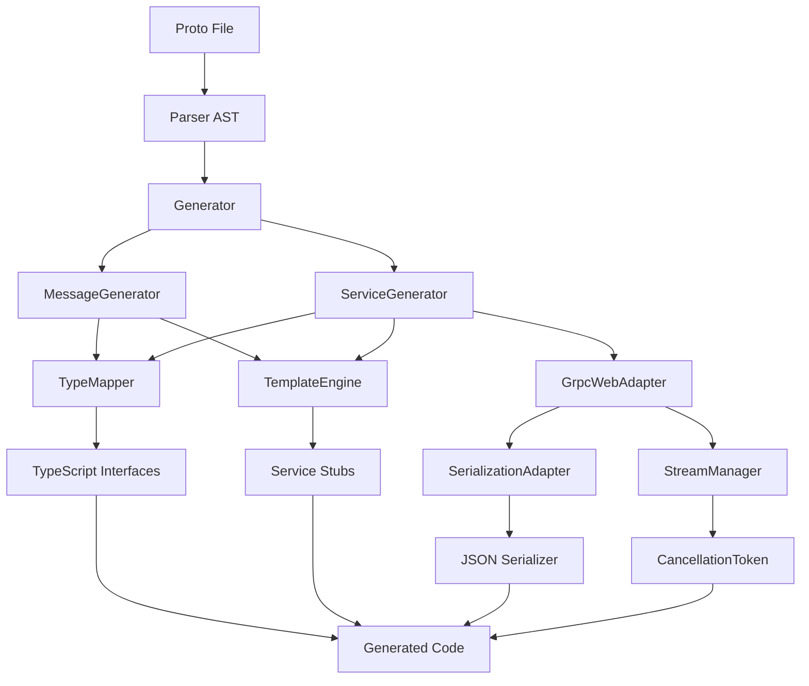
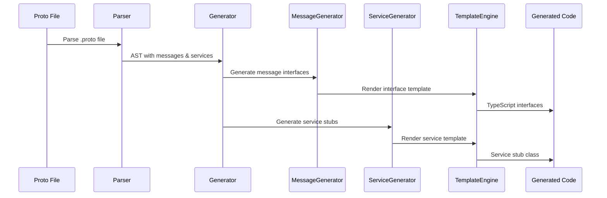
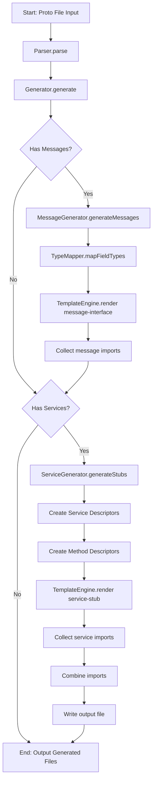
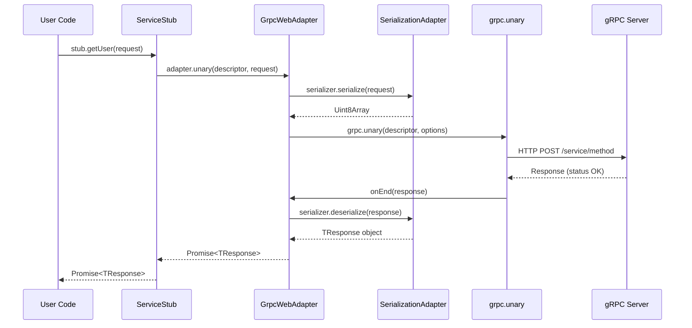
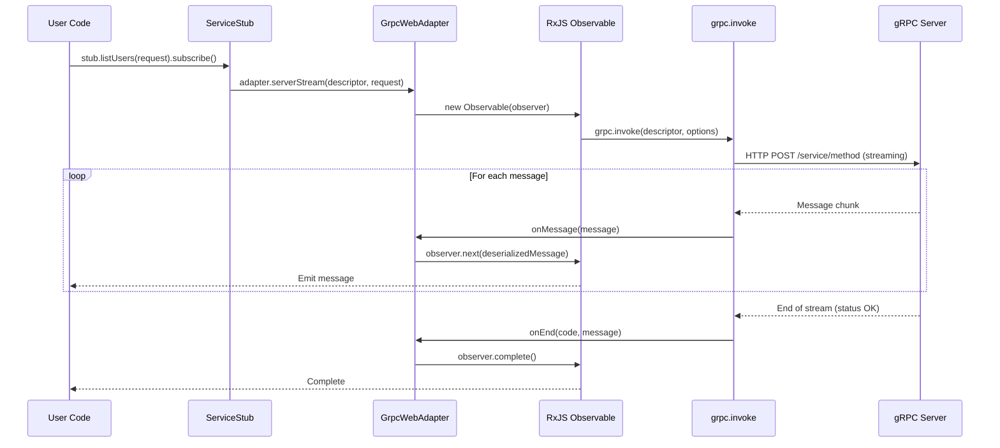
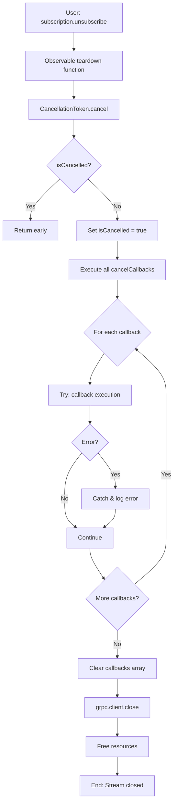
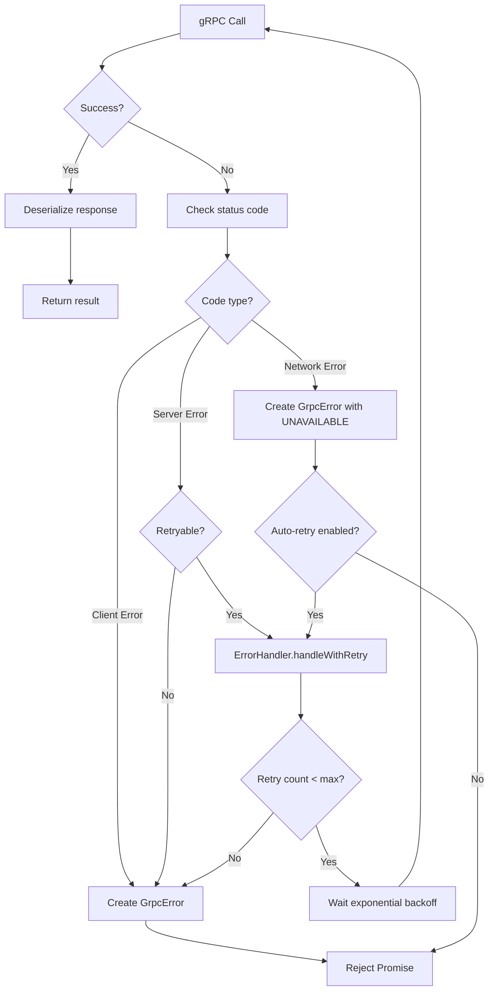

# Design Document: Generator Code Quality Improvement

## Overview

This design document describes the architectural approach to transform the Hallow gRPC generator from its current state (generating syntactically invalid TypeScript with placeholders) into a production-ready system that produces complete, type-safe, and functional gRPC-web client code.

### Design Goals

1. **Complete Type Generation**: Generate all message interfaces with correct TypeScript types
2. **Functional Method Signatures**: Create valid method signatures for all RPC types
3. **gRPC-Web Integration**: Implement actual gRPC communication using @improbable-eng/grpc-web
4. **Serialization**: Handle request/response serialization using JSON format (MVP)
5. **Stream Management**: Implement cancellation and resource cleanup for streaming RPCs
6. **Type Safety**: Ensure strict TypeScript compliance with zero compilation errors
7. **Error Handling**: Provide comprehensive error handling with typed error responses
8. **Developer Experience**: Generate well-documented, IDE-friendly code

### Design Scope

**In Scope:**
- Enhanced MessageGenerator for complete type generation
- Enhanced ServiceGenerator for functional gRPC-web integration
- Serialization/deserialization infrastructure
- Stream cancellation and resource management
- Template system improvements
- Error handling architecture
- Testing infrastructure

**Out of Scope (deferred to future phases):**
- React hooks generation
- Binary protobuf serialization (MVP uses JSON)
- Client/bidirectional streaming over HTTP/1.1 (gRPC-web limitation)
- Performance optimization beyond baseline functionality

---

## System Architecture

### High-Level Component Diagram



### Architecture Layers

**Layer 1: Input Processing**
- Parser AST (already implemented)
- Proto type definitions (already implemented)

**Layer 2: Code Generation Core**
- MessageGenerator (enhance existing)
- ServiceGenerator (enhance existing)
- TypeMapper (enhance existing)
- TemplateEngine (enhance existing)

**Layer 3: Integration Layer (NEW)**
- GrpcWebAdapter: Wrapper around @improbable-eng/grpc-web
- SerializationAdapter: JSON serialization/deserialization
- StreamManager: Observable stream management and cancellation

**Layer 4: Output**
- Generated TypeScript files with:
  - Message interfaces
  - Service stubs with functional methods
  - Serialization helpers
  - Stream management utilities

### Data Flow



---

## Component Design

### 1. Enhanced MessageGenerator

**Current State:**
- Generates basic message interfaces
- Has serialization template stubs
- Uses Handlebars templates (inline strings)

**Design Enhancements:**

#### 1.1 Interface Generation Improvements

```typescript
/**
 * Enhanced message context with complete type information
 */
interface EnhancedMessageContext extends MessageContext {
  // Add validation metadata
  validationRules?: FieldValidationRule[];

  // Add default value generation
  hasDefaultValues: boolean;

  // Add import dependencies
  requiredImports: ImportStatement[];
}

/**
 * Field validation rule for runtime validation
 */
interface FieldValidationRule {
  fieldName: string;
  fieldNumber: number;
  required: boolean;
  validators: Validator[];
}

/**
 * Import statement structure
 */
interface ImportStatement {
  moduleName: string;
  imports: string[];
  isTypeOnly: boolean;
}
```

#### 1.2 Template Structure

Move from inline strings to external template files:

**File: `packages/generator/templates/message-interface.hbs`**
```handlebars
{{#if generateComments}}
/**
 * {{name}} message interface
 * @generated from protobuf message {{package}}.{{name}}
 */
{{/if}}
export interface {{interfaceName}} {
{{#each fields}}
  {{#if comment}}
  /** {{comment}} */
  {{/if}}
  {{#if ../readonlyProperties}}readonly {{/if}}{{camelCaseName}}{{#if optional}}?{{/if}}: {{tsType}};
{{/each}}

{{#each oneofs}}
  /**
   * Oneof field {{camelCaseName}}
   * Only one of the following fields will be set at a time
   */
  {{camelCaseName}}: {{unionType}};
{{/each}}
}

{{#if hasNestedTypes}}
export namespace {{interfaceName}} {
{{#each nestedEnums}}
  {{> enum-definition this}}
{{/each}}

{{#each nestedMessages}}
  {{> message-interface this}}
{{/each}}
}
{{/if}}
```

**File: `packages/generator/templates/partials/enum-definition.hbs`**
```handlebars
{{#if ../generateComments}}
/**
 * {{name}} enum
 * @generated from protobuf enum {{package}}.{{name}}
 */
{{/if}}
export enum {{name}} {
{{#each values}}
  {{#if comment}}
  /** {{comment}} */
  {{/if}}
  {{name}} = {{number}},
{{/each}}
}
```

#### 1.3 Message Generator Methods

```typescript
export class MessageGenerator {
  /**
   * Generate message interface with full type information
   */
  public generateInterface(
    message: MessageDefinition,
    namespace?: string
  ): GeneratedInterface {
    // Validate message definition
    this.validateMessage(message);

    // Create enhanced context
    const context = this.createEnhancedMessageContext(message, namespace);

    // Collect all required imports
    const imports = this.collectRequiredImports(context);

    // Render template
    const code = this.templateEngine.render('message-interface', context);

    return {
      code,
      imports,
      exports: this.generateExports(message),
    };
  }

  /**
   * Validate message definition for completeness
   */
  private validateMessage(message: MessageDefinition): void {
    if (!message.name) {
      throw new GenerationError('Message name is required',
        GenerationErrorCode.INVALID_PROTO);
    }

    // Validate field numbers are unique
    const fieldNumbers = new Set<number>();
    for (const field of message.fields) {
      if (fieldNumbers.has(field.number)) {
        throw new GenerationError(
          `Duplicate field number ${field.number} in message ${message.name}`,
          GenerationErrorCode.INVALID_PROTO
        );
      }
      fieldNumbers.add(field.number);
    }
  }

  /**
   * Collect all required imports for a message
   */
  private collectRequiredImports(context: EnhancedMessageContext): ImportStatement[] {
    const imports: ImportStatement[] = [];

    // Check each field for external types
    for (const field of context.fields) {
      if (!this.typeMapper.isScalarType(field.type)) {
        // External message or enum type
        const importPath = this.resolveImportPath(field.type);
        imports.push({
          moduleName: importPath,
          imports: [field.type],
          isTypeOnly: true,
        });
      }
    }

    return this.deduplicateImports(imports);
  }
}
```

### 2. Enhanced ServiceGenerator

**Current State:**
- Generates service stub class structure
- Has placeholder method implementations
- Uses inline template string

**Design Enhancements:**

#### 2.1 Service Descriptor Generation

```typescript
/**
 * Service descriptor metadata for gRPC-web
 */
interface ServiceDescriptor {
  serviceName: string;
  packageName: string;
  methods: MethodDescriptor[];
}

/**
 * Method descriptor for gRPC-web method calls
 */
interface MethodDescriptor {
  methodName: string;
  requestType: MessageDescriptor;
  responseType: MessageDescriptor;
  requestStream: boolean;
  responseStream: boolean;
}

/**
 * Message descriptor for serialization
 */
interface MessageDescriptor {
  messageName: string;
  serializeBinary(): Uint8Array;
  deserializeBinary(bytes: Uint8Array): any;
  toObject(): any;
  fromObject(obj: any): any;
}
```

#### 2.2 gRPC-Web Integration Architecture

```typescript
/**
 * GrpcWebAdapter - Wrapper around @improbable-eng/grpc-web
 */
export class GrpcWebAdapter {
  constructor(
    private readonly baseUrl: string,
    private readonly serializer: SerializationAdapter
  ) {}

  /**
   * Make unary RPC call
   */
  async unary<TRequest, TResponse>(
    methodDescriptor: MethodDescriptor,
    request: TRequest
  ): Promise<TResponse> {
    // Serialize request
    const serializedRequest = this.serializer.serialize(request);

    // Make gRPC-web call
    return new Promise<TResponse>((resolve, reject) => {
      grpc.unary(methodDescriptor, {
        request: serializedRequest,
        host: this.baseUrl,
        onEnd: (response) => {
          if (response.status !== grpc.Code.OK) {
            reject(new GrpcError(
              response.statusMessage,
              response.status,
              methodDescriptor.methodName
            ));
            return;
          }

          // Deserialize response
          const deserializedResponse = this.serializer.deserialize<TResponse>(
            response.message,
            methodDescriptor.responseType
          );

          resolve(deserializedResponse);
        }
      });
    });
  }

  /**
   * Make server streaming RPC call
   */
  serverStream<TRequest, TResponse>(
    methodDescriptor: MethodDescriptor,
    request: TRequest
  ): Observable<TResponse> {
    return new Observable<TResponse>(observer => {
      const cancellationToken = new CancellationTokenImpl();

      // Serialize request
      const serializedRequest = this.serializer.serialize(request);

      // Open streaming connection
      const client = grpc.invoke(methodDescriptor, {
        request: serializedRequest,
        host: this.baseUrl,
        onMessage: (message) => {
          // Deserialize and emit response
          const deserializedResponse = this.serializer.deserialize<TResponse>(
            message,
            methodDescriptor.responseType
          );
          observer.next(deserializedResponse);
        },
        onEnd: (code, message) => {
          if (code !== grpc.Code.OK) {
            observer.error(new GrpcError(message, code, methodDescriptor.methodName));
          } else {
            observer.complete();
          }
        }
      });

      // Handle cancellation
      cancellationToken.onCancel(() => {
        client.close();
      });

      // Return teardown function
      return () => {
        cancellationToken.cancel();
      };
    });
  }
}
```

#### 2.3 Service Template Structure

**File: `packages/generator/templates/service-stub.hbs`**
```handlebars
{{> file-header}}

{{> imports}}

{{> service-descriptor}}

{{#each services}}
/**
 * {{pascalName}} service client
 * @generated from protobuf service {{package}}.{{name}}
 */
export class {{pascalName}}Stub {
  private readonly adapter: GrpcWebAdapter;

  constructor(
    private readonly baseUrl: string,
    options?: GrpcClientOptions
  ) {
    this.adapter = new GrpcWebAdapter(
      baseUrl,
      new JsonSerializationAdapter()
    );
  }

  {{#each methods}}
  {{#if serverStreaming}}
  {{#if clientStreaming}}
  {{> bidirectional-method this}}
  {{else}}
  {{> server-streaming-method this}}
  {{/if}}
  {{else if clientStreaming}}
  {{> client-streaming-method this}}
  {{else}}
  {{> unary-method this}}
  {{/if}}

  {{/each}}
}
{{/each}}

{{> grpc-error-class}}
{{> cancellation-token}}
```

**File: `packages/generator/templates/partials/unary-method.hbs`**
```handlebars
/**
 * {{description}}
 * @param request - {{inputType}} request message
 * @returns Promise<{{outputType}}> response message
 */
public async {{camelName}}(
  request: {{inputType}}
): Promise<{{outputType}}> {
  return this.adapter.unary<{{inputType}}, {{outputType}}>(
    {{../name}}Service.{{pascalName}}Descriptor,
    request
  );
}
```

**File: `packages/generator/templates/partials/server-streaming-method.hbs`**
```handlebars
/**
 * {{description}}
 * @param request - {{inputType}} request message
 * @returns Observable<{{outputType}}> stream of response messages
 */
public {{camelName}}(
  request: {{inputType}}
): Observable<{{outputType}}> {
  return this.adapter.serverStream<{{inputType}}, {{outputType}}>(
    {{../name}}Service.{{pascalName}}Descriptor,
    request
  );
}
```

### 3. SerializationAdapter

**Design:**

```typescript
/**
 * Serialization adapter interface
 */
export interface ISerializationAdapter {
  /**
   * Serialize a message to wire format
   */
  serialize<T>(message: T): Uint8Array;

  /**
   * Deserialize a message from wire format
   */
  deserialize<T>(bytes: Uint8Array, messageDescriptor: MessageDescriptor): T;

  /**
   * Serialize to object (for JSON)
   */
  toObject<T>(message: T): any;

  /**
   * Deserialize from object (for JSON)
   */
  fromObject<T>(obj: any, messageDescriptor: MessageDescriptor): T;
}

/**
 * JSON serialization adapter (MVP implementation)
 */
export class JsonSerializationAdapter implements ISerializationAdapter {
  serialize<T>(message: T): Uint8Array {
    // Convert to JSON string
    const json = JSON.stringify(message);

    // Convert to Uint8Array
    const encoder = new TextEncoder();
    return encoder.encode(json);
  }

  deserialize<T>(bytes: Uint8Array, messageDescriptor: MessageDescriptor): T {
    // Convert from Uint8Array
    const decoder = new TextDecoder();
    const json = decoder.decode(bytes);

    // Parse JSON
    const obj = JSON.parse(json);

    // Convert to typed message
    return this.fromObject<T>(obj, messageDescriptor);
  }

  toObject<T>(message: T): any {
    // Handle nested messages, enums, and special types
    return this.convertToPlainObject(message);
  }

  fromObject<T>(obj: any, messageDescriptor: MessageDescriptor): T {
    // Create message instance with proper typing
    const message: any = {};

    // Map each field according to descriptor
    for (const field of messageDescriptor.fields) {
      if (obj[field.name] !== undefined) {
        message[field.name] = this.convertField(
          obj[field.name],
          field
        );
      }
    }

    return message as T;
  }

  private convertToPlainObject(message: any): any {
    if (message === null || message === undefined) {
      return message;
    }

    if (Array.isArray(message)) {
      return message.map(item => this.convertToPlainObject(item));
    }

    if (message instanceof Map) {
      const obj: any = {};
      for (const [key, value] of message.entries()) {
        obj[key] = this.convertToPlainObject(value);
      }
      return obj;
    }

    if (message instanceof Uint8Array) {
      // Convert to base64 string for JSON
      return this.uint8ArrayToBase64(message);
    }

    if (typeof message === 'object') {
      const obj: any = {};
      for (const key in message) {
        if (message.hasOwnProperty(key)) {
          obj[key] = this.convertToPlainObject(message[key]);
        }
      }
      return obj;
    }

    return message;
  }

  private convertField(value: any, field: FieldDescriptor): any {
    // Handle different field types
    if (field.repeated) {
      return Array.isArray(value)
        ? value.map(item => this.convertFieldValue(item, field))
        : [];
    }

    if (field.map) {
      const map = new Map();
      if (typeof value === 'object') {
        for (const key in value) {
          map.set(key, this.convertFieldValue(value[key], field));
        }
      }
      return map;
    }

    return this.convertFieldValue(value, field);
  }

  private convertFieldValue(value: any, field: FieldDescriptor): any {
    switch (field.type) {
      case 'bytes':
        return typeof value === 'string'
          ? this.base64ToUint8Array(value)
          : value;

      case 'int64':
      case 'uint64':
      case 'sint64':
      case 'fixed64':
      case 'sfixed64':
        // Convert to string representation for precision
        return String(value);

      default:
        return value;
    }
  }

  private uint8ArrayToBase64(bytes: Uint8Array): string {
    let binary = '';
    for (let i = 0; i < bytes.length; i++) {
      binary += String.fromCharCode(bytes[i]);
    }
    return btoa(binary);
  }

  private base64ToUint8Array(base64: string): Uint8Array {
    const binary = atob(base64);
    const bytes = new Uint8Array(binary.length);
    for (let i = 0; i < binary.length; i++) {
      bytes[i] = binary.charCodeAt(i);
    }
    return bytes;
  }
}
```

### 4. Stream Management

**Design:**

```typescript
/**
 * Enhanced CancellationToken implementation
 */
export class CancellationTokenImpl implements CancellationToken {
  private _isCancelled = false;
  private readonly cancelCallbacks: Array<() => void> = [];

  get isCancelled(): boolean {
    return this._isCancelled;
  }

  cancel(): void {
    if (this._isCancelled) {
      return;
    }

    this._isCancelled = true;

    // Execute all callbacks with error handling
    for (const callback of this.cancelCallbacks) {
      try {
        callback();
      } catch (error) {
        // Log error but don't throw to ensure all callbacks execute
        console.error('Error in cancellation callback:', error);
      }
    }

    // Clear callbacks to prevent memory leaks
    this.cancelCallbacks.length = 0;
  }

  onCancel(callback: () => void): void {
    if (this._isCancelled) {
      // Already cancelled, execute immediately
      try {
        callback();
      } catch (error) {
        console.error('Error in immediate cancellation callback:', error);
      }
    } else {
      this.cancelCallbacks.push(callback);
    }
  }

  /**
   * Register cleanup function to be called on cancellation
   */
  registerCleanup(cleanup: () => void): void {
    this.onCancel(cleanup);
  }
}

/**
 * Stream manager for handling multiple concurrent streams
 */
export class StreamManager {
  private readonly activeStreams = new Map<string, Subscription>();

  /**
   * Register a new stream
   */
  registerStream(streamId: string, subscription: Subscription): void {
    // Cancel existing stream with same ID if present
    this.cancelStream(streamId);

    // Register new stream
    this.activeStreams.set(streamId, subscription);
  }

  /**
   * Cancel a specific stream
   */
  cancelStream(streamId: string): void {
    const subscription = this.activeStreams.get(streamId);
    if (subscription) {
      subscription.unsubscribe();
      this.activeStreams.delete(streamId);
    }
  }

  /**
   * Cancel all active streams
   */
  cancelAll(): void {
    for (const [streamId, subscription] of this.activeStreams.entries()) {
      subscription.unsubscribe();
    }
    this.activeStreams.clear();
  }

  /**
   * Get count of active streams
   */
  getActiveStreamCount(): number {
    return this.activeStreams.size;
  }
}
```

### 5. Error Handling Architecture

**Design:**

```typescript
/**
 * gRPC error class with status code information
 */
export class GrpcError extends Error {
  constructor(
    message: string,
    public readonly code: grpc.Code,
    public readonly methodName: string,
    public readonly metadata?: grpc.Metadata
  ) {
    super(message);
    this.name = 'GrpcError';

    // Maintain proper stack trace
    if (Error.captureStackTrace) {
      Error.captureStackTrace(this, GrpcError);
    }
  }

  /**
   * Check if error is a specific gRPC status code
   */
  isCode(code: grpc.Code): boolean {
    return this.code === code;
  }

  /**
   * Get human-readable error message
   */
  toUserMessage(): string {
    return `gRPC ${this.methodName} failed: ${this.message} (code: ${grpc.Code[this.code]})`;
  }
}

/**
 * Serialization error
 */
export class SerializationError extends Error {
  constructor(
    message: string,
    public readonly field?: string,
    public readonly value?: any
  ) {
    super(message);
    this.name = 'SerializationError';

    if (Error.captureStackTrace) {
      Error.captureStackTrace(this, SerializationError);
    }
  }
}

/**
 * Validation error for invalid requests
 */
export class ValidationError extends Error {
  constructor(
    message: string,
    public readonly field: string,
    public readonly constraint: string
  ) {
    super(message);
    this.name = 'ValidationError';

    if (Error.captureStackTrace) {
      Error.captureStackTrace(this, ValidationError);
    }
  }
}

/**
 * Type guard for GrpcError
 */
export function isGrpcError(error: any): error is GrpcError {
  return error instanceof GrpcError;
}

/**
 * Type guard for SerializationError
 */
export function isSerializationError(error: any): error is SerializationError {
  return error instanceof SerializationError;
}

/**
 * Type guard for ValidationError
 */
export function isValidationError(error: any): error is ValidationError {
  return error instanceof ValidationError;
}

/**
 * Error handler utility
 */
export class ErrorHandler {
  /**
   * Handle gRPC errors with appropriate retry logic
   */
  static async handleWithRetry<T>(
    operation: () => Promise<T>,
    maxRetries: number = 3,
    retryDelay: number = 1000
  ): Promise<T> {
    let lastError: Error;

    for (let attempt = 0; attempt < maxRetries; attempt++) {
      try {
        return await operation();
      } catch (error) {
        lastError = error as Error;

        // Don't retry on client errors
        if (isGrpcError(error) && this.isClientError(error.code)) {
          throw error;
        }

        // Wait before retry
        if (attempt < maxRetries - 1) {
          await this.sleep(retryDelay * Math.pow(2, attempt));
        }
      }
    }

    throw lastError!;
  }

  private static isClientError(code: grpc.Code): boolean {
    return [
      grpc.Code.InvalidArgument,
      grpc.Code.NotFound,
      grpc.Code.AlreadyExists,
      grpc.Code.PermissionDenied,
      grpc.Code.Unauthenticated,
    ].includes(code);
  }

  private static sleep(ms: number): Promise<void> {
    return new Promise(resolve => setTimeout(resolve, ms));
  }
}
```

---

## Template System Architecture

### Template Organization

```
packages/generator/templates/
├── service-stub.hbs              # Main service template
├── message-interface.hbs         # Main message template
├── partials/
│   ├── file-header.hbs          # File header with generated notice
│   ├── imports.hbs               # Import statements
│   ├── service-descriptor.hbs    # Service descriptor constant
│   ├── method-descriptor.hbs     # Method descriptor constant
│   ├── unary-method.hbs         # Unary RPC method
│   ├── server-streaming-method.hbs  # Server streaming method
│   ├── client-streaming-method.hbs  # Client streaming method
│   ├── bidirectional-method.hbs     # Bidirectional streaming method
│   ├── enum-definition.hbs      # Enum type definition
│   ├── grpc-error-class.hbs     # GrpcError class
│   └── cancellation-token.hbs   # CancellationToken implementation
└── helpers/
    ├── type-helpers.ts          # Type conversion helpers
    ├── string-helpers.ts        # String manipulation helpers
    └── validation-helpers.ts    # Validation helpers
```

### Handlebars Helpers

```typescript
/**
 * Register custom Handlebars helpers
 */
export function registerTemplateHelpers(handlebars: typeof Handlebars): void {
  // Join array with separator
  handlebars.registerHelper('join', (array: string[], separator: string) => {
    return array.join(separator);
  });

  // Convert to PascalCase
  handlebars.registerHelper('pascalCase', (str: string) => {
    return str.charAt(0).toUpperCase() + str.slice(1);
  });

  // Convert to camelCase
  handlebars.registerHelper('camelCase', (str: string) => {
    return str.charAt(0).toLowerCase() + str.slice(1);
  });

  // Check if value is in array
  handlebars.registerHelper('includes', (array: any[], value: any) => {
    return array.includes(value);
  });

  // Conditional equality
  handlebars.registerHelper('eq', (a: any, b: any) => {
    return a === b;
  });

  // Logical OR
  handlebars.registerHelper('or', (...args: any[]) => {
    // Last argument is Handlebars options object
    const values = args.slice(0, -1);
    return values.some(v => !!v);
  });

  // Logical AND
  handlebars.registerHelper('and', (...args: any[]) => {
    const values = args.slice(0, -1);
    return values.every(v => !!v);
  });

  // Format JSDoc comment
  handlebars.registerHelper('jsdoc', (text: string, indent: number = 0) => {
    const spaces = ' '.repeat(indent);
    const lines = text.split('\n').map(line => `${spaces} * ${line}`);
    return `${spaces}/**\n${lines.join('\n')}\n${spaces} */`;
  });
}
```

### Template Data Model

```typescript
/**
 * Complete template context for service generation
 */
interface ServiceTemplateContext {
  // File metadata
  fileName: string;
  packageName: string;
  protoPath: string;

  // Import statements
  imports: ImportStatement[];

  // Service descriptors
  serviceDescriptor: {
    serviceName: string;
    fullServiceName: string;
    methods: MethodDescriptorTemplate[];
  };

  // Service classes
  services: ServiceTemplate[];

  // Options
  includeReactHooks: boolean;
  includeSuspenseHooks: boolean;
  includeComments: boolean;

  // Runtime dependencies
  dependencies: {
    grpcWeb: string;
    rxjs: string;
    googleProtobuf: string;
  };
}

interface MethodDescriptorTemplate {
  constantName: string;
  methodName: string;
  serviceName: string;
  requestType: string;
  responseType: string;
  requestStream: boolean;
  responseStream: boolean;
}

interface ServiceTemplate {
  name: string;
  pascalName: string;
  description: string;
  methods: MethodTemplate[];
}

interface MethodTemplate {
  name: string;
  pascalName: string;
  camelName: string;
  inputType: string;
  outputType: string;
  clientStreaming: boolean;
  serverStreaming: boolean;
  description: string;
  jsdocParams: string[];
  jsdocReturns: string;
}
```

---

## Business Process Diagrams

### Process 1: Code Generation Flow



### Process 2: Unary RPC Call Flow



### Process 3: Server Streaming Flow



### Process 4: Stream Cancellation Flow



### Process 5: Error Handling Flow



---

## Type System Design

### Generated TypeScript Types

```typescript
/**
 * Example generated message interface
 */
export interface GetUserRequest {
  userId: string;
}

export interface GetUserResponse {
  id: string;
  name: string;
  email: string;
}

export interface ListUsersRequest {
  pageSize: number;
  pageToken: string;
}

export interface ListUsersResponse {
  users: GetUserResponse[];
  nextPageToken: string;
}

/**
 * Example generated service stub
 */
export class UserServiceStub {
  private readonly adapter: GrpcWebAdapter;

  constructor(baseUrl: string, options?: GrpcClientOptions) {
    this.adapter = new GrpcWebAdapter(
      baseUrl,
      new JsonSerializationAdapter()
    );
  }

  /**
   * Get a single user by ID
   * @param request - GetUserRequest
   * @returns Promise<GetUserResponse>
   */
  async getUser(request: GetUserRequest): Promise<GetUserResponse> {
    return this.adapter.unary<GetUserRequest, GetUserResponse>(
      UserService.GetUserDescriptor,
      request
    );
  }

  /**
   * List users with pagination (server streaming)
   * @param request - ListUsersRequest
   * @returns Observable<ListUsersResponse>
   */
  listUsers(request: ListUsersRequest): Observable<ListUsersResponse> {
    return this.adapter.serverStream<ListUsersRequest, ListUsersResponse>(
      UserService.ListUsersDescriptor,
      request
    );
  }
}

/**
 * Service descriptor constant
 */
export const UserService = {
  serviceName: 'UserService',
  fullServiceName: 'test.services.UserService',

  GetUserDescriptor: {
    methodName: 'GetUser',
    service: UserService,
    requestStream: false,
    responseStream: false,
    requestType: GetUserRequest,
    responseType: GetUserResponse,
  },

  ListUsersDescriptor: {
    methodName: 'ListUsers',
    service: UserService,
    requestStream: false,
    responseStream: true,
    requestType: ListUsersRequest,
    responseType: ListUsersResponse,
  },
};
```

### Type Safety Guarantees

1. **Strict Mode Compliance:**
   - All generated code compiles with `tsc --strict`
   - No implicit `any` types in public APIs
   - Proper null/undefined handling with strict null checks

2. **Type Inference:**
   - Generic type parameters for request/response types
   - Full IntelliSense support in IDEs
   - Type-safe method signatures

3. **Runtime Type Checking:**
   - Serialization validates field types
   - Deserialization performs type conversion
   - Invalid data throws SerializationError

---

## Testing Strategy

### Unit Tests

**MessageGenerator Tests:**
```typescript
describe('MessageGenerator', () => {
  describe('generateInterface', () => {
    it('should generate interface for simple message', () => {
      // Test primitive types
    });

    it('should generate interface for message with repeated fields', () => {
      // Test array types
    });

    it('should generate interface for message with map fields', () => {
      // Test Map<K, V> types
    });

    it('should generate interface for message with nested messages', () => {
      // Test nested type resolution
    });

    it('should generate interface for message with oneof fields', () => {
      // Test discriminated union types
    });
  });

  describe('Type Mapping', () => {
    it('should map proto scalar types to TypeScript types', () => {
      // Test all scalar type mappings
    });

    it('should handle optional fields with strict null checks', () => {
      // Test optional field handling
    });
  });
});
```

**ServiceGenerator Tests:**
```typescript
describe('ServiceGenerator', () => {
  describe('generateStub', () => {
    it('should generate stub for service with unary methods', () => {
      // Test unary method generation
    });

    it('should generate stub for service with streaming methods', () => {
      // Test streaming method generation
    });

    it('should generate correct method signatures', () => {
      // Test method signature correctness
    });
  });

  describe('gRPC-Web Integration', () => {
    it('should create correct service descriptors', () => {
      // Test descriptor generation
    });

    it('should create correct method descriptors', () => {
      // Test method descriptor generation
    });
  });
});
```

**SerializationAdapter Tests:**
```typescript
describe('JsonSerializationAdapter', () => {
  it('should serialize simple message to JSON', () => {
    // Test basic serialization
  });

  it('should deserialize JSON to typed message', () => {
    // Test basic deserialization
  });

  it('should handle nested messages', () => {
    // Test nested object serialization
  });

  it('should handle repeated fields', () => {
    // Test array serialization
  });

  it('should handle map fields', () => {
    // Test Map serialization
  });

  it('should handle Uint8Array (bytes type)', () => {
    // Test base64 encoding/decoding
  });

  it('should handle 64-bit integers as strings', () => {
    // Test int64/uint64 conversion
  });
});
```

### Integration Tests

**End-to-End gRPC Call Tests:**
```typescript
describe('Generated Service Stub - Integration', () => {
  let server: TestGrpcServer;
  let stub: UserServiceStub;

  beforeAll(async () => {
    // Start test gRPC server
    server = await startTestServer();
  });

  afterAll(async () => {
    await server.stop();
  });

  beforeEach(() => {
    stub = new UserServiceStub('http://localhost:3000');
  });

  describe('Unary RPC', () => {
    it('should successfully call GetUser', async () => {
      const request: GetUserRequest = { userId: '123' };
      const response = await stub.getUser(request);

      expect(response.id).toBe('123');
      expect(response.name).toBeDefined();
      expect(response.email).toBeDefined();
    });

    it('should handle GetUser error', async () => {
      const request: GetUserRequest = { userId: 'invalid' };

      await expect(stub.getUser(request)).rejects.toThrow(GrpcError);
    });
  });

  describe('Server Streaming RPC', () => {
    it('should successfully stream ListUsers', (done) => {
      const request: ListUsersRequest = { pageSize: 10, pageToken: '' };
      const messages: ListUsersResponse[] = [];

      stub.listUsers(request).subscribe({
        next: (msg) => messages.push(msg),
        error: (err) => done(err),
        complete: () => {
          expect(messages.length).toBeGreaterThan(0);
          done();
        }
      });
    });

    it('should handle stream cancellation', (done) => {
      const request: ListUsersRequest = { pageSize: 100, pageToken: '' };

      const subscription = stub.listUsers(request).subscribe({
        next: () => {
          // Unsubscribe after first message
          subscription.unsubscribe();

          // Verify no more messages received
          setTimeout(() => done(), 100);
        }
      });
    });
  });
});
```

### Test Fixtures

**Mock Proto Definitions:**
```typescript
// Test message definitions
export const testMessages: MessageDefinition[] = [
  {
    name: 'SimpleMessage',
    fields: [
      { name: 'id', number: 1, type: 'string', repeated: false, optional: false },
      { name: 'count', number: 2, type: 'int32', repeated: false, optional: false },
    ],
    nestedMessages: [],
    nestedEnums: [],
    oneofs: [],
    options: {},
  },
  // ... more test messages
];

// Test service definitions
export const testServices: ServiceDefinition[] = [
  {
    name: 'TestService',
    methods: [
      {
        name: 'UnaryMethod',
        inputType: 'SimpleMessage',
        outputType: 'SimpleMessage',
        clientStreaming: false,
        serverStreaming: false,
        options: {},
      },
      // ... more test methods
    ],
    options: {},
  },
];
```

---

## Implementation Phases

### Phase 1: Message Type Generation (Week 1)

**Goal:** Generate complete, type-safe message interfaces

**Components:**
- Enhanced MessageGenerator
- Improved TypeMapper
- Message interface templates
- Unit tests for message generation

**Deliverables:**
- All message types generated correctly
- TypeScript strict mode compliance
- Nested messages and enums supported
- 95% unit test coverage

**Validation:**
- Run generator on service.proto
- Verify all 6 message interfaces present
- Compile with `tsc --strict` (0 errors)

### Phase 2: Method Signature Generation (Week 2)

**Goal:** Generate complete method signatures for all RPC types

**Components:**
- Enhanced ServiceGenerator
- Service stub templates
- Method signature partials
- Unit tests for service generation

**Deliverables:**
- All method signatures syntactically valid
- Correct return types (Promise/Observable)
- Complete JSDoc comments
- 90% unit test coverage

**Validation:**
- Compile generated service stubs with `tsc --strict`
- Verify IntelliSense works in IDE
- No `any` types in public APIs

### Phase 3: gRPC-Web Integration (Week 2-3)

**Goal:** Implement actual gRPC communication

**Components:**
- GrpcWebAdapter
- Service descriptors
- Method descriptors
- Integration tests with test server

**Deliverables:**
- Functional unary RPC calls
- Functional server streaming RPC
- Error handling with GrpcError
- Integration test suite

**Validation:**
- End-to-end unary call succeeds
- End-to-end streaming succeeds
- Error scenarios handled correctly

### Phase 4: Serialization (Week 3)

**Goal:** Implement JSON serialization/deserialization

**Components:**
- SerializationAdapter interface
- JsonSerializationAdapter implementation
- Type conversion utilities
- Unit tests for serialization

**Deliverables:**
- Complete JSON serialization
- Type-safe deserialization
- Support for all field types
- 95% test coverage

**Validation:**
- Complex messages serialize correctly
- Nested objects handled properly
- Map and repeated fields work
- Bytes type (base64) conversion works

### Phase 5: Stream Cancellation & Resource Management (Week 3-4)

**Goal:** Implement cancellation and prevent resource leaks

**Components:**
- Enhanced CancellationToken
- StreamManager
- Observable teardown logic
- Memory leak tests

**Deliverables:**
- Complete CancellationToken implementation
- Stream cleanup on unsubscribe
- Error-safe callback execution
- Memory leak prevention

**Validation:**
- Cancellation prevents further messages
- Resources cleaned up (no leaks)
- Concurrent cancellations work
- Error in callback doesn't break cleanup

### Phase 6: Error Handling & Documentation (Week 4)

**Goal:** Comprehensive error handling and developer experience

**Components:**
- Error class hierarchy
- Error type guards
- JSDoc generation
- Code comments

**Deliverables:**
- GrpcError, SerializationError, ValidationError
- Type guards for error types
- Complete JSDoc on all generated code
- Inline code comments

**Validation:**
- All error types thrown correctly
- Type guards work properly
- IDE hover shows JSDoc
- Code is self-documenting

---

## Migration Strategy

### From Current State to Phase 1

**Current generators remain functional:**
- Keep existing MessageGenerator and ServiceGenerator
- Create enhanced versions in parallel
- Switch via configuration flag

**Template migration:**
- Move inline templates to external files
- Register template partials
- Test both old and new templates

**Gradual adoption:**
- Enable new generators for new proto files
- Migrate existing generated code incrementally
- Maintain backward compatibility

### Breaking Changes

**None expected for Phase 1-4**

**Possible breaking changes in Phase 5:**
- CancellationToken API changes
- Observable teardown behavior changes

**Mitigation:**
- Version generated code
- Provide migration guide
- Offer compatibility layer

---

## Design Decisions and Rationale

### Decision 1: JSON Serialization for MVP

**Options Considered:**
1. Binary protobuf serialization
2. JSON serialization
3. Both (configurable)

**Decision:** JSON serialization for MVP

**Rationale:**
- Simpler to implement and debug
- Browser DevTools can inspect payloads
- Faster development iteration
- Sufficient for MVP performance requirements
- Binary can be added later without API changes

**Trade-offs:**
- Larger payload size (~30% larger than binary)
- Slightly slower serialization/deserialization
- Accepted for MVP, will optimize in Phase 2

### Decision 2: External Template Files

**Options Considered:**
1. Inline template strings (current)
2. External .hbs files
3. Code-based generation (no templates)

**Decision:** External .hbs files with partials

**Rationale:**
- Better maintainability (syntax highlighting, formatting)
- Reusable partials reduce duplication
- Easier to test templates independently
- Version control shows template changes clearly
- Handlebars has good community support

**Trade-offs:**
- More files to manage
- Template loading overhead
- Accepted because maintainability is critical

### Decision 3: Observable for Streaming

**Options Considered:**
1. RxJS Observable
2. Async iterators
3. Custom stream abstraction

**Decision:** RxJS Observable

**Rationale:**
- Industry standard for reactive streams
- @improbable-eng/grpc-web uses Observable internally
- Rich operator ecosystem (retry, timeout, etc.)
- TypeScript support is excellent
- Familiar to most developers

**Trade-offs:**
- Adds rxjs as dependency (~70KB minified)
- Learning curve for developers unfamiliar with RxJS
- Accepted because benefits outweigh costs

### Decision 4: GrpcError Class Hierarchy

**Options Considered:**
1. Standard Error with message
2. Custom GrpcError with status code
3. Full error hierarchy (NetworkError, ServerError, etc.)

**Decision:** GrpcError with status code + type guards

**Rationale:**
- Status code provides enough information for error handling
- Type guards enable type-safe error discrimination
- Simpler than full hierarchy
- Matches gRPC error model
- Extensible if needed later

**Trade-offs:**
- Less granular than full hierarchy
- Developers must check status code manually
- Accepted because it's simpler and sufficient

### Decision 5: TypeScript Strict Mode Target

**Options Considered:**
1. Relaxed TypeScript settings
2. Strict mode compliance
3. Extra-strict (enable all checks)

**Decision:** Strict mode compliance

**Rationale:**
- Industry best practice
- Catches more errors at compile time
- Better IDE support
- Encourages proper type usage
- Required for professional libraries

**Trade-offs:**
- More complex type annotations required
- Longer development time
- Accepted because quality is paramount

---

## Open Questions

### Question 1: Client Streaming Implementation

**Question:** How should client streaming methods behave over HTTP/1.1?

**Options:**
1. Throw descriptive error immediately
2. Buffer all requests, send as batch
3. Use WebSocket transport fallback

**Recommendation:** Option 1 for MVP, research Option 3 for future

**Impact:** Affects client streaming method generation template

### Question 2: Retry Configuration

**Question:** Should retry logic be configurable per-method or per-stub?

**Options:**
1. Per-stub configuration in constructor
2. Per-method configuration in options
3. Global configuration with method overrides

**Recommendation:** Option 1 for MVP (per-stub), add Option 3 later

**Impact:** Affects GrpcWebAdapter constructor signature

### Question 3: Metadata Support

**Question:** Should we support gRPC metadata (headers) in MVP?

**Options:**
1. No metadata support in MVP
2. Basic metadata support (request headers only)
3. Full metadata support (request + response headers)

**Recommendation:** Option 2 (basic support)

**Impact:** Affects method signature generation and GrpcWebAdapter

---

## Appendices

### Appendix A: Type Mapping Reference

| Proto Type | TypeScript Type | Notes |
|------------|----------------|-------|
| double     | number         | IEEE 754 double |
| float      | number         | IEEE 754 float |
| int32      | number         | 32-bit signed |
| int64      | string         | 64-bit as string for precision |
| uint32     | number         | 32-bit unsigned |
| uint64     | string         | 64-bit as string for precision |
| sint32     | number         | Signed with zigzag encoding |
| sint64     | string         | 64-bit as string |
| fixed32    | number         | Fixed 32-bit |
| fixed64    | string         | Fixed 64-bit as string |
| sfixed32   | number         | Signed fixed 32-bit |
| sfixed64   | string         | Signed fixed 64-bit as string |
| bool       | boolean        | true/false |
| string     | string         | UTF-8 string |
| bytes      | Uint8Array     | Binary data |

### Appendix B: gRPC Status Codes

| Code | Name | Retry? | Description |
|------|------|--------|-------------|
| 0    | OK   | No     | Success |
| 1    | CANCELLED | No | Client cancelled |
| 2    | UNKNOWN | Maybe | Unknown error |
| 3    | INVALID_ARGUMENT | No | Invalid request |
| 4    | DEADLINE_EXCEEDED | Yes | Timeout |
| 5    | NOT_FOUND | No | Resource not found |
| 6    | ALREADY_EXISTS | No | Resource exists |
| 7    | PERMISSION_DENIED | No | No permission |
| 8    | RESOURCE_EXHAUSTED | Yes | Quota exceeded |
| 9    | FAILED_PRECONDITION | No | Precondition failed |
| 10   | ABORTED | Yes | Operation aborted |
| 11   | OUT_OF_RANGE | No | Range error |
| 12   | UNIMPLEMENTED | No | Not implemented |
| 13   | INTERNAL | Maybe | Server error |
| 14   | UNAVAILABLE | Yes | Service unavailable |
| 15   | DATA_LOSS | No | Data corruption |
| 16   | UNAUTHENTICATED | No | No credentials |

### Appendix C: Template Data Flow

```
Proto AST
  ↓
MessageGenerator.createEnhancedMessageContext()
  ↓
MessageContext {
  name, fields, oneofs, nestedTypes, options
}
  ↓
TemplateEngine.render('message-interface', context)
  ↓
Handlebars processes template with helpers
  ↓
Generated TypeScript interface code
```

### Appendix D: Dependencies

**Runtime Dependencies (in generated code):**
- @improbable-eng/grpc-web: ^0.15.0
- google-protobuf: ^3.21.0
- rxjs: ^7.8.0

**Generator Dependencies:**
- handlebars: ^4.7.7
- typescript: ^5.0.0

**Development Dependencies:**
- jest: ^29.0.0
- @types/jest: ^29.0.0
- ts-jest: ^29.0.0

---

## Approval and Sign-off

**Version:** 1.0
**Created:** 2025-10-21
**Author:** Spec-Design Agent
**Status:** Draft - Awaiting Review

### Review Checklist

- [ ] Architecture addresses all functional requirements (FR-1 through FR-8)
- [ ] Design supports all non-functional requirements (NFR-1 through NFR-5)
- [ ] Component interfaces are well-defined
- [ ] Data flow is clear and logical
- [ ] Error handling is comprehensive
- [ ] Testing strategy is complete
- [ ] Implementation phases are realistic
- [ ] Design decisions are justified
- [ ] Trade-offs are documented
- [ ] No major architectural risks remain

### Next Steps

1. Review this design document
2. Address any design feedback
3. Proceed to implementation plan refinement
4. Begin Phase 1 implementation (Message Type Generation)
