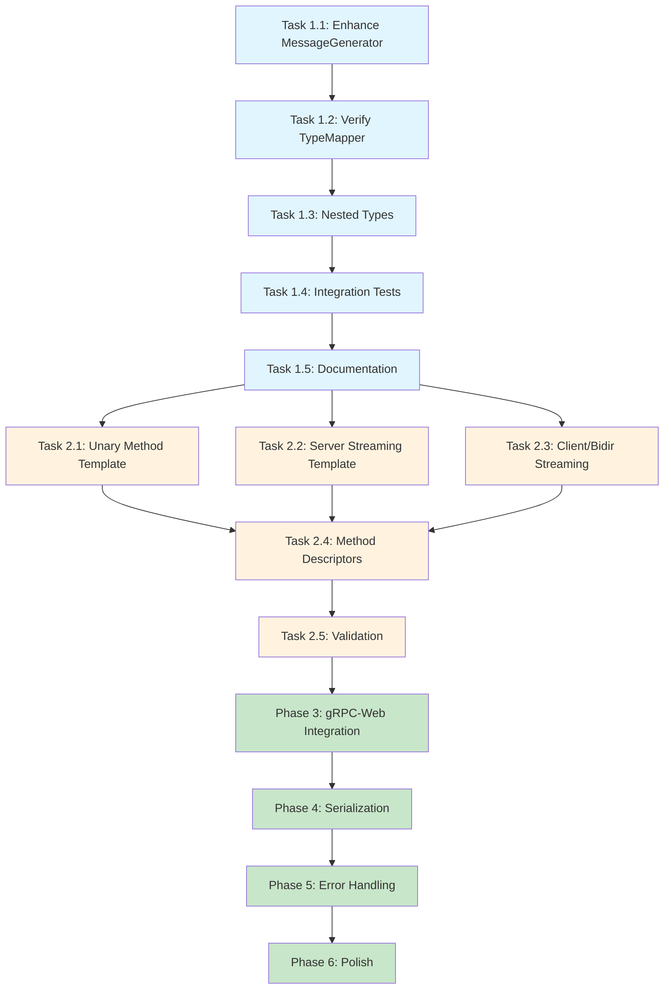

# Implementation Tasks: Generator Code Quality Improvement

**Feature:** Generator Gap Resolution
**Priority:** P0 Critical
**Timeline:** 21 days (3 weeks)
**Language:** English

## Overview

Transform the Hallow gRPC generator from producing syntactically invalid TypeScript to generating production-ready, type-safe, functional gRPC-web client code. This document provides a phased implementation plan with detailed tasks for Phase 1 and high-level overviews for remaining phases.

---

- [x] ## Phase 1: Message Type Generation (Days 1-3)

**Goal:** Generate complete TypeScript interfaces for all protobuf message types
**Priority:** P0 Critical | **Time:** 16 hours

### Task 1.1: Enhance MessageGenerator Interface Generation
**Time:** 4 hours | **File:** `packages/generator/src/generators/MessageGenerator.ts`

**Objective:** Ensure MessageGenerator produces complete, compilable TypeScript interfaces

**Key Files to Modify:**
- `packages/generator/src/generators/MessageGenerator.ts` (lines 382-395, 622-690)
- Template: inline template at lines 242-267

**Implementation Steps:**
1. Review `generateInterface()` method (lines 382-395)
2. Verify `createMessageContext()` properly populates field data (lines 470-512)
3. Ensure `createFieldContext()` handles all field types (lines 515-564)
4. Test template rendering with complex message types
5. Add validation for nested messages and enums

**Acceptance Criteria:**
- [ ] All 6 message interfaces from service.proto are generated
- [ ] Primitive types map correctly (string→string, int32→number, bool→boolean)
- [ ] Optional fields have `?` modifier
- [ ] Repeated fields are arrays
- [ ] Map fields use `Map<K, V>` type
- [ ] Nested messages reference correct types
- [ ] Code compiles with `tsc --strict`

**Requirements Coverage:** FR-1 AC 1-10

---

- [x] ### Task 1.2: Verify TypeMapper Coverage
**Time:** 2 hours | **File:** `packages/generator/src/utils/TypeMapper.ts`

**Objective:** Ensure all protobuf types have correct TypeScript mappings

**Key Files:**
- `packages/generator/src/utils/TypeMapper.ts` (lines 74-97, 159-177)

**Implementation Steps:**
1. Review scalar type mappings (lines 74-97)
2. Verify 64-bit integer handling (string vs bigint)
3. Test map field type mapping (lines 188-200)
4. Test repeated field type mapping (lines 203-213)
5. Add missing type mappings if any

**Acceptance Criteria:**
- [ ] All protobuf primitive types mapped
- [ ] bytes type maps to Uint8Array
- [ ] 64-bit integers map to string (MVP) or bigint (config)
- [ ] Well-known types handled correctly
- [ ] Unit tests pass (>95% coverage)

**Requirements Coverage:** FR-1 AC 2, FR-6 AC 1-3

---

- [x] ### Task 1.3: Add Nested Type Generation
**Time:** 3 hours | **File:** `packages/generator/src/generators/MessageGenerator.ts`

**Objective:** Generate nested message interfaces and enums correctly

**Key Files:**
- `packages/generator/src/generators/MessageGenerator.ts` (lines 484-487, 852-882)

**Implementation Steps:**
1. Review `generateNestedTypes()` method (lines 852-882)
2. Ensure nested messages namespace properly
3. Test enum generation (lines 884-908)
4. Verify export statements for nested types
5. Test with deeply nested structures

**Acceptance Criteria:**
- [ ] Nested messages generate within parent namespace
- [ ] Nested enums export correctly
- [ ] Enum values use correct TypeScript enum syntax
- [ ] No naming conflicts between nested and top-level types

**Requirements Coverage:** FR-1 AC 6-7

---

- [ ] ### Task 1.4: Integration Testing - Message Generation
**Time:** 5 hours | **File:** `packages/generator/tests/integration/message-generation.test.ts`

**Objective:** Validate end-to-end message generation with real proto files

**Test Cases:**
```typescript
describe('Message Generation Integration', () => {
  it('generates all message interfaces from service.proto', () => {
    // Test count: expect 6 interfaces
  });

  it('handles complex nested messages', () => {
    // Test nested User.Address.Location structure
  });

  it('handles map fields correctly', () => {
    // Test map<string, User> generates Map<string, User>
  });

  it('generates code that compiles with tsc --strict', () => {
    // Run actual TypeScript compiler
  });
});
```

**Acceptance Criteria:**
- [ ] Test with service.proto (6 messages)
- [ ] Test with complex proto (nested, maps, enums)
- [ ] Generated code compiles with zero errors
- [ ] All field types are present
- [ ] Integration tests pass

**Requirements Coverage:** FR-1 AC 10, FR-6 AC 1, NFR-3 AC 1-3

---

- [ ] ### Task 1.5: Documentation & Code Review
**Time:** 2 hours

**Objective:** Document message generation enhancements and prepare for code review

**Implementation Steps:**
1. Add JSDoc comments to new/modified methods
2. Update inline code documentation
3. Create examples in comments
4. Prepare PR description with before/after comparison
5. Run linter and fix any issues

**Acceptance Criteria:**
- [ ] All public methods have JSDoc comments
- [ ] Complex logic has inline comments
- [ ] Code follows TypeScript style guide
- [ ] Linter passes with zero errors
- [ ] PR ready for review

**Requirements Coverage:** FR-8 AC 1-4, NFR-1 AC 1-6

---

- [ ] ## Phase 2: Method Signature Generation (Days 4-7)

**Goal:** Generate complete, syntactically valid method signatures for all RPC types
**Priority:** P0 Critical | **Time:** 24 hours

### High-Level Tasks

- [ ] #### Task 2.1: Fix Unary Method Template (4h)
  - Update ServiceGenerator template for unary RPC
  - Generate `async methodName(request: RequestType): Promise<ResponseType>`
  - Add JSDoc comments with parameter and return type descriptions
  - **Requirements:** FR-2 AC 1, 5-10

- [ ] #### Task 2.2: Fix Server Streaming Method Template (4h)
  - Generate `methodName(request: RequestType): Observable<ResponseType>`
  - Add cancellation token support
  - Ensure proper Observable typing
  - **Requirements:** FR-2 AC 2, 5-10

- [ ] #### Task 2.3: Fix Client/Bidirectional Streaming Templates (4h)
  - Client streaming: Return interface with send(), complete(), cancel()
  - Bidirectional: Return interface with send(), responses, complete(), cancel()
  - Add clear documentation about HTTP/1.1 limitations
  - **Requirements:** FR-2 AC 3-4, 5-10

- [ ] #### Task 2.4: Add Method Descriptors (4h)
  - Generate service descriptor constant
  - Generate method descriptor for each RPC
  - Include metadata (method name, request/response types, streaming flags)
  - **Requirements:** FR-3 AC 2-3

- [ ] #### Task 2.5: Validation & Testing (8h)
  - Compile generated code with `tsc --strict`
  - Verify IntelliSense works in IDE
  - Test all 4 RPC types
  - Integration tests pass
  - **Requirements:** FR-2 AC 9-10, FR-6 AC 1-2

---

- [ ] ## Phase 3: gRPC-Web Integration (Days 8-14)

**Goal:** Implement actual gRPC communication using @improbable-eng/grpc-web
**Priority:** P0 Critical | **Time:** 40 hours

### High-Level Tasks

- [ ] #### Task 3.1: Research & Design (4h)
  - Study @improbable-eng/grpc-web API
  - Document descriptor structure
  - Plan GrpcWebAdapter architecture

- [ ] #### Task 3.2: Implement Unary RPC Logic (8h)
  - Replace placeholder with grpc.unary() call
  - Handle serialization/deserialization
  - Implement error handling
  - **Requirements:** FR-3 AC 4, 6-7

- [ ] #### Task 3.3: Implement Server Streaming Logic (8h)
  - Use grpc.invoke() for streaming
  - Convert gRPC events to Observable
  - Handle stream completion and errors
  - **Requirements:** FR-3 AC 5, 8-10

- [ ] #### Task 3.4: Add Cancellation Support (8h)
  - Implement Observable teardown
  - Close gRPC client on unsubscribe
  - Test resource cleanup
  - **Requirements:** FR-3 AC 11-12, FR-5 AC 1-6

- [ ] #### Task 3.5: Integration Testing with Test Server (12h)
  - Start gRPC test server
  - Test unary calls end-to-end
  - Test server streaming end-to-end
  - Test error scenarios
  - **Requirements:** FR-3 AC 12, NFR-3 AC 4-6

---

- [ ] ## Phase 4: Serialization Implementation (Days 15-17)

**Goal:** Implement JSON serialization/deserialization for messages
**Priority:** P0 Critical | **Time:** 16 hours

### High-Level Tasks

- [ ] #### Task 4.1: Configure JSON Serialization (4h)
  - Configure gRPC-web for JSON transport
  - Update method descriptors for JSON format
  - **Requirements:** FR-4 AC 1

- [ ] #### Task 4.2: Implement SerializationAdapter (6h)
  - Create JsonSerializationAdapter class
  - Implement serialize() and deserialize() methods
  - Handle nested objects, arrays, maps
  - Handle Uint8Array (bytes) conversion to/from base64
  - **Requirements:** FR-4 AC 2-7

- [ ] #### Task 4.3: Integration & Testing (6h)
  - Test with complex messages
  - Verify data integrity (no loss)
  - Test all field types
  - Integration tests pass
  - **Requirements:** FR-4 AC 8-9, NFR-3 AC 4

---

- [ ] ## Phase 5: Error Handling & Resource Management (Days 18-19)

**Goal:** Comprehensive error handling and stream cancellation
**Priority:** P1 High | **Time:** 12 hours

### High-Level Tasks

- [ ] #### Task 5.1: Implement GrpcError Classes (3h)
  - Create GrpcError with status code
  - Create SerializationError and ValidationError
  - Add type guards
  - **Requirements:** FR-7 AC 1-10

- [ ] #### Task 5.2: Complete CancellationToken (3h)
  - Fix cancel() method (execute callbacks, clear array)
  - Add error handling in callbacks
  - Test cancellation scenarios
  - **Requirements:** FR-5 AC 1-4, 9-10

- [ ] #### Task 5.3: Stream Resource Cleanup (3h)
  - Implement proper Observable teardown
  - Close gRPC connections on cancel
  - Test for memory leaks
  - **Requirements:** FR-5 AC 5-9

- [ ] #### Task 5.4: Testing (3h)
  - Error scenario tests
  - Cancellation tests
  - Memory leak tests
  - **Requirements:** FR-7 AC 9-10, NFR-3 AC 5-6

---

- [ ] ## Phase 6: Polish & Documentation (Days 20-21)

**Goal:** Final polish, documentation, and production readiness
**Priority:** P1 High | **Time:** 8 hours

### High-Level Tasks

- [ ] #### Task 6.1: Add JSDoc Comments (3h)
  - Document all public classes
  - Document all public methods
  - Add usage examples
  - **Requirements:** FR-8 AC 1-4, 8-10

- [ ] #### Task 6.2: Code Cleanup (2h)
  - Remove debug code
  - Remove TODOs
  - Format code
  - Run linter
  - **Requirements:** NFR-1 AC 1-6

- [ ] #### Task 6.3: Final Testing (3h)
  - Run full test suite
  - Test with real server
  - Performance testing
  - Code coverage >80%
  - **Requirements:** NFR-3 AC 9-10, NFR-4 AC 1-4

---

## Success Criteria

- [ ] ### Phase 1 Complete
  - [ ] All message interfaces generated
  - [ ] Code compiles with TypeScript strict mode
  - [ ] Nested messages work correctly
  - [ ] Test coverage >95%

- [ ] ### Phase 2 Complete
  - [ ] All method signatures syntactically valid
  - [ ] Correct return types (Promise/Observable)
  - [ ] No `any` types in public APIs
  - [ ] IntelliSense works in IDE

- [ ] ### Phase 3 Complete
  - [ ] Unary calls work end-to-end
  - [ ] Server streaming works end-to-end
  - [ ] Error handling functional
  - [ ] Cancellation prevents resource leaks

- [ ] ### Phase 4 Complete
  - [ ] JSON serialization works
  - [ ] Complex messages serialize correctly
  - [ ] No data loss

- [ ] ### Phase 5 Complete
  - [ ] All error types implemented
  - [ ] Cancellation fully functional
  - [ ] No memory leaks

- [ ] ### Phase 6 Complete
  - [ ] All code documented
  - [ ] Code polished and clean
  - [ ] All tests pass
  - [ ] Production ready

---

## Testing Strategy

### Unit Tests
```
packages/generator/tests/unit/
  type-mapper.test.ts          - Type mapping validation
  message-generator.test.ts    - Message interface generation
  service-generator.test.ts    - Service stub generation
  serialization.test.ts        - JSON serialization/deserialization
  cancellation-token.test.ts   - Cancellation logic
```

### Integration Tests
```
packages/generator/tests/integration/
  message-generation.test.ts   - End-to-end message generation
  method-generation.test.ts    - Method signature generation
  grpc-communication.test.ts   - Real gRPC server calls
  streaming.test.ts            - Streaming RPC tests
  error-handling.test.ts       - Error scenarios
```

### Test Commands
```bash
# Unit tests only
yarn test:unit

# Integration tests (requires test server)
yarn test:integration

# All tests
yarn test

# Coverage report
yarn test:coverage
```

---

## Risk Mitigation

### High Risks

**Risk:** JSON serialization may not handle all edge cases
- **Impact:** Critical - data corruption possible
- **Mitigation:** Extensive testing with complex messages, nested structures
- **Contingency:** Add validation layer before serialization

**Risk:** gRPC-web client/bidirectional streaming not supported over HTTP/1.1
- **Impact:** Medium - some RPC types won't work
- **Mitigation:** Document limitations, provide clear error messages
- **Status:** Accepted limitation for MVP

### Medium Risks

**Risk:** Template complexity increases maintenance burden
- **Impact:** Medium - harder to modify
- **Mitigation:** Use partials, comprehensive comments
- **Status:** Monitoring

---

## Dependencies

### External Dependencies
- `@improbable-eng/grpc-web` v0.15.0+ (gRPC-web client)
- `google-protobuf` v3.21.0+ (protobuf runtime)
- `rxjs` v7.8.0+ (Observable support)
- `handlebars` v4.7.7+ (template engine)

### Internal Dependencies
- Parser AST must provide complete message metadata
- Test server must support all RPC types for integration testing

### Timeline Dependencies
- Phase 1 must complete before Phase 2 (method signatures need message types)
- Phase 2 must complete before Phase 3 (gRPC integration needs valid methods)
- Phase 3 must complete before Phase 4 (serialization integrates with gRPC calls)

---

## Validation Commands

### Phase 1 Validation
```bash
cd packages/test-client
node generate.js
cd src
tsc --strict --noEmit service.service.ts
grep -c "export interface" service.service.ts  # Should output: 6
```

### Phase 2 Validation
```bash
cd packages/test-client
node generate.js
cd src
tsc --strict service.service.ts
# Check for zero compilation errors
```

### Phase 3-6 Validation
```bash
# Start test server
cd packages/test-server && yarn start

# Run integration tests
cd packages/test-client
yarn test:integration
```

---

## Tasks Dependency Diagram



**Legend:**
- Blue: Phase 1 (Message Type Generation) - Detailed tasks
- Orange: Phase 2 (Method Signatures) - Medium detail
- Green: Phases 3-6 - High-level phases

---

## Approval and Sign-off

**Version:** 1.0
**Created:** 2025-10-21
**Author:** Spec-Tasks Agent
**Status:** Draft - Awaiting Review

### Stakeholder Approval
- [ ] Product Owner - Scope and priority approval
- [ ] Tech Lead - Technical approach approval
- [ ] Backend Developer - Implementation feasibility approval
- [ ] QA Engineer - Test strategy approval

### Next Steps
After approval:
1. Begin Phase 1 implementation
2. Daily progress tracking
3. Weekly phase reviews
4. Adjust timeline as needed based on actual progress
