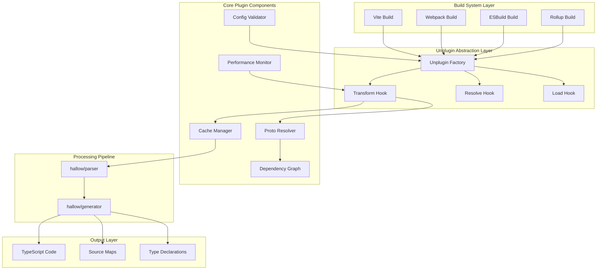
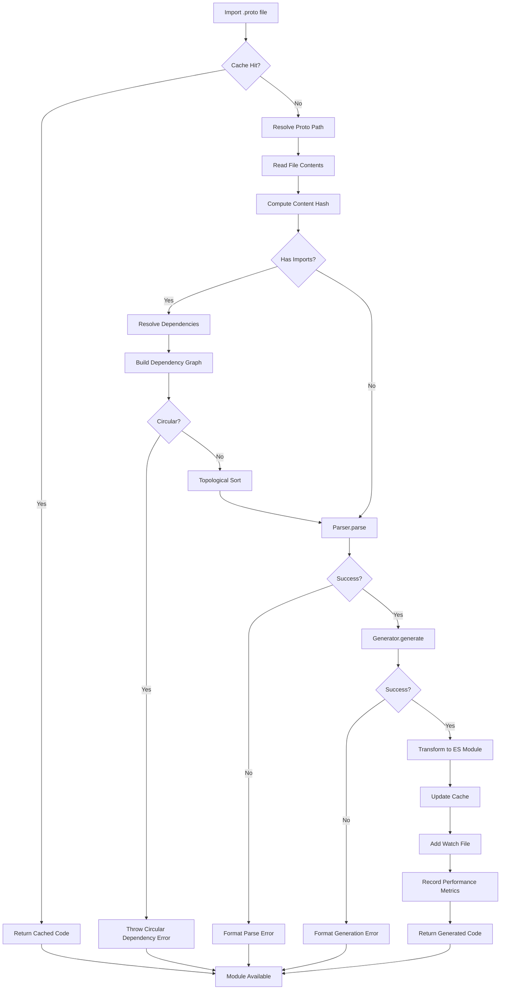
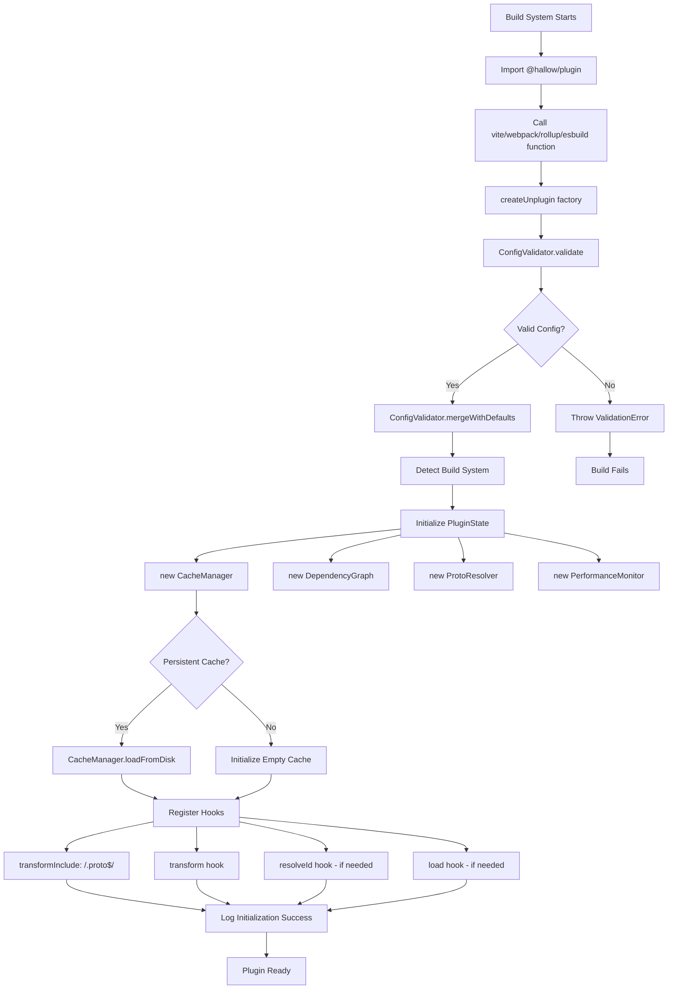
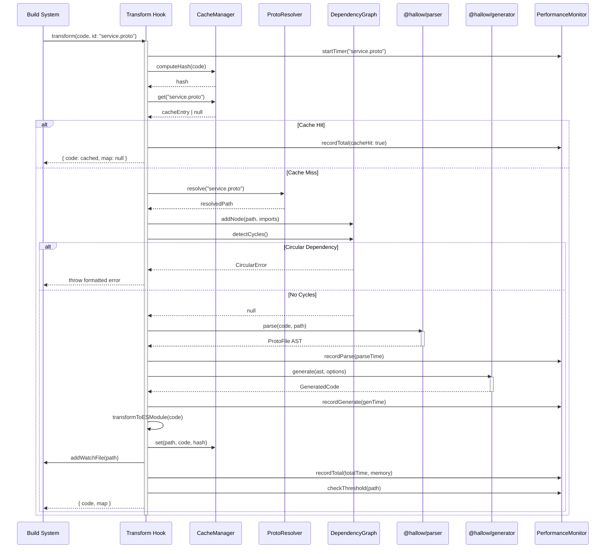
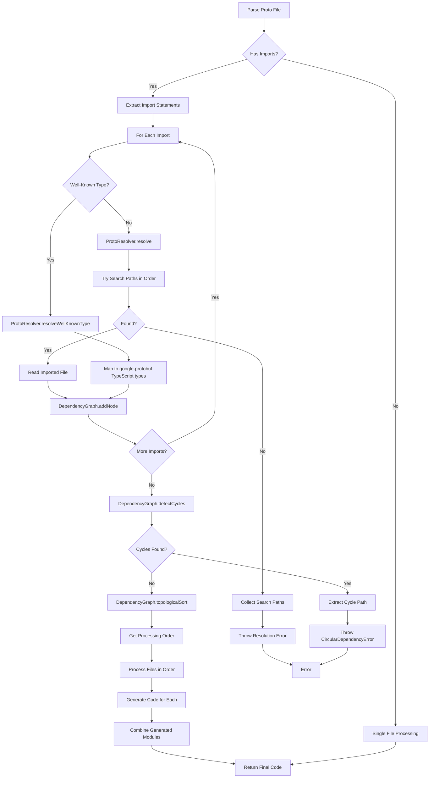
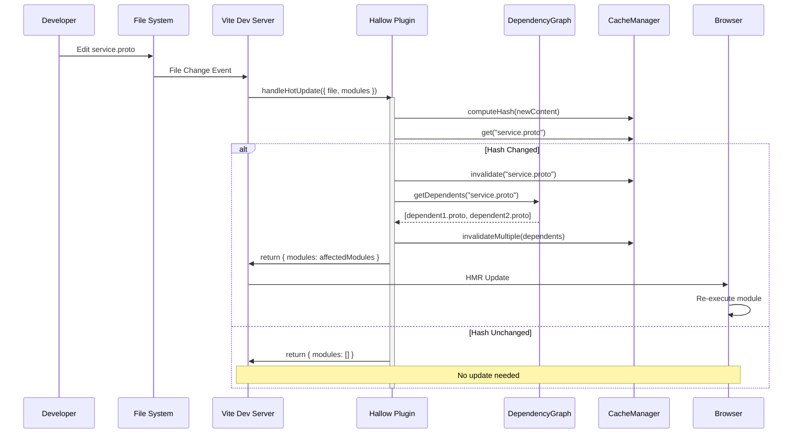
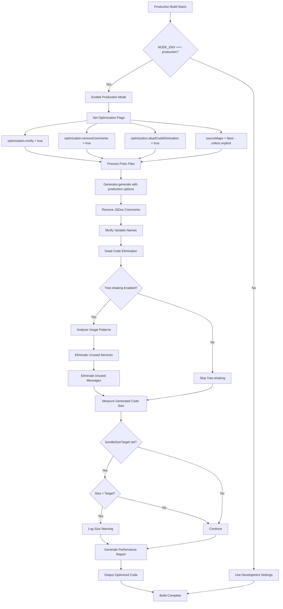
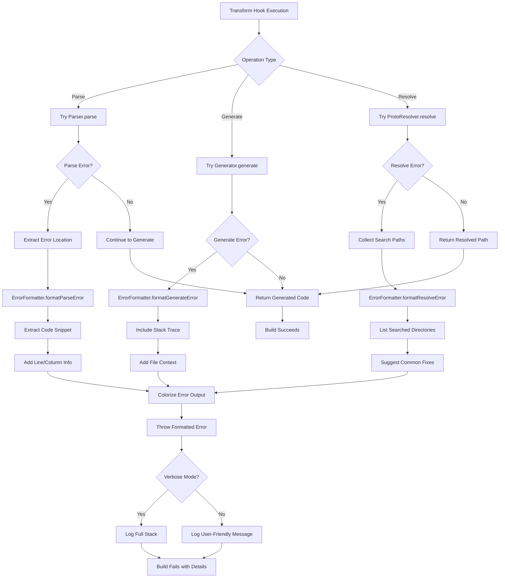

# Design Document: Plugin Package (@hallow/plugin)

## Overview

The `@hallow/plugin` package is a build-time integration layer that enables seamless importing of `.proto` files as first-class TypeScript modules without manual code generation. Built on the **Unplugin** framework, it provides universal compatibility across modern build systems (Vite, Webpack, ESBuild, Rollup) and orchestrates the `@hallow/parser` and `@hallow/generator` packages to deliver type-safe gRPC-web client code.

### Design Goals

1. **Zero-Configuration Experience**: Enable proto file imports with minimal setup
2. **Universal Build System Support**: Work seamlessly across Vite, Webpack, ESBuild, and Rollup
3. **Performance Optimization**: Intelligent caching with sub-200ms cold-start processing
4. **Developer Experience**: Full TypeScript type safety, IDE integration, and HMR support
5. **Production Ready**: Optimized code generation with tree-shaking and minification

### Scope

**In Scope:**
- Proto file transformation via unplugin transform hook
- Dependency graph management with topological sorting
- Intelligent caching with LRU eviction
- Build system-specific optimizations (HMR, virtual modules)
- TypeScript ambient module declarations
- React hooks generation (optional)
- Performance monitoring and metrics
- Comprehensive error handling

**Out of Scope:**
- Proto schema validation (delegated to `@hallow/parser`)
- gRPC server implementation
- Runtime proto reflection
- Custom proto plugins

---

## Architecture Design

### System Architecture Diagram



### Data Flow Diagram



---

## Component Design

### Component 1: UnpluginFactory

**Responsibilities:**
- Create unplugin instance using `createUnplugin` from unplugin framework
- Export build-system-specific adapters (vite, webpack, rollup, esbuild)
- Initialize plugin configuration and validate options
- Register transform, resolve, and load hooks

**Interfaces:**
```typescript
export interface PluginOptions extends GeneratorOptions {
  // File filtering
  include?: string[];
  exclude?: string[];

  // Proto resolution
  protoRoot?: string;
  importPaths?: string[];

  // Code generation
  generateReactHooks?: boolean;
  generateSuspenseHooks?: boolean;
  serverUrl?: string;

  // Build optimization
  sourceMaps?: boolean;
  optimization?: OptimizationOptions;

  // Caching
  cacheDir?: string;
  maxCacheSize?: number; // in MB
  enablePersistentCache?: boolean;

  // Performance monitoring
  enablePerformanceMonitoring?: boolean;
  performanceThreshold?: number; // in ms

  // Debugging
  verbose?: boolean;
  debug?: boolean;
}

export interface OptimizationOptions {
  production?: boolean;
  minify?: boolean;
  removeComments?: boolean;
  deadCodeElimination?: boolean;
  treeshaking?: boolean;
  codeSplitting?: boolean;
  lazyLoading?: boolean;
  bundleSizeTarget?: number; // in bytes
}
```

**Dependencies:**
- `unplugin` - Plugin framework
- `ConfigValidator` - Configuration validation
- `CacheManager` - Caching layer
- `PerformanceMonitor` - Performance tracking

**Key Methods:**
```typescript
createUnplugin((options: PluginOptions) => UnpluginInstance)
vite(): VitePlugin
webpack(): WebpackPlugin
rollup(): RollupPlugin
esbuild(): EsbuildPlugin
```

---

### Component 2: ProtoResolver

**Responsibilities:**
- Resolve proto file paths from imports
- Handle relative, absolute, and package imports
- Resolve well-known types from `google-protobuf`
- Manage import search paths
- Detect and report resolution failures

**Interfaces:**
```typescript
export interface ResolverOptions {
  protoRoot: string;
  importPaths: string[];
  projectRoot: string;
}

export interface ResolvedProto {
  absolutePath: string;
  originalImport: string;
  isWellKnown: boolean;
  packagePath?: string;
}

export class ProtoResolver {
  constructor(options: ResolverOptions);

  resolve(importPath: string, fromFile: string): ResolvedProto;
  resolveWellKnownType(typePath: string): ResolvedProto;
  getSearchPaths(fromFile: string): string[];
  validatePath(path: string): boolean;
}
```

**Dependencies:**
- Node.js `path` module
- Node.js `fs.promises` module

**Resolution Strategy:**
1. Check if path is well-known type (`google/protobuf/*`)
2. Try relative resolution from importing file directory
3. Try absolute resolution from project root
4. Try resolution from `protoRoot`
5. Try resolution from `importPaths` in order
6. Try resolution from `node_modules`
7. Throw resolution error with searched paths

---

### Component 3: DependencyGraph

**Responsibilities:**
- Build dependency graph from proto imports
- Track file dependencies and dependents
- Perform topological sorting for generation order
- Detect circular dependencies
- Invalidate dependent caches on file changes

**Interfaces:**
```typescript
export interface DependencyNode {
  filePath: string;
  imports: string[];
  importedBy: string[];
  hash: string;
  timestamp: number;
}

export interface CircularDependencyError {
  cycle: string[];
  message: string;
}

export class DependencyGraph {
  private nodes: Map<string, DependencyNode>;
  private adjacencyList: Map<string, Set<string>>;

  addNode(filePath: string, imports: string[]): void;
  getNode(filePath: string): DependencyNode | undefined;
  detectCycles(): CircularDependencyError | null;
  topologicalSort(): string[];
  getDependents(filePath: string): string[];
  invalidateDependents(filePath: string): string[];
  clear(): void;
}
```

**Dependencies:**
- None (pure TypeScript implementation)

**Key Algorithms:**
- **Topological Sort**: Kahn's algorithm for DAG ordering
- **Cycle Detection**: DFS-based cycle detection with path tracking

---

### Component 4: CacheManager

**Responsibilities:**
- Manage in-memory cache of parsed and generated code
- Compute content hashes for cache invalidation
- Implement LRU eviction policy
- Optional persistent disk cache
- Track cache statistics (hit/miss rates)

**Interfaces:**
```typescript
export interface CacheEntry {
  content: string;
  hash: string;
  timestamp: number;
  size: number; // in bytes
  accessCount: number;
  lastAccess: number;
}

export interface CacheStats {
  hits: number;
  misses: number;
  hitRate: number;
  totalSize: number;
  entryCount: number;
}

export class CacheManager {
  private cache: Map<string, CacheEntry>;
  private lruList: string[]; // Ordered by access time
  private stats: CacheStats;

  constructor(
    maxSizeInMB: number,
    persistentCacheDir?: string
  );

  get(key: string): CacheEntry | null;
  set(key: string, content: string, hash: string): void;
  invalidate(key: string): void;
  invalidateMultiple(keys: string[]): void;
  computeHash(content: string): string;
  evictLRU(): void;
  getStats(): CacheStats;
  clear(): void;

  // Persistent cache methods
  loadFromDisk(): Promise<void>;
  saveToDisk(): Promise<void>;
}
```

**Dependencies:**
- `crypto` - SHA-256 hashing
- `fs.promises` - Persistent cache I/O

**Eviction Strategy:**
- Monitor total cache size
- When size exceeds `maxCacheSize`, evict least recently used entries
- Track access time and access count for each entry
- Prioritize frequently accessed entries

---

### Component 5: ConfigValidator

**Responsibilities:**
- Validate plugin options at initialization
- Provide type-safe runtime validation
- Suggest corrections for common mistakes
- Merge user options with defaults
- Detect conflicting options

**Interfaces:**
```typescript
export interface ValidationResult {
  valid: boolean;
  errors: ValidationError[];
  warnings: ValidationWarning[];
}

export interface ValidationError {
  field: string;
  message: string;
  suggestion?: string;
}

export interface ValidationWarning {
  field: string;
  message: string;
  suggestion?: string;
}

export class ConfigValidator {
  private schema: ZodSchema<PluginOptions>;

  validate(options: Partial<PluginOptions>): ValidationResult;
  mergeWithDefaults(options: Partial<PluginOptions>): PluginOptions;
  suggestCorrection(invalidKey: string, validKeys: string[]): string;
  detectConflicts(options: PluginOptions): ValidationWarning[];
}
```

**Dependencies:**
- `zod` - Schema validation

**Default Configuration:**
```typescript
const DEFAULT_OPTIONS: PluginOptions = {
  include: ['**/*.proto'],
  exclude: ['node_modules/**'],
  protoRoot: process.cwd(),
  importPaths: [],
  generateReactHooks: false,
  generateSuspenseHooks: false,
  sourceMaps: true,
  maxCacheSize: 100, // MB
  enablePersistentCache: false,
  enablePerformanceMonitoring: false,
  performanceThreshold: 1000, // ms
  verbose: false,
  debug: false,
  optimization: {
    production: process.env.NODE_ENV === 'production',
    minify: process.env.NODE_ENV === 'production',
    removeComments: process.env.NODE_ENV === 'production',
    deadCodeElimination: false,
    treeshaking: false,
  }
};
```

---

### Component 6: PerformanceMonitor

**Responsibilities:**
- Track processing time for each proto file
- Measure parse, generate, and total time
- Monitor memory usage
- Detect performance bottlenecks
- Generate performance reports

**Interfaces:**
```typescript
export interface PerformanceMetrics {
  filePath: string;
  parseMs: number;
  generateMs: number;
  totalMs: number;
  memoryMB: number;
  cacheHit: boolean;
}

export interface PerformanceSummary {
  totalFiles: number;
  totalTimeMs: number;
  averageTimeMs: number;
  slowestFiles: PerformanceMetrics[];
  memoryPeakMB: number;
}

export class PerformanceMonitor {
  private metrics: Map<string, PerformanceMetrics>;
  private enabled: boolean;
  private threshold: number;

  constructor(enabled: boolean, threshold: number);

  startTimer(filePath: string): void;
  recordParse(filePath: string, timeMs: number): void;
  recordGenerate(filePath: string, timeMs: number): void;
  recordTotal(filePath: string, timeMs: number, memoryMB: number): void;
  checkThreshold(filePath: string): void;
  getSummary(): PerformanceSummary;
  exportReport(outputPath: string): Promise<void>;
}
```

**Dependencies:**
- Node.js `perf_hooks` - High-resolution timing
- Node.js `process.memoryUsage()` - Memory tracking

---

### Component 7: ErrorFormatter

**Responsibilities:**
- Format parser errors with file location
- Format generator errors with context
- Format resolution errors with search paths
- Add ANSI color codes for terminal output
- Include code snippets for syntax errors
- Provide helpful suggestions

**Interfaces:**
```typescript
export interface FormattedError {
  type: 'parse' | 'generate' | 'resolve' | 'validation' | 'circular';
  message: string;
  filePath?: string;
  line?: number;
  column?: number;
  snippet?: string;
  suggestion?: string;
  searchPaths?: string[];
}

export class ErrorFormatter {
  static formatParseError(
    filePath: string,
    line: number,
    column: number,
    message: string,
    sourceCode?: string
  ): string;

  static formatGenerateError(
    filePath: string,
    error: Error
  ): string;

  static formatResolveError(
    importPath: string,
    fromFile: string,
    searchPaths: string[]
  ): string;

  static formatCircularDependency(
    cycle: string[]
  ): string;

  static formatConfigError(
    field: string,
    expected: string,
    actual: string
  ): string;

  static extractCodeSnippet(
    source: string,
    line: number,
    contextLines: number
  ): string;

  static colorize(text: string, color: 'red' | 'yellow' | 'green' | 'blue'): string;
}
```

**Dependencies:**
- `chalk` or `kleur` - Terminal colors

---

## Data Model

### Core Data Structures

```typescript
// AST from Parser
export interface ProtoFile {
  syntax: 'proto3';
  package?: string;
  imports: ProtoImport[];
  messages: MessageDescriptor[];
  services: ServiceDescriptor[];
  enums: EnumDescriptor[];
}

export interface ProtoImport {
  path: string;
  isPublic: boolean;
  isWeak: boolean;
}

export interface MessageDescriptor {
  name: string;
  fields: FieldDescriptor[];
  nestedMessages: MessageDescriptor[];
  nestedEnums: EnumDescriptor[];
}

export interface ServiceDescriptor {
  name: string;
  methods: MethodDescriptor[];
}

export interface MethodDescriptor {
  name: string;
  inputType: string;
  outputType: string;
  clientStreaming: boolean;
  serverStreaming: boolean;
}

// Generated Code from Generator
export interface GeneratedCode {
  files: GeneratedFile[];
  sourceMaps?: SourceMapGenerator[];
}

export interface GeneratedFile {
  path: string;
  content: string;
  hash: string;
}

// Plugin Internal State
export interface PluginState {
  config: PluginOptions;
  cache: CacheManager;
  dependencyGraph: DependencyGraph;
  resolver: ProtoResolver;
  performanceMonitor: PerformanceMonitor;
  buildSystem: 'vite' | 'webpack' | 'rollup' | 'esbuild' | 'unknown';
  watchedFiles: Set<string>;
}
```

### Type Definitions Export Structure

```typescript
// Generated module structure for a proto file
export class GreetingServiceStub {
  constructor(client: Client);
  methods: {
    greet(request: GreetRequest): Promise<GreetResponse>;
    streamGreet(request: GreetRequest): Observable<GreetResponse>;
  };
}

export interface GreetRequest {
  name: string;
  metadata?: { [key: string]: string };
}

export interface GreetResponse {
  reply: string;
  timestamp?: google.protobuf.Timestamp;
}

// React hooks (if enabled)
export function useGreet(
  request: GreetRequest
): {
  data: GreetResponse | null;
  error: Error | null;
  loading: boolean;
};

export function useGreetSuspense(
  request: GreetRequest
): GreetResponse;
```

---

## Business Process

### Process 1: Plugin Initialization



### Process 2: Proto File Transformation (Core Process)



### Process 3: Dependency Resolution and Graph Building



### Process 4: Hot Module Replacement (Vite-specific)



### Process 5: Production Build Optimization



### Process 6: Error Handling and Recovery



---

## Error Handling Strategy

### Error Categories and Handling

#### 1. Parse Errors (from @hallow/parser)

**Strategy**: Catch, format with location, and re-throw with enhanced context

```typescript
try {
  const ast = parser.parse(content, filePath);
} catch (error) {
  throw new Error(
    ErrorFormatter.formatParseError(
      filePath,
      error.line,
      error.column,
      error.message,
      content
    )
  );
}
```

**Error Format:**
```
[Hallow Plugin] Proto syntax error
File: /path/to/service.proto
Line 15, Column 8: Expected ';' but found 'string'

  13 | message GreetRequest {
  14 |   string name = 1
> 15 |   string metadata = 2;
     |        ^
  16 | }
```

#### 2. Generation Errors (from @hallow/generator)

**Strategy**: Wrap with file context and include original stack trace

```typescript
try {
  const generated = generator.generate(ast, options);
} catch (error) {
  throw new Error(
    ErrorFormatter.formatGenerateError(filePath, error as Error)
  );
}
```

#### 3. Resolution Errors

**Strategy**: List all searched paths and suggest common fixes

```typescript
const searchPaths = resolver.getSearchPaths(fromFile);
throw new Error(
  ErrorFormatter.formatResolveError(importPath, fromFile, searchPaths)
);
```

**Error Format:**
```
[Hallow Plugin] Import resolution failed
File: /path/to/service.proto
Cannot resolve import: "common/types.proto"
Searched in:
  - /path/to (relative to importing file)
  - /project/root
  - /project/protos (protoRoot)
  - /project/node_modules

Suggestion: Check if the file exists and the path is correct.
```

#### 4. Circular Dependency Errors

**Strategy**: Show complete cycle path to help identify the loop

```typescript
const cycle = dependencyGraph.detectCycles();
if (cycle) {
  throw new Error(ErrorFormatter.formatCircularDependency(cycle.cycle));
}
```

**Error Format:**
```
[Hallow Plugin] Circular import detected

a.proto → b.proto → c.proto → a.proto

This creates a dependency cycle that cannot be resolved.
```

#### 5. Configuration Errors

**Strategy**: Validate early, provide specific suggestions

```typescript
const validation = configValidator.validate(options);
if (!validation.valid) {
  const errorMessages = validation.errors
    .map(e => ErrorFormatter.formatConfigError(e.field, e.expected, e.actual))
    .join('\n');
  throw new Error(`[Hallow Plugin] Configuration errors:\n${errorMessages}`);
}
```

#### 6. File System Errors

**Strategy**: Retry with exponential backoff for transient errors

```typescript
async function readFileWithRetry(
  path: string,
  maxRetries = 3
): Promise<string> {
  for (let i = 0; i < maxRetries; i++) {
    try {
      return await fs.readFile(path, 'utf-8');
    } catch (error) {
      if (i === maxRetries - 1 || !isTransientError(error)) {
        throw error;
      }
      await sleep(Math.pow(2, i) * 100); // Exponential backoff
    }
  }
}
```

### Error Recovery Mechanisms

1. **Cache Corruption**: Clear cache and retry if cache read fails
2. **Partial Generation**: Allow partial success for multi-file processing
3. **Graceful Degradation**: Fall back to less optimized code if optimization fails
4. **Development Mode**: More lenient error handling, warnings instead of failures

---

## Testing Strategy

### Unit Tests

**Target Coverage: ≥90%**

#### ProtoResolver Tests
- ✅ Resolve relative imports
- ✅ Resolve absolute imports
- ✅ Resolve well-known types
- ✅ Handle resolution failures
- ✅ Search path ordering
- ✅ Path validation

#### DependencyGraph Tests
- ✅ Add nodes and edges
- ✅ Topological sort
- ✅ Cycle detection (simple and complex)
- ✅ Get dependents
- ✅ Invalidate dependents
- ✅ Empty graph handling

#### CacheManager Tests
- ✅ Cache set and get
- ✅ Hash computation
- ✅ LRU eviction
- ✅ Cache invalidation
- ✅ Statistics tracking
- ✅ Persistent cache save/load
- ✅ Memory limit enforcement

#### ConfigValidator Tests
- ✅ Validate valid configs
- ✅ Detect invalid types
- ✅ Detect unknown options
- ✅ Suggest corrections
- ✅ Detect conflicts
- ✅ Merge with defaults

#### ErrorFormatter Tests
- ✅ Format parse errors
- ✅ Format generation errors
- ✅ Format resolution errors
- ✅ Format circular dependency errors
- ✅ Extract code snippets
- ✅ Colorize output

#### PerformanceMonitor Tests
- ✅ Record metrics
- ✅ Check threshold warnings
- ✅ Generate summary
- ✅ Export report
- ✅ Memory tracking

### Integration Tests

**Build System Compatibility**

#### Vite Integration
```typescript
describe('Vite Integration', () => {
  it('should transform proto files in Vite dev server');
  it('should trigger HMR on proto file changes');
  it('should handle virtual modules');
  it('should work with TypeScript in Vite');
  it('should generate source maps in dev mode');
});
```

#### Webpack Integration
```typescript
describe('Webpack Integration', () => {
  it('should transform proto files with webpack loader');
  it('should integrate with webpack module resolution');
  it('should work in production webpack build');
  it('should support webpack watch mode');
});
```

#### ESBuild Integration
```typescript
describe('ESBuild Integration', () => {
  it('should transform proto files with esbuild plugin');
  it('should maintain esbuild performance characteristics');
  it('should work with esbuild bundler');
});
```

#### Rollup Integration
```typescript
describe('Rollup Integration', () => {
  it('should transform proto files with rollup plugin');
  it('should use rollup resolveId hook');
  it('should generate rollup-compatible bundles');
});
```

### End-to-End Tests

```typescript
describe('E2E: Complete Workflow', () => {
  it('should import proto file and call gRPC method');
  it('should generate React hooks when enabled');
  it('should handle multi-file proto dependencies');
  it('should invalidate cache on file changes');
  it('should optimize code in production mode');
  it('should provide TypeScript autocomplete');
});
```

### Performance Tests

```typescript
describe('Performance Benchmarks', () => {
  it('should process single proto file in <200ms (cold start)');
  it('should process cached file in <10ms');
  it('should handle 100+ proto files without memory issues');
  it('should complete topological sort of 1000 nodes in <100ms');
});
```

### Error Scenario Tests

```typescript
describe('Error Handling', () => {
  it('should report proto syntax errors with location');
  it('should detect circular dependencies');
  it('should handle missing imports gracefully');
  it('should validate configuration and report errors');
  it('should handle file system errors with retry');
});
```

---

## Performance Optimization Techniques

### 1. Lazy Parsing
Only parse imported dependencies when actually needed, not all upfront.

### 2. Parallel Processing
Use `Promise.all()` for concurrent proto file processing when dependencies allow.

### 3. Incremental Generation
Only regenerate files that changed or have changed dependencies.

### 4. Memory Pooling
Reuse parser/generator instances instead of creating new ones per file.

### 5. Stream Processing
For very large proto files, consider streaming parsing if supported by parser.

### 6. Build System Hints
Leverage build system capabilities:
- **Vite**: Use `optimizeDeps` to pre-bundle generated code
- **Webpack**: Use `cache: { type: 'filesystem' }` for persistent cache
- **ESBuild**: Minimize plugin overhead with efficient filtering

---

## Security Considerations

### 1. Path Traversal Prevention
```typescript
function validatePath(path: string): boolean {
  const normalized = path.normalize(path);
  return !normalized.includes('..') &&
         !normalized.startsWith('/') &&
         !normalized.match(/^[a-zA-Z]:\\/);
}
```

### 2. Input Sanitization
All file paths and content must be validated before processing.

### 3. Safe Error Messages
Sanitize error messages to prevent leaking sensitive file system information.

### 4. No Dynamic Code Execution
Never use `eval()`, `Function()`, or dynamic `require()` with user input.

### 5. Dependency Scanning
Regularly scan dependencies for vulnerabilities using `npm audit`.

---

## Deployment and Distribution

### Package Structure

```
@hallow/plugin/
├── dist/
│   ├── index.js          # CommonJS entry
│   ├── index.mjs         # ESM entry
│   ├── index.d.ts        # TypeScript types
│   └── proto.d.ts        # Ambient module declarations
├── src/
├── tests/
├── package.json
├── README.md
├── LICENSE
└── CHANGELOG.md
```

### package.json Configuration

```json
{
  "name": "@hallow/plugin",
  "version": "0.1.0",
  "description": "Universal proto file plugin for Vite, Webpack, ESBuild, and Rollup",
  "main": "dist/index.js",
  "module": "dist/index.mjs",
  "types": "dist/index.d.ts",
  "exports": {
    ".": {
      "import": "./dist/index.mjs",
      "require": "./dist/index.js",
      "types": "./dist/index.d.ts"
    }
  },
  "files": [
    "dist"
  ],
  "engines": {
    "node": ">=14.0.0"
  },
  "dependencies": {
    "unplugin": "^1.0.0",
    "@hallow/parser": "workspace:*",
    "@hallow/generator": "workspace:*",
    "fast-glob": "^3.2.0",
    "zod": "^3.20.0",
    "chalk": "^4.1.0"
  },
  "peerDependencies": {
    "@hallow/react": ">=0.1.0"
  },
  "peerDependenciesMeta": {
    "@hallow/react": {
      "optional": true
    }
  },
  "publishConfig": {
    "access": "public"
  }
}
```

### TypeScript Ambient Declarations (proto.d.ts)

```typescript
declare module "*.proto" {
  import { Client } from '@hallow/grpc-web';

  // Placeholder types - will be replaced by actual generated types
  export interface Message {
    [key: string]: any;
  }

  export interface ServiceStub<T = any> {
    new (client: Client): T;
  }

  // Generic exports for type checking
  const exports: {
    [key: string]: ServiceStub | Message | Function;
  };

  export default exports;
}
```

---

## Future Enhancements

### Phase 2 Features
1. **Watch Mode Optimization**: Dedicated watch mode with optimized file watching
2. **Distributed Caching**: Share cache across team members via remote cache
3. **Proto Linting**: Integrate proto style guide validation
4. **Custom Generators**: Plugin system for custom code generators
5. **Streaming API**: Support for server and client streaming with enhanced types

### Phase 3 Features
1. **Proto Reflection**: Runtime proto reflection support
2. **gRPC Interceptors**: Built-in interceptor generation
3. **Mock Generation**: Automatic mock data generator for testing
4. **Performance Profiler**: Built-in profiler for gRPC calls
5. **Multi-Language Support**: Generate clients for multiple languages

---

## Appendix

### A. Dependency Graph Algorithm (Topological Sort)

```typescript
// Kahn's Algorithm for Topological Sort
topologicalSort(): string[] {
  const inDegree = new Map<string, number>();
  const result: string[] = [];
  const queue: string[] = [];

  // Calculate in-degree for each node
  for (const [node, deps] of this.adjacencyList) {
    if (!inDegree.has(node)) {
      inDegree.set(node, 0);
    }
    for (const dep of deps) {
      inDegree.set(dep, (inDegree.get(dep) || 0) + 1);
    }
  }

  // Find all nodes with in-degree 0
  for (const [node, degree] of inDegree) {
    if (degree === 0) {
      queue.push(node);
    }
  }

  // Process nodes
  while (queue.length > 0) {
    const node = queue.shift()!;
    result.push(node);

    for (const neighbor of this.adjacencyList.get(node) || []) {
      const newDegree = inDegree.get(neighbor)! - 1;
      inDegree.set(neighbor, newDegree);
      if (newDegree === 0) {
        queue.push(neighbor);
      }
    }
  }

  // Check if all nodes were processed (no cycles)
  if (result.length !== this.nodes.size) {
    throw new Error('Cycle detected in dependency graph');
  }

  return result;
}
```

### B. LRU Cache Implementation

```typescript
evictLRU(): void {
  if (this.lruList.length === 0) return;

  // Sort by last access time
  this.lruList.sort((a, b) => {
    const entryA = this.cache.get(a)!;
    const entryB = this.cache.get(b)!;
    return entryA.lastAccess - entryB.lastAccess;
  });

  // Evict until under memory limit
  while (this.getTotalSize() > this.maxSizeInBytes && this.lruList.length > 0) {
    const keyToEvict = this.lruList.shift()!;
    this.cache.delete(keyToEvict);
  }
}
```

### C. Build System Detection

```typescript
function detectBuildSystem(context: any): BuildSystem {
  if (context.meta?.framework === 'vite') return 'vite';
  if (context.webpack) return 'webpack';
  if (context.esbuild) return 'esbuild';
  if (context.meta?.rollup) return 'rollup';
  return 'unknown';
}
```

---

## Glossary

- **Unplugin**: Universal plugin framework for build tools
- **Transform Hook**: Build system hook that transforms file content
- **Virtual Module**: Module that exists only in memory, not on disk
- **HMR**: Hot Module Replacement - live update without full reload
- **DAG**: Directed Acyclic Graph - graph with no cycles
- **Topological Sort**: Ordering of graph nodes respecting dependencies
- **LRU**: Least Recently Used - cache eviction strategy
- **Well-Known Types**: Standard protobuf types from google.protobuf package
- **Ambient Declaration**: TypeScript type declaration without implementation
- **Source Map**: Mapping from generated code back to original source

---

## References

1. [Unplugin Documentation](https://unplugin.unjs.io/)
2. [Vite Plugin API](https://vite.dev/guide/api-plugin)
3. [TypeScript Module Resolution](https://www.typescriptlang.org/docs/handbook/modules/reference.html)
4. [Protocol Buffers Language Guide](https://protobuf.dev/programming-guides/proto3/)
5. [gRPC-Web Specification](https://github.com/grpc/grpc/blob/master/doc/PROTOCOL-WEB.md)
6. [Topological Sort Algorithms](https://en.wikipedia.org/wiki/Topological_sorting)
