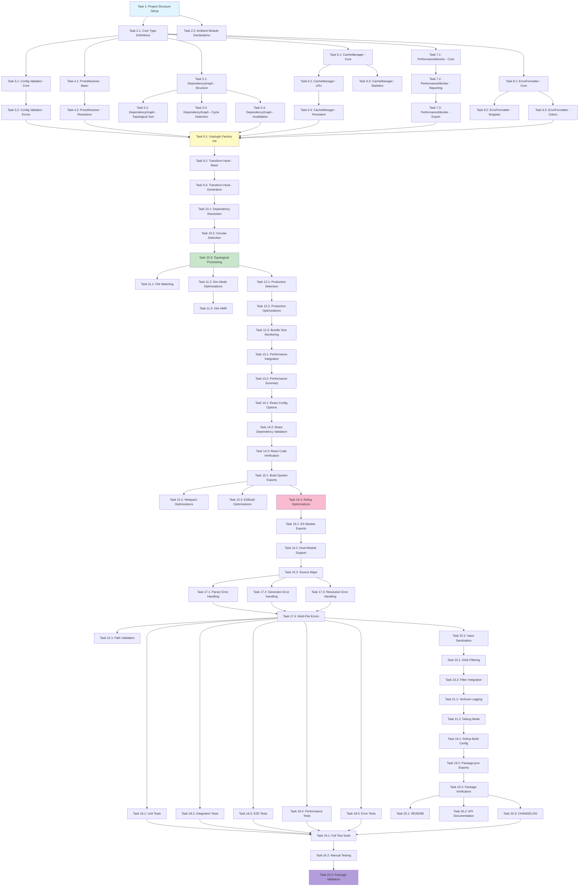

# Implementation Plan: Plugin Package (@hallow/plugin)

## Task Overview

This implementation plan creates the `@hallow/plugin` package - a build-time integration layer that enables seamless importing of `.proto` files as first-class TypeScript modules. The plan follows a test-driven, incremental approach with each task building on previous work.

---

## Implementation Tasks

- [ ] 1. Set up project structure and core TypeScript configuration
  - Create `packages/plugin/` directory with standard monorepo structure
  - Initialize `package.json` with dependencies: `unplugin`, `fast-glob`, `zod`, `chalk`
  - Configure `tsconfig.json` for strict TypeScript with no `any` types
  - Set up `rollup.config.js` for dual ESM/CJS builds
  - Create initial `src/index.ts` entry point
  - _Requirements: 15.1, 15.2, 15.3, 15.14_

- [ ] 2. Implement core type definitions and interfaces
  - [ ] 2.1 Create TypeScript type definitions file
    - Create `src/types.ts` with all interfaces from design document
    - Define `PluginOptions` interface extending `GeneratorOptions`
    - Define `OptimizationOptions`, `ResolverOptions`, `ResolvedProto` interfaces
    - Define `CacheEntry`, `CacheStats`, `DependencyNode` interfaces
    - Define `PerformanceMetrics`, `PerformanceSummary`, `FormattedError` interfaces
    - Write JSDoc comments for all type definitions
    - _Requirements: 4.1, 4.2, 15.8_

  - [ ] 2.2 Create ambient module declarations
    - Create `src/proto.d.ts` with ambient module pattern for `*.proto` files
    - Define placeholder `Message`, `ServiceStub` interfaces
    - Add JSDoc documentation for proto module types
    - _Requirements: 5.1, 5.2, 5.3, 15.1_

- [ ] 3. Implement ConfigValidator with schema validation
  - [ ] 3.1 Create configuration validation module
    - Create `src/config.ts` with `ConfigValidator` class
    - Define Zod schema for `PluginOptions` with all validation rules
    - Implement `validate()` method with comprehensive type checking
    - Implement `mergeWithDefaults()` method with default values from design
    - Create `DEFAULT_OPTIONS` constant with sensible defaults
    - Write unit tests for valid configurations
    - _Requirements: 4.11, 4.12, 4.13, 14.1, 14.2, 14.3_

  - [ ] 3.2 Implement configuration error handling and suggestions
    - Implement `suggestCorrection()` method using Levenshtein distance for typos
    - Implement `detectConflicts()` method for conflicting options
    - Write unit tests for invalid type detection
    - Write unit tests for unknown option warnings
    - Write unit tests for conflict detection (e.g., minify + sourceMaps)
    - _Requirements: 14.2, 14.3, 14.4, 14.9_

- [ ] 4. Implement ProtoResolver for path resolution
  - [ ] 4.1 Create basic path resolution logic
    - Create `src/resolver.ts` with `ProtoResolver` class
    - Implement constructor accepting `ResolverOptions`
    - Implement `getSearchPaths()` method returning ordered search directories
    - Implement `validatePath()` method for security checks (prevent traversal)
    - Write unit tests for search path ordering
    - _Requirements: 2.1, 2.2, 2.3, 2.4, 2.5_

  - [ ] 4.2 Implement proto file resolution strategy
    - Implement `resolve()` method with 7-step resolution strategy from design
    - Implement `resolveWellKnownType()` for google.protobuf types
    - Handle relative, absolute, and package-based imports
    - Throw descriptive errors with searched paths on failure
    - Write unit tests for relative import resolution
    - Write unit tests for absolute import resolution
    - Write unit tests for well-known type resolution
    - Write unit tests for resolution failures
    - _Requirements: 2.1, 2.2, 2.3, 2.4, 2.5, 2.6, 9.1, 9.2, 9.8_

- [ ] 5. Implement DependencyGraph for import management
  - [ ] 5.1 Create dependency graph data structure
    - Create `src/utils/dependency-graph.ts` with `DependencyGraph` class
    - Implement `addNode()` method to register file and its imports
    - Implement `getNode()` method to retrieve dependency information
    - Create adjacency list representation for graph
    - Write unit tests for adding nodes
    - Write unit tests for retrieving nodes
    - _Requirements: 9.3, 9.4, 9.5_

  - [ ] 5.2 Implement topological sort algorithm
    - Implement `topologicalSort()` using Kahn's algorithm from design appendix
    - Calculate in-degree for all nodes
    - Process nodes in dependency order
    - Write unit tests for simple dependency chains
    - Write unit tests for complex multi-file dependencies
    - _Requirements: 2.7, 9.6, 9.7_

  - [ ] 5.3 Implement circular dependency detection
    - Implement `detectCycles()` using DFS-based cycle detection
    - Track visited nodes and current path
    - Return complete cycle path when detected
    - Write unit tests for simple circular dependencies (A→B→A)
    - Write unit tests for complex cycles (A→B→C→D→B)
    - _Requirements: 2.8, 9.5_

  - [ ] 5.4 Implement dependent invalidation
    - Implement `getDependents()` to find all files that import a given file
    - Implement `invalidateDependents()` for cache invalidation on changes
    - Write unit tests for dependent tracking
    - Write unit tests for invalidation propagation
    - _Requirements: 2.9, 6.5_

- [ ] 6. Implement CacheManager for intelligent caching
  - [ ] 6.1 Create in-memory cache with hashing
    - Create `src/cache.ts` with `CacheManager` class
    - Implement SHA-256 hash computation using Node.js `crypto` module
    - Implement `get()` method with cache hit tracking
    - Implement `set()` method with timestamp and size tracking
    - Initialize cache statistics tracking
    - Write unit tests for cache set and get operations
    - Write unit tests for hash computation consistency
    - _Requirements: 6.1, 6.2, 6.3, 6.4, 6.10_

  - [ ] 6.2 Implement LRU eviction policy
    - Implement `evictLRU()` method using algorithm from design appendix
    - Track access count and last access time for each entry
    - Sort entries by last access time
    - Evict entries when total size exceeds `maxCacheSize`
    - Write unit tests for memory limit enforcement
    - Write unit tests for LRU eviction order
    - _Requirements: 6.11_

  - [ ] 6.3 Implement cache statistics and monitoring
    - Implement `getStats()` method returning hit rate and size metrics
    - Track cache hits and misses
    - Calculate hit rate percentage
    - Write unit tests for statistics accuracy
    - _Requirements: 6.10_

  - [ ] 6.4 Implement persistent disk cache (optional)
    - Implement `saveToDisk()` method using `fs.promises.writeFile`
    - Implement `loadFromDisk()` method with error handling
    - Create `.hallow-cache/` directory structure
    - Write cache entries as JSON files
    - Write unit tests for save and load operations
    - Write unit tests for corrupted cache handling
    - _Requirements: 6.12_

- [ ] 7. Implement PerformanceMonitor for metrics tracking
  - [ ] 7.1 Create performance monitoring infrastructure
    - Create `src/utils/performance.ts` with `PerformanceMonitor` class
    - Implement `startTimer()` using `perf_hooks.performance.now()`
    - Implement `recordParse()`, `recordGenerate()`, `recordTotal()` methods
    - Track memory usage using `process.memoryUsage()`
    - Write unit tests for timer accuracy
    - _Requirements: 10.1, 10.2, 10.3, 10.4, 10.8_

  - [ ] 7.2 Implement threshold checking and reporting
    - Implement `checkThreshold()` to warn on slow processing
    - Implement `getSummary()` to generate performance summary
    - Calculate average processing time and identify slowest files
    - Write unit tests for threshold warnings
    - _Requirements: 10.4, 10.6, 10.9, 10.10_

  - [ ] 7.3 Implement performance report export
    - Implement `exportReport()` to write JSON performance report
    - Include all metrics: parse time, generate time, memory usage
    - Write to `.hallow-cache/performance.json`
    - Write unit tests for report generation
    - _Requirements: 10.5, 10.6, 10.12_

- [ ] 8. Implement ErrorFormatter for comprehensive error messages
  - [ ] 8.1 Create error formatting utilities
    - Create `src/utils/error.ts` with `ErrorFormatter` class
    - Implement `formatParseError()` with file location and code snippet
    - Implement `formatGenerateError()` with stack trace
    - Implement `formatResolveError()` with searched paths
    - Implement `formatCircularDependency()` with cycle path
    - Implement `formatConfigError()` with type mismatch details
    - Write unit tests for all error format methods
    - _Requirements: 8.1, 8.2, 8.3, 8.4, 8.5_

  - [ ] 8.2 Implement code snippet extraction
    - Implement `extractCodeSnippet()` to extract context lines around error
    - Highlight error line with proper indentation
    - Include line numbers in snippet
    - Write unit tests for snippet extraction
    - _Requirements: 8.12_

  - [ ] 8.3 Add ANSI color support
    - Implement `colorize()` method using `chalk` library
    - Apply colors: red for errors, yellow for warnings, green for success
    - Detect terminal color support
    - Write unit tests for colorization
    - _Requirements: 8.9_

- [ ] 9. Implement core Unplugin factory and transform hook
  - [ ] 9.1 Create unplugin instance with configuration
    - Create `src/plugin.ts` with main plugin logic
    - Import `createUnplugin` from `unplugin` package
    - Initialize plugin with `PluginOptions` parameter
    - Validate configuration using `ConfigValidator`
    - Detect build system using context metadata
    - Initialize all components: resolver, cache, dependency graph, performance monitor
    - Log initialization success in verbose mode
    - Write unit tests for plugin initialization
    - _Requirements: 1.1, 1.2, 1.3, 1.10, 14.7, 14.10_

  - [ ] 9.2 Implement transform hook for proto files
    - Register `transformInclude` pattern: `/\.proto$/`
    - Implement `transform(code, id)` hook following data flow from design
    - Compute content hash and check cache
    - Return cached code on cache hit
    - Parse proto file on cache miss using `@hallow/parser`
    - Handle parser errors with `ErrorFormatter`
    - Write unit tests for transform hook with simple proto file
    - Write unit tests for cache hit scenario
    - _Requirements: 1.4, 1.5, 1.6, 1.7, 3.1, 3.2, 3.3, 6.2, 6.3_

  - [ ] 9.3 Integrate code generation in transform hook
    - Call `generator.generate()` with parsed AST
    - Pass plugin options to generator
    - Handle generation errors with `ErrorFormatter`
    - Extract generated TypeScript code
    - Transform to ES module format
    - Update cache with generated code
    - Return `{ code, map }` object
    - Write unit tests for successful code generation
    - Write unit tests for generation error handling
    - _Requirements: 3.4, 3.5, 3.6, 3.7, 3.8, 3.9, 3.10, 3.11, 3.12_

- [ ] 10. Implement dependency resolution in transform hook
  - [ ] 10.1 Add import parsing and resolution
    - Parse import statements from proto AST
    - Resolve each import using `ProtoResolver`
    - Handle well-known types separately
    - Build dependency graph with all imports
    - Write unit tests for proto file with imports
    - Write unit tests for well-known type imports
    - _Requirements: 2.6, 9.1, 9.2, 9.3_

  - [ ] 10.2 Add circular dependency detection
    - Call `dependencyGraph.detectCycles()` before generation
    - Throw formatted error if cycles detected
    - Include complete cycle path in error message
    - Write unit tests for circular dependency detection
    - _Requirements: 2.8, 9.5_

  - [ ] 10.3 Implement topological processing
    - Get processing order using `dependencyGraph.topologicalSort()`
    - Process dependencies before dependents
    - Generate import statements in TypeScript code
    - Maintain import registry to avoid duplicates
    - Write unit tests for multi-file dependency resolution
    - _Requirements: 2.7, 9.6, 9.7, 9.10_

- [ ] 11. Implement development mode features
  - [ ] 11.1 Add file watching support
    - Call `this.addWatchFile()` for each processed proto file
    - Register all dependencies for watching
    - Write integration tests for file watching
    - _Requirements: 2.9, 2.10, 6.8, 6.9_

  - [ ] 11.2 Add development mode optimizations
    - Detect development mode using `process.env.NODE_ENV`
    - Enable source maps by default in development
    - Set generator optimization flags for development
    - Write unit tests for development mode detection
    - _Requirements: 6.6, 6.7_

  - [ ] 11.3 Implement HMR support for Vite
    - Implement `handleHotUpdate` hook for Vite
    - Detect file changes and recompute hash
    - Invalidate cache for changed file and dependents
    - Return affected modules for HMR
    - Write integration tests for Vite HMR
    - _Requirements: 1.8, 2.9, 13.1, 13.9_

- [ ] 12. Implement production mode optimizations
  - [ ] 12.1 Add production mode detection and configuration
    - Detect production mode from `NODE_ENV` or build system flags
    - Set production optimization flags automatically
    - Disable source maps by default in production
    - Write unit tests for production mode detection
    - _Requirements: 7.1, 7.2, 7.3_

  - [ ] 12.2 Pass optimization flags to generator
    - Configure generator with minification options
    - Enable dead code elimination if configured
    - Enable tree-shaking if configured
    - Write unit tests for optimization flag propagation
    - _Requirements: 7.4, 7.5, 7.6, 7.7, 7.11, 7.12_

  - [ ] 12.3 Implement bundle size monitoring
    - Measure generated code size in bytes
    - Compare against `bundleSizeTarget` if configured
    - Log warnings when exceeding target
    - Log optimization metrics on build completion
    - Write unit tests for bundle size tracking
    - _Requirements: 7.8, 7.9, 7.10_

- [ ] 13. Implement performance monitoring integration
  - [ ] 13.1 Add performance tracking to transform hook
    - Start timer at beginning of transform
    - Record parse time after parser completion
    - Record generation time after generator completion
    - Record total time and memory usage
    - Check threshold and log warnings
    - Write unit tests for performance metric collection
    - _Requirements: 10.1, 10.2, 10.3, 10.7, 10.9_

  - [ ] 13.2 Add performance summary generation
    - Generate summary after all files processed
    - Log total files, total time, average time
    - Identify and log slowest files
    - Optionally export performance report to JSON
    - Write unit tests for summary generation
    - _Requirements: 10.6, 10.10, 10.11, 10.12_

- [ ] 14. Implement React hooks generation support
  - [ ] 14.1 Add React configuration options
    - Add `generateReactHooks` and `generateSuspenseHooks` to options
    - Pass these flags to generator configuration
    - Write unit tests for React option handling
    - _Requirements: 4.6, 4.7, 11.1_

  - [ ] 14.2 Add React dependency validation
    - Check if `@hallow/react` is installed when hooks enabled
    - Log warning if missing with installation instructions
    - Detect React in project dependencies
    - Suggest enabling hooks if React detected
    - Write unit tests for dependency validation
    - _Requirements: 11.6, 11.8, 11.9_

  - [ ] 14.3 Verify React hook code generation
    - Ensure generated code imports from `@hallow/react`
    - Verify hook function exports are present
    - Verify TypeScript types for hooks
    - Write integration tests for React hooks generation
    - _Requirements: 11.2, 11.3, 11.4, 11.5, 11.10_

- [ ] 15. Implement build system-specific adapters
  - [ ] 15.1 Export build system-specific functions
    - Export `vite()` function from `index.ts`
    - Export `webpack()` function from `index.ts`
    - Export `rollup()` function from `index.ts`
    - Export `esbuild()` function from `index.ts`
    - Export default unplugin instance
    - Write unit tests for all exports
    - _Requirements: 1.2, 15.4_

  - [ ] 15.2 Add Webpack-specific optimizations
    - Implement loader interface for Webpack
    - Integrate with Webpack module resolution
    - Write integration tests for Webpack
    - _Requirements: 1.9, 13.2_

  - [ ] 15.3 Add ESBuild-specific optimizations
    - Minimize plugin overhead for ESBuild performance
    - Ensure async transform hook compatibility
    - Write integration tests for ESBuild
    - _Requirements: 13.3, 13.5_

  - [ ] 15.4 Add Rollup-specific optimizations
    - Implement `resolveId` hook for Rollup
    - Implement `load` hook for Rollup
    - Ensure tree-shaking compatibility
    - Write integration tests for Rollup
    - _Requirements: 13.4, 13.8_

- [ ] 16. Implement virtual module system
  - [ ] 16.1 Generate ES module exports
    - Generate valid ES module syntax with `export` statements
    - Export service stub classes
    - Export message interfaces
    - Export enum types
    - Include runtime dependency imports
    - Write unit tests for ES module generation
    - _Requirements: 12.1, 12.2, 12.5, 12.6, 12.7, 12.8, 12.9_

  - [ ] 16.2 Add dual module support
    - Configure build to output both ESM and CJS
    - Ensure compatibility with `import` and `require()`
    - Write integration tests for both module systems
    - _Requirements: 12.10, 15.9_

  - [ ] 16.3 Implement source map generation
    - Generate source maps mapping to original proto files
    - Enable source maps in development mode
    - Disable in production unless explicitly enabled
    - Write unit tests for source map generation
    - _Requirements: 4.9, 12.11_

- [ ] 17. Implement comprehensive error handling
  - [ ] 17.1 Add parser error handling
    - Catch parser errors in transform hook
    - Format with file path, line, and column
    - Extract and display code snippet
    - Write unit tests for parser error formatting
    - _Requirements: 8.1, 8.6, 8.12_

  - [ ] 17.2 Add generator error handling
    - Catch generator errors in transform hook
    - Wrap with file context
    - Include stack trace in verbose mode
    - Write unit tests for generator error formatting
    - _Requirements: 8.4, 8.8_

  - [ ] 17.3 Add resolution error handling
    - Catch resolution errors from `ProtoResolver`
    - Format with searched paths
    - Provide helpful suggestions
    - Write unit tests for resolution error formatting
    - _Requirements: 8.3, 8.7, 8.10_

  - [ ] 17.4 Add multi-file error collection
    - Collect all errors instead of failing on first
    - Report all errors together
    - Write unit tests for error collection
    - _Requirements: 8.5, 8.11_

- [ ] 18. Create comprehensive test suite
  - [ ] 18.1 Write unit tests for all components
    - ProtoResolver: resolution strategies, well-known types, failures
    - DependencyGraph: topological sort, cycle detection, invalidation
    - CacheManager: get/set, LRU eviction, persistent cache
    - ConfigValidator: valid/invalid configs, suggestions, conflicts
    - ErrorFormatter: all error types, snippets, colorization
    - PerformanceMonitor: metrics, thresholds, reports
    - Achieve ≥90% code coverage
    - _Requirements: Non-functional: Maintainability 2, 3_

  - [ ] 18.2 Write integration tests for build systems
    - Vite: transform, HMR, virtual modules, TypeScript integration
    - Webpack: transform, module resolution, watch mode
    - ESBuild: transform, performance characteristics
    - Rollup: transform, resolveId/load hooks
    - _Requirements: Non-functional: Compatibility 3_

  - [ ] 18.3 Write end-to-end workflow tests
    - Import proto file and verify generated code structure
    - Multi-file dependencies with topological processing
    - Cache invalidation on file changes
    - Production optimization verification
    - TypeScript autocomplete verification
    - React hooks generation
    - _Requirements: Non-functional: Reliability 1, 2, 3_

  - [ ] 18.4 Write performance benchmark tests
    - Single proto file cold start (<200ms)
    - Cached file retrieval (<10ms)
    - Large proto file sets (100+ files) without memory issues
    - Topological sort of 1000 nodes (<100ms)
    - _Requirements: Non-functional: Performance 1, 5_

  - [ ] 18.5 Write error scenario tests
    - Proto syntax errors with location
    - Circular dependencies
    - Missing imports
    - Invalid configuration
    - File system errors with retry
    - _Requirements: Non-functional: Reliability 2_

- [ ] 19. Configure package build and distribution
  - [ ] 19.1 Configure Rollup build
    - Create `rollup.config.js` for dual ESM/CJS output
    - Configure TypeScript compilation
    - Set up type declaration generation
    - Configure external dependencies
    - Write build script in `package.json`
    - Test build output structure
    - _Requirements: 15.1, 15.2_

  - [ ] 19.2 Configure package.json exports
    - Add `main`, `module`, `types` fields
    - Add `exports` field with conditional exports
    - Add `files` field to include only `dist/`
    - Add `engines` field for Node.js version
    - Add proper dependencies and peerDependencies
    - Add `publishConfig` for public access
    - _Requirements: 15.2, 15.3, 15.5, 15.6, 15.7, 15.12, 15.14, 15.15_

  - [ ] 19.3 Verify package exports and compatibility
    - Test CommonJS import with `require()`
    - Test ES module import with `import`
    - Verify TypeScript types resolve correctly
    - Verify all build system adapters export correctly
    - Test in Node.js 14, 16, 18 environments
    - _Requirements: 15.9, 15.15, Non-functional: Compatibility 1, 2, 5_

- [ ] 20. Create package documentation
  - [ ] 20.1 Write comprehensive README.md
    - Add project overview and key features
    - Add installation instructions
    - Add quick start guide with example
    - Add configuration options reference with all fields
    - Add build system-specific setup (Vite, Webpack, ESBuild, Rollup)
    - Add troubleshooting section with common issues
    - Add example configurations for different scenarios
    - _Requirements: Non-functional: Documentation 1_

  - [ ] 20.2 Add API documentation with examples
    - Document all configuration options with types and examples
    - Add JSDoc comments to all public APIs
    - Include inline code examples
    - Document error messages and how to resolve them
    - _Requirements: Non-functional: Documentation 2, 3, 4_

  - [ ] 20.3 Create CHANGELOG.md
    - Set up changelog format with version sections
    - Document initial 0.1.0 release features
    - _Requirements: Non-functional: Documentation 5_

- [ ] 21. Add logging and debugging support
  - [ ] 21.1 Implement verbose logging mode
    - Add debug logging for plugin initialization
    - Log configuration after validation
    - Log cache hit/miss statistics
    - Log performance metrics per file
    - Log build system detection
    - Use consistent log format with `[Hallow Plugin]` prefix
    - _Requirements: 6.10, 10.9, 14.7_

  - [ ] 21.2 Add debug mode with detailed output
    - Add debug flag to configuration
    - Log dependency graph structure
    - Log resolution search paths
    - Log full error stacks
    - Write unit tests for logging behavior
    - _Requirements: 8.8_

- [ ] 22. Implement security validations
  - [ ] 22.1 Add path traversal prevention
    - Validate all file paths in `ProtoResolver`
    - Prevent `..` in normalized paths
    - Prevent absolute paths outside allowed directories
    - Write unit tests for path validation
    - _Requirements: Non-functional: Security 1_

  - [ ] 22.2 Add input sanitization
    - Sanitize error messages to prevent information leakage
    - Validate configuration inputs before processing
    - Never use `eval()` or `Function()` with user input
    - Write unit tests for sanitization
    - _Requirements: Non-functional: Security 2, 3, 4_

- [ ] 23. Add glob pattern filtering
  - [ ] 23.1 Implement include/exclude filtering
    - Use `fast-glob` to match file patterns
    - Apply include patterns first
    - Apply exclude patterns to filter results
    - Support glob patterns like `**/*.proto`, `node_modules/**`
    - Write unit tests for pattern matching
    - _Requirements: 4.3, 4.4_

  - [ ] 23.2 Integrate filtering with transform hook
    - Check if file matches patterns before processing
    - Skip excluded files early in transform hook
    - Write integration tests for filtering
    - _Requirements: 4.3, 4.4_

- [ ] 24. Final integration and validation
  - [ ] 24.1 Run full test suite
    - Execute all unit tests with coverage report
    - Execute all integration tests
    - Execute all E2E tests
    - Verify ≥90% code coverage
    - Fix any failing tests
    - _Requirements: Non-functional: Maintainability 2_

  - [ ] 24.2 Perform manual integration testing
    - Test plugin in real Vite project with proto imports
    - Test plugin in real Webpack project
    - Test plugin in real ESBuild project
    - Test plugin in real Rollup project
    - Verify HMR works in Vite dev server
    - Verify production builds are optimized
    - Verify TypeScript autocomplete works in VS Code
    - _Requirements: Non-functional: Compatibility 3_

  - [ ] 24.3 Validate package structure
    - Build package with `yarn build`
    - Verify dist/ output contains all required files
    - Check file sizes are reasonable
    - Test package installation locally with `yarn link`
    - Verify all exports work correctly
    - _Requirements: 15.1, 15.2, 15.13_

---

## Tasks Dependency Diagram

