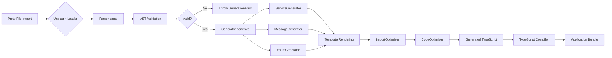
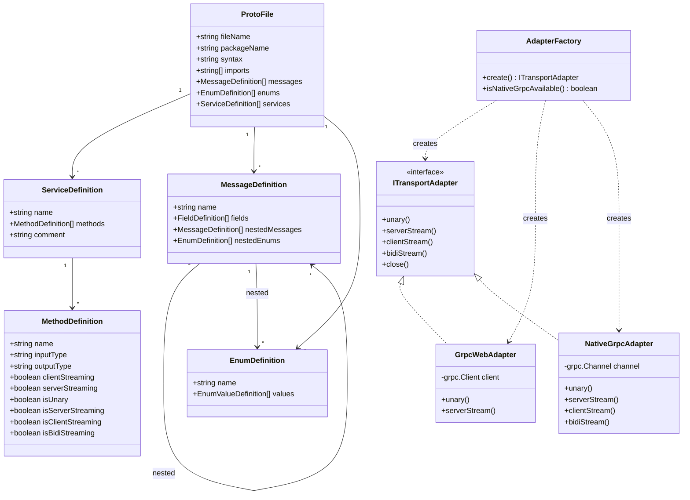
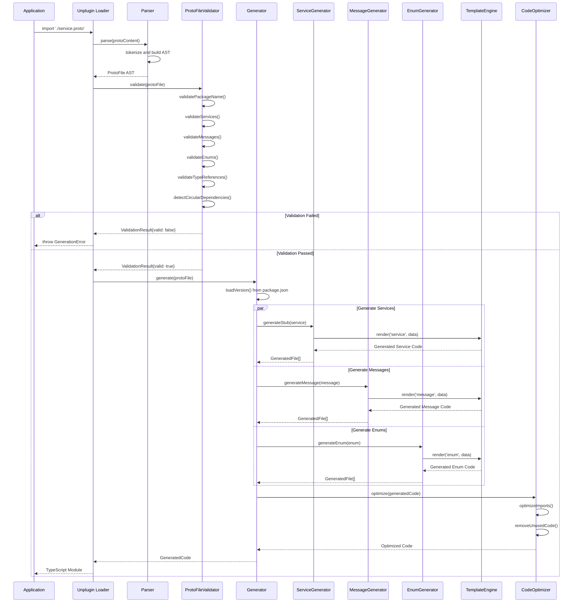
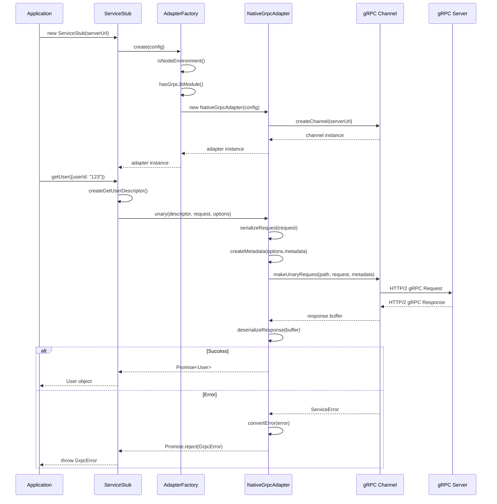
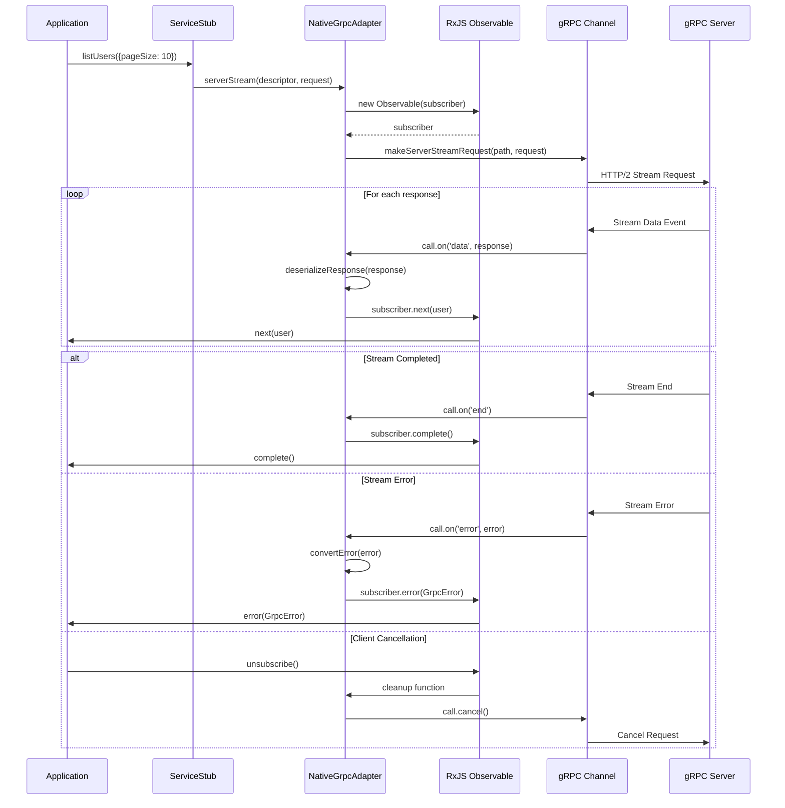
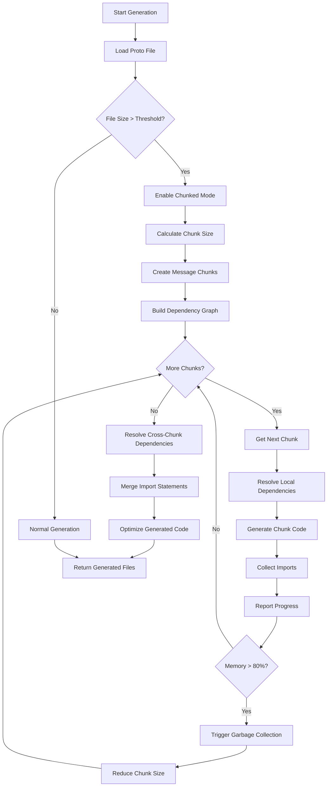
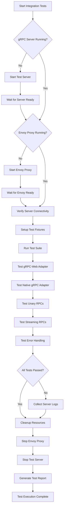

# Design Document: Hallow gRPC Project Enhancements

## Overview

This design document outlines the comprehensive technical architecture for enhancing the Hallow gRPC project, a seamless gRPC web client library that enables importing `.proto` files directly in TypeScript without code generation commands. The enhancements focus on migrating from `@improbable-eng/grpc-web` to the official `@grpc/grpc-js` implementation, improving code generation reliability, implementing full streaming support, and enhancing testing infrastructure.

### Design Goals

1. **Native gRPC Migration**: Migrate from grpc-web to native gRPC for better performance, full streaming support, and long-term maintainability
2. **Enhanced Reliability**: Implement comprehensive proto file validation and error handling
3. **Feature Completeness**: Support all gRPC streaming patterns (unary, server streaming, client streaming, bidirectional)
4. **Performance Optimization**: Implement chunked generation for memory efficiency with large proto files
5. **Developer Experience**: Improve error messages, documentation, and testing infrastructure
6. **Backward Compatibility**: Maintain existing APIs through adapter patterns during migration

### Project Scope

**Estimated Total Effort**: 60-90 hours

**Priority Requirements**:
- Native gRPC Migration (High Priority, 40-60 hours)
- Comprehensive Proto File Validation (High Priority, 4-6 hours)
- Automated Integration Test Infrastructure (High Priority, 8-12 hours)
- Streaming Method Implementation (Medium Priority, 8-12 hours)
- Message/Enum Chunked Generation (Medium Priority, 6-8 hours)
- Standalone Enum Generation (Medium Priority, 4-6 hours)
- Automatic Version Management (High Priority, 1 hour)

---

## Architecture Design

### System Architecture Diagram

```mermaid
graph TB
    subgraph "Build Time"
        Proto[.proto files] --> Parser[Parser<br/>ANTLR4TS]
        Parser --> AST[Proto AST]
        AST --> Generator[Generator]
        Generator --> Templates[Handlebars<br/>Templates]
        Templates --> Generated[Generated TS Code]
    end

    subgraph "Runtime - Client Adapters"
        Generated --> AdapterFactory[Adapter Factory]
        AdapterFactory --> GrpcWebAdapter[@improbable-eng/grpc-web]
        AdapterFactory --> NativeAdapter[@grpc/grpc-js]

        GrpcWebAdapter --> Envoy[Envoy Proxy<br/>:8080]
        NativeAdapter --> GrpcServer[gRPC Server<br/>:50051]

        Envoy --> GrpcServer
    end

    subgraph "React Integration"
        Generated --> ReactHooks[React Hooks]
        ReactHooks --> AdapterFactory
    end

    subgraph "Unplugin Integration"
        Vite[Vite] --> Unplugin[Unplugin]
        Webpack[Webpack] --> Unplugin
        ESBuild[ESBuild] --> Unplugin
        Unplugin --> Generator
    end

    style NativeAdapter fill:#90EE90
    style GrpcWebAdapter fill:#FFE4B5
```

### Data Flow Diagram



### Migration Architecture: Dual Adapter Pattern

```mermaid
graph TB
    subgraph "Application Layer"
        App[User Application Code]
    end

    subgraph "Generated Client Stubs"
        ServiceStub[ServiceStub Class]
        Methods[RPC Methods]
    end

    subgraph "Adapter Abstraction Layer"
        IAdapter[ITransportAdapter Interface]
        AdapterFactory[Adapter Factory]

        AdapterFactory --> GrpcWebAdapter[GrpcWebAdapter<br/>Legacy]
        AdapterFactory --> NativeGrpcAdapter[NativeGrpcAdapter<br/>New]
    end

    subgraph "Transport Layer"
        GrpcWebAdapter --> GrpcWebLib[@improbable-eng/grpc-web]
        NativeGrpcAdapter --> GrpcJsLib[@grpc/grpc-js]
    end

    App --> ServiceStub
    ServiceStub --> Methods
    Methods --> IAdapter
    IAdapter --> AdapterFactory

    style NativeGrpcAdapter fill:#90EE90
    style GrpcWebAdapter fill:#FFE4B5
```

---

## Component Design

### Component 1: Native gRPC Adapter

#### Overview

The Native gRPC Adapter is the core component for migrating from grpc-web to native gRPC. It implements the adapter pattern to provide a consistent interface while using the official `@grpc/grpc-js` library.

#### Responsibilities

- Provide a unified interface compatible with existing GrpcWebAdapter
- Handle unary, server streaming, client streaming, and bidirectional streaming RPCs
- Manage gRPC channels and connection lifecycle
- Convert between application errors and gRPC status codes
- Support metadata and deadline propagation
- Handle cancellation and resource cleanup

#### Interfaces

```typescript
/**
 * Transport adapter interface for gRPC communication
 * Both GrpcWebAdapter and NativeGrpcAdapter implement this interface
 */
interface ITransportAdapter {
  /**
   * Execute a unary RPC call
   */
  unary<TRequest, TResponse>(
    method: MethodDescriptor<TRequest, TResponse>,
    request: TRequest,
    options?: CallOptions
  ): Promise<TResponse>;

  /**
   * Execute a server streaming RPC call
   */
  serverStream<TRequest, TResponse>(
    method: MethodDescriptor<TRequest, TResponse>,
    request: TRequest,
    options?: CallOptions
  ): Observable<TResponse>;

  /**
   * Execute a client streaming RPC call
   */
  clientStream<TRequest, TResponse>(
    method: MethodDescriptor<TRequest, TResponse>,
    options?: CallOptions
  ): ClientStreamingCall<TRequest, TResponse>;

  /**
   * Execute a bidirectional streaming RPC call
   */
  bidiStream<TRequest, TResponse>(
    method: MethodDescriptor<TRequest, TResponse>,
    options?: CallOptions
  ): BidiStreamingCall<TRequest, TResponse>;

  /**
   * Close the adapter and clean up resources
   */
  close(): void;
}

/**
 * Method descriptor used by adapters
 */
interface MethodDescriptor<TRequest = any, TResponse = any> {
  serviceName: string;
  methodName: string;
  requestStream: boolean;
  responseStream: boolean;
  requestType: MessageType<TRequest>;
  responseType: MessageType<TResponse>;
}

/**
 * Message type with serialization methods
 */
interface MessageType<T> {
  deserializeBinary(bytes: Uint8Array): T;
  serializeBinary(message: T): Uint8Array;
}

/**
 * Call options for RPC methods
 */
interface CallOptions {
  timeout?: number;
  metadata?: Metadata;
  signal?: AbortSignal;
}

/**
 * Client streaming call interface
 */
interface ClientStreamingCall<TRequest, TResponse> {
  write(request: TRequest): void;
  end(): void;
  getResponse(): Promise<TResponse>;
  cancel(): void;
}

/**
 * Bidirectional streaming call interface
 */
interface BidiStreamingCall<TRequest, TResponse> {
  write(request: TRequest): void;
  end(): void;
  responses(): Observable<TResponse>;
  cancel(): void;
}
```

#### Dependencies

- `@grpc/grpc-js`: Official Node.js gRPC library
- `rxjs`: For Observable-based streaming API
- `google-protobuf`: For message serialization (existing dependency)

#### File Structure

```
packages/generator/src/adapters/
├── index.ts                          # Adapter exports
├── ITransportAdapter.ts              # Adapter interface definition
├── GrpcWebAdapter.ts                 # Existing grpc-web adapter
├── NativeGrpcAdapter.ts              # NEW: Native gRPC adapter
├── AdapterFactory.ts                 # NEW: Factory for adapter selection
├── metadata/
│   ├── MetadataConverter.ts          # NEW: Convert between metadata formats
│   └── index.ts
├── errors/
│   ├── GrpcError.ts                  # Enhanced error class
│   ├── StatusCodeMapper.ts           # NEW: Map gRPC status codes
│   └── index.ts
└── streaming/
    ├── StreamingTypes.ts             # NEW: Streaming type definitions
    ├── ClientStreamHandler.ts        # NEW: Client stream management
    ├── BidiStreamHandler.ts          # NEW: Bidi stream management
    └── index.ts
```

---

### Component 2: Adapter Factory

#### Overview

The Adapter Factory provides a centralized mechanism for creating the appropriate transport adapter based on runtime configuration and environment detection.

#### Responsibilities

- Detect runtime environment (Node.js vs Browser)
- Select appropriate adapter based on configuration
- Provide adapter instances with proper configuration
- Support adapter-specific options
- Enable gradual migration through feature flags

#### Interface

```typescript
/**
 * Adapter factory configuration
 */
interface AdapterFactoryConfig {
  /**
   * Preferred adapter type
   */
  adapterType?: 'grpc-web' | 'native' | 'auto';

  /**
   * Server URL
   */
  serverUrl: string;

  /**
   * Use TLS/SSL
   */
  secure?: boolean;

  /**
   * Default call options
   */
  defaultOptions?: CallOptions;

  /**
   * Enable native gRPC in Node.js (migration flag)
   */
  enableNativeGrpc?: boolean;
}

/**
 * Adapter factory class
 */
class AdapterFactory {
  /**
   * Create appropriate adapter based on configuration and environment
   */
  static create(config: AdapterFactoryConfig): ITransportAdapter {
    // Auto-detection logic
    if (config.adapterType === 'auto' || config.adapterType === undefined) {
      // Check if @grpc/grpc-js is available and we're in Node.js
      if (isNodeEnvironment() && config.enableNativeGrpc !== false) {
        return new NativeGrpcAdapter(config);
      } else {
        return new GrpcWebAdapter(config);
      }
    }

    // Explicit adapter selection
    if (config.adapterType === 'native') {
      if (!isNodeEnvironment()) {
        throw new Error('Native gRPC adapter requires Node.js environment');
      }
      return new NativeGrpcAdapter(config);
    }

    return new GrpcWebAdapter(config);
  }

  /**
   * Check if native gRPC is available
   */
  static isNativeGrpcAvailable(): boolean {
    return isNodeEnvironment() && hasGrpcJsModule();
  }
}
```

---

### Component 3: Proto File Validator

#### Overview

The Proto File Validator provides comprehensive validation of proto files before code generation, ensuring early detection of errors with actionable error messages.

#### Responsibilities

- Validate proto file structure and syntax
- Check package naming conventions
- Validate service and method definitions
- Verify message field types and references
- Detect circular dependencies
- Validate enum definitions
- Check import statements and dependencies
- Collect and report multiple validation errors

#### Interface

```typescript
/**
 * Validation result
 */
interface ValidationResult {
  valid: boolean;
  errors: ValidationError[];
  warnings: ValidationWarning[];
}

/**
 * Validation error
 */
interface ValidationError {
  code: ValidationErrorCode;
  message: string;
  location: SourceLocation;
  suggestion?: string;
}

/**
 * Validation error codes
 */
enum ValidationErrorCode {
  INVALID_PACKAGE_NAME = 'INVALID_PACKAGE_NAME',
  DUPLICATE_SERVICE_NAME = 'DUPLICATE_SERVICE_NAME',
  DUPLICATE_MESSAGE_NAME = 'DUPLICATE_MESSAGE_NAME',
  DUPLICATE_ENUM_NAME = 'DUPLICATE_ENUM_NAME',
  INVALID_FIELD_TYPE = 'INVALID_FIELD_TYPE',
  UNRESOLVED_TYPE_REFERENCE = 'UNRESOLVED_TYPE_REFERENCE',
  CIRCULAR_DEPENDENCY = 'CIRCULAR_DEPENDENCY',
  INVALID_IMPORT = 'INVALID_IMPORT',
  DUPLICATE_FIELD_NUMBER = 'DUPLICATE_FIELD_NUMBER',
  RESERVED_FIELD_NUMBER = 'RESERVED_FIELD_NUMBER',
  INVALID_ENUM_VALUE = 'INVALID_ENUM_VALUE',
}

/**
 * Source location for error reporting
 */
interface SourceLocation {
  file: string;
  line: number;
  column: number;
  context?: string; // Surrounding code for context
}

/**
 * Proto file validator class
 */
class ProtoFileValidator {
  /**
   * Validate a single proto file
   */
  validate(protoFile: ProtoFile): ValidationResult;

  /**
   * Validate multiple proto files with cross-file dependencies
   */
  validateMultiple(protoFiles: ProtoFile[]): ValidationResult;

  /**
   * Validate package name follows conventions
   */
  private validatePackageName(packageName: string): ValidationError[];

  /**
   * Validate service definitions
   */
  private validateServices(services: ServiceDefinition[]): ValidationError[];

  /**
   * Validate message definitions
   */
  private validateMessages(messages: MessageDefinition[]): ValidationError[];

  /**
   * Validate enum definitions
   */
  private validateEnums(enums: EnumDefinition[]): ValidationError[];

  /**
   * Validate field type references
   */
  private validateTypeReferences(
    messages: MessageDefinition[],
    protoFiles: ProtoFile[]
  ): ValidationError[];

  /**
   * Detect circular dependencies
   */
  private detectCircularDependencies(protoFiles: ProtoFile[]): ValidationError[];
}
```

#### Implementation Strategy

```typescript
// Integration into Generator
class Generator {
  private validator: ProtoFileValidator;

  constructor(options: GeneratorOptions) {
    // ... existing initialization
    this.validator = new ProtoFileValidator();
  }

  generate(protoFile: ProtoFile): GeneratedCode {
    // Validate before generation
    const validationResult = this.validator.validate(protoFile);

    if (!validationResult.valid) {
      throw new GenerationError(
        GenerationErrorCode.VALIDATION_FAILED,
        this.formatValidationErrors(validationResult.errors)
      );
    }

    // Log warnings
    if (validationResult.warnings.length > 0) {
      console.warn('Proto file validation warnings:', validationResult.warnings);
    }

    // Proceed with generation
    // ... existing generation logic
  }
}
```

---

### Component 4: Enhanced Service Generator

#### Overview

The Enhanced Service Generator generates type-safe service stubs with support for all streaming patterns and adapter selection.

#### Responsibilities

- Generate service stub classes with all RPC methods
- Support unary, server streaming, client streaming, and bidirectional streaming
- Integrate with adapter factory for transport selection
- Generate React hooks for each RPC method
- Generate TypeScript type definitions
- Include JSDoc comments and metadata

#### Template Structure

The service generator uses Handlebars templates for code generation:

```handlebars
{{!-- service.hbs --}}
/**
 * Generated gRPC service stub for {{serviceName}}
 * @generated by hallow-grpc-generator v{{version}}
 */

import { Observable } from 'rxjs';
import {
  ITransportAdapter,
  AdapterFactory,
  MethodDescriptor,
  CallOptions,
  ClientStreamingCall,
  BidiStreamingCall,
} from '@hallow/grpc-core';
{{#each imports}}
import { {{this.types}} } from '{{this.path}}';
{{/each}}

/**
 * {{serviceName}} service stub
 */
export class {{stubClassName}} {
  private adapter: ITransportAdapter;

  constructor(
    serverUrl: string,
    options?: {
      adapterType?: 'grpc-web' | 'native' | 'auto';
      enableNativeGrpc?: boolean;
      defaultCallOptions?: CallOptions;
    }
  ) {
    this.adapter = AdapterFactory.create({
      serverUrl,
      adapterType: options?.adapterType,
      enableNativeGrpc: options?.enableNativeGrpc,
      defaultOptions: options?.defaultCallOptions,
    });
  }

  {{#each methods}}
  {{#if this.isUnary}}
  /**
   * {{this.comment}}
   * @param request - {{this.requestType}}
   * @param options - Call options
   * @returns Promise<{{this.responseType}}>
   */
  async {{this.name}}(
    request: {{this.requestType}},
    options?: CallOptions
  ): Promise<{{this.responseType}}> {
    return this.adapter.unary(
      this.create{{this.methodName}}Descriptor(),
      request,
      options
    );
  }
  {{/if}}

  {{#if this.isServerStreaming}}
  /**
   * {{this.comment}}
   * @param request - {{this.requestType}}
   * @param options - Call options
   * @returns Observable<{{this.responseType}}>
   */
  {{this.name}}(
    request: {{this.requestType}},
    options?: CallOptions
  ): Observable<{{this.responseType}}> {
    return this.adapter.serverStream(
      this.create{{this.methodName}}Descriptor(),
      request,
      options
    );
  }
  {{/if}}

  {{#if this.isClientStreaming}}
  /**
   * {{this.comment}}
   * @param options - Call options
   * @returns ClientStreamingCall<{{this.requestType}}, {{this.responseType}}>
   */
  {{this.name}}(
    options?: CallOptions
  ): ClientStreamingCall<{{this.requestType}}, {{this.responseType}}> {
    return this.adapter.clientStream(
      this.create{{this.methodName}}Descriptor(),
      options
    );
  }
  {{/if}}

  {{#if this.isBidiStreaming}}
  /**
   * {{this.comment}}
   * @param options - Call options
   * @returns BidiStreamingCall<{{this.requestType}}, {{this.responseType}}>
   */
  {{this.name}}(
    options?: CallOptions
  ): BidiStreamingCall<{{this.requestType}}, {{this.responseType}}> {
    return this.adapter.bidiStream(
      this.create{{this.methodName}}Descriptor(),
      options
    );
  }
  {{/if}}

  private create{{this.methodName}}Descriptor(): MethodDescriptor<
    {{this.requestType}},
    {{this.responseType}}
  > {
    return {
      serviceName: '{{../serviceName}}',
      methodName: '{{this.protoMethodName}}',
      requestStream: {{this.requestStream}},
      responseStream: {{this.responseStream}},
      requestType: {{this.requestType}},
      responseType: {{this.responseType}},
    };
  }
  {{/each}}

  /**
   * Close the adapter and clean up resources
   */
  close(): void {
    this.adapter.close();
  }
}
```

---

### Component 5: Streaming Support

#### Overview

Comprehensive streaming support for all gRPC streaming patterns using RxJS Observables for consistency.

#### Stream Types

```typescript
/**
 * Server streaming - server sends multiple responses
 */
interface ServerStreamResponse<T> extends Observable<T> {
  /**
   * Get metadata after initial response
   */
  getMetadata(): Promise<Metadata>;

  /**
   * Get trailers after stream completes
   */
  getTrailers(): Promise<Metadata>;

  /**
   * Cancel the stream
   */
  cancel(): void;
}

/**
 * Client streaming - client sends multiple requests
 */
interface ClientStreamRequest<TRequest, TResponse> {
  /**
   * Write a request to the stream
   */
  write(request: TRequest): void;

  /**
   * Signal end of requests and wait for response
   */
  end(): Promise<TResponse>;

  /**
   * Cancel the stream
   */
  cancel(): void;

  /**
   * Check if stream is writable
   */
  readonly writable: boolean;
}

/**
 * Bidirectional streaming - both send multiple messages
 */
interface BidiStream<TRequest, TResponse> {
  /**
   * Write a request to the stream
   */
  write(request: TRequest): void;

  /**
   * Signal end of requests (still can receive responses)
   */
  end(): void;

  /**
   * Observable of responses
   */
  responses(): Observable<TResponse>;

  /**
   * Cancel the stream
   */
  cancel(): void;

  /**
   * Check if stream is writable
   */
  readonly writable: boolean;
}
```

#### Implementation Pattern

```typescript
// Native gRPC adapter streaming implementation
class NativeGrpcAdapter implements ITransportAdapter {
  serverStream<TRequest, TResponse>(
    method: MethodDescriptor<TRequest, TResponse>,
    request: TRequest,
    options?: CallOptions
  ): Observable<TResponse> {
    return new Observable(subscriber => {
      const call = this.client.makeServerStreamRequest(
        `/${method.serviceName}/${method.methodName}`,
        (arg: TRequest) => method.requestType.serializeBinary(arg),
        (bytes: Buffer) => method.responseType.deserializeBinary(new Uint8Array(bytes)),
        request,
        this.createMetadata(options?.metadata)
      );

      // Handle data events
      call.on('data', (response: TResponse) => {
        subscriber.next(response);
      });

      // Handle completion
      call.on('end', () => {
        subscriber.complete();
      });

      // Handle errors
      call.on('error', (error: grpc.ServiceError) => {
        subscriber.error(this.convertError(error));
      });

      // Cleanup on unsubscribe
      return () => {
        call.cancel();
      };
    });
  }
}
```

---

### Component 6: Memory-Efficient Generator Enhancement

#### Overview

Enhance the existing MemoryEfficientGenerator to support chunked processing of messages and enums.

#### Responsibilities

- Process large proto files in configurable chunks
- Maintain dependency resolution across chunks
- Monitor memory usage and adjust chunk size dynamically
- Provide progress reporting
- Generate code incrementally without loading entire AST in memory

#### Enhanced Interface

```typescript
/**
 * Enhanced memory-efficient generator
 */
class MemoryEfficientGenerator {
  /**
   * Generate messages in chunks
   */
  async *generateMessagesInChunks(
    messages: MessageDefinition[],
    chunkSize: number
  ): AsyncGenerator<GeneratedFile[], void, unknown> {
    const chunks = this.createChunks(messages, chunkSize);

    for (let i = 0; i < chunks.length; i++) {
      const chunk = chunks[i];
      const metadata: ChunkMetadata = {
        index: i,
        totalChunks: chunks.length,
        itemCount: chunk.length,
        memoryUsage: process.memoryUsage().heapUsed,
        startTime: Date.now(),
      };

      // Generate code for chunk
      const files = await this.messageGenerator.generateChunk(chunk);

      metadata.endTime = Date.now();
      this.reportProgress(metadata);

      yield files;

      // Force GC if needed
      if (this.shouldTriggerGC()) {
        global.gc?.();
      }
    }
  }

  /**
   * Generate enums in chunks
   */
  async *generateEnumsInChunks(
    enums: EnumDefinition[],
    chunkSize: number
  ): AsyncGenerator<GeneratedFile[], void, unknown> {
    // Similar to generateMessagesInChunks
  }

  /**
   * Resolve dependencies across chunks
   */
  private resolveCrossChunkDependencies(
    chunks: MessageDefinition[][],
    allMessages: MessageDefinition[]
  ): Map<string, string[]> {
    // Build dependency graph
    // Return map of message name -> dependent message names
  }
}
```

---

### Component 7: Standalone Enum Generator

#### Overview

Generate TypeScript enum definitions for top-level proto enums with proper scoping for nested enums.

#### Responsibilities

- Generate TypeScript enums for top-level proto enums
- Generate scoped enums for nested enums within messages
- Handle enum value conflicts
- Provide serialization/deserialization utilities
- Generate type guards for enum validation

#### Template Structure

```handlebars
{{!-- enum.hbs --}}
/**
 * Enum: {{enumName}}
 * {{#if comment}}
 * {{comment}}
 * {{/if}}
 * @generated by hallow-grpc-generator v{{version}}
 */
export enum {{enumName}} {
  {{#each values}}
  {{#if this.comment}}
  /**
   * {{this.comment}}
   */
  {{/if}}
  {{this.name}} = {{this.number}},
  {{/each}}
}

/**
 * Helper to check if a value is a valid {{enumName}}
 */
export function is{{enumName}}(value: any): value is {{enumName}} {
  return typeof value === 'number' && value in {{enumName}};
}

/**
 * Helper to convert from number to {{enumName}}
 */
export function to{{enumName}}(value: number): {{enumName}} | undefined {
  return is{{enumName}}(value) ? value : undefined;
}

/**
 * Helper to get enum name from value
 */
export function get{{enumName}}Name(value: {{enumName}}): string {
  return {{enumName}}[value];
}
```

#### Implementation

```typescript
class EnumGenerator {
  /**
   * Generate enum code from proto enum definition
   */
  generateEnum(enumDef: EnumDefinition, context: GenerationContext): string {
    const templateData = {
      enumName: this.nameResolver.resolveEnumName(enumDef.name),
      comment: enumDef.comment,
      values: enumDef.values.map(v => ({
        name: this.nameResolver.resolveEnumValueName(v.name),
        number: v.number,
        comment: v.comment,
      })),
      version: context.version,
    };

    return this.templateEngine.render('enum', templateData);
  }

  /**
   * Generate nested enum within message namespace
   */
  generateNestedEnum(
    enumDef: EnumDefinition,
    parentMessage: MessageDefinition,
    context: GenerationContext
  ): string {
    // Generate with proper namespace scoping
    const namespace = this.nameResolver.resolveMessageNamespace(parentMessage);
    // ... similar to generateEnum but with namespace
  }
}
```

---

## Data Model

### Core Data Structures

```typescript
/**
 * Proto file representation (existing)
 */
interface ProtoFile {
  fileName: string;
  packageName: string;
  syntax: 'proto3';
  imports: string[];
  messages: MessageDefinition[];
  enums: EnumDefinition[];
  services: ServiceDefinition[];
  options: Record<string, any>;
}

/**
 * Service definition (existing)
 */
interface ServiceDefinition {
  name: string;
  methods: MethodDefinition[];
  comment?: string;
  options: Record<string, any>;
}

/**
 * Method definition (existing, enhanced)
 */
interface MethodDefinition {
  name: string;
  inputType: string;
  outputType: string;
  clientStreaming: boolean;
  serverStreaming: boolean;
  comment?: string;
  options: Record<string, any>;

  // NEW: Helper properties for template generation
  isUnary: boolean;
  isServerStreaming: boolean;
  isClientStreaming: boolean;
  isBidiStreaming: boolean;
}

/**
 * Message definition (existing)
 */
interface MessageDefinition {
  name: string;
  fields: FieldDefinition[];
  nestedMessages: MessageDefinition[];
  nestedEnums: EnumDefinition[];
  oneofs: OneofDefinition[];
  comment?: string;
  options: Record<string, any>;
}

/**
 * Enum definition (existing)
 */
interface EnumDefinition {
  name: string;
  values: EnumValueDefinition[];
  comment?: string;
  options: Record<string, any>;
}

/**
 * Generation context (NEW)
 */
interface GenerationContext {
  protoFile: ProtoFile;
  version: string;
  options: GeneratorOptions;
  allProtoFiles?: ProtoFile[];
  importResolver: ImportResolver;
  typeMapper: TypeMapper;
}

/**
 * Adapter configuration (NEW)
 */
interface AdapterConfig {
  serverUrl: string;
  adapterType: 'grpc-web' | 'native' | 'auto';
  enableNativeGrpc: boolean;
  secure: boolean;
  defaultCallOptions?: CallOptions;
  channelOptions?: ChannelOptions;
}
```

### Data Model Diagram



---

## Business Process

### Process 1: Proto File Import and Code Generation

This process describes the complete flow from proto file import to generated TypeScript code.



### Process 2: Native gRPC Unary RPC Call

This process shows how a unary RPC call flows through the native gRPC adapter.



### Process 3: Server Streaming RPC Call

This process demonstrates server streaming with proper resource management.



### Process 4: Chunked Message Generation

This process shows memory-efficient chunked generation for large proto files.



### Process 5: Integration Test Execution

This process describes the automated integration test infrastructure.



---

## Error Handling Strategy

### Error Type Hierarchy

```typescript
/**
 * Base gRPC error class
 */
class GrpcError extends Error {
  constructor(
    public code: GrpcStatusCode,
    message: string,
    public metadata?: Metadata,
    public details?: any
  ) {
    super(message);
    this.name = 'GrpcError';
  }

  /**
   * Check if error is a specific status code
   */
  is(code: GrpcStatusCode): boolean {
    return this.code === code;
  }

  /**
   * Get human-readable error description
   */
  getDescription(): string {
    return GrpcStatusCodeDescriptions[this.code] || 'Unknown error';
  }
}

/**
 * gRPC status codes
 */
enum GrpcStatusCode {
  OK = 0,
  CANCELLED = 1,
  UNKNOWN = 2,
  INVALID_ARGUMENT = 3,
  DEADLINE_EXCEEDED = 4,
  NOT_FOUND = 5,
  ALREADY_EXISTS = 6,
  PERMISSION_DENIED = 7,
  RESOURCE_EXHAUSTED = 8,
  FAILED_PRECONDITION = 9,
  ABORTED = 10,
  OUT_OF_RANGE = 11,
  UNIMPLEMENTED = 12,
  INTERNAL = 13,
  UNAVAILABLE = 14,
  DATA_LOSS = 15,
  UNAUTHENTICATED = 16,
}

/**
 * Generation error (build-time errors)
 */
class GenerationError extends Error {
  constructor(
    public code: GenerationErrorCode,
    message: string,
    public location?: SourceLocation
  ) {
    super(message);
    this.name = 'GenerationError';
  }
}

enum GenerationErrorCode {
  VALIDATION_FAILED = 'VALIDATION_FAILED',
  TEMPLATE_ERROR = 'TEMPLATE_ERROR',
  IMPORT_RESOLUTION_FAILED = 'IMPORT_RESOLUTION_FAILED',
  TYPE_RESOLUTION_FAILED = 'TYPE_RESOLUTION_FAILED',
  CIRCULAR_DEPENDENCY = 'CIRCULAR_DEPENDENCY',
}
```

### Error Handling Patterns

#### 1. Validation Errors

```typescript
// Collect multiple validation errors before failing
class ProtoFileValidator {
  validate(protoFile: ProtoFile): ValidationResult {
    const errors: ValidationError[] = [];

    // Collect all errors instead of failing fast
    errors.push(...this.validatePackageName(protoFile.packageName));
    errors.push(...this.validateServices(protoFile.services));
    errors.push(...this.validateMessages(protoFile.messages));

    return {
      valid: errors.length === 0,
      errors,
      warnings: [],
    };
  }
}

// Usage in generator
if (!validationResult.valid) {
  const errorMessage = validationResult.errors
    .map(e => `${e.location.file}:${e.location.line} - ${e.message}`)
    .join('\n');

  throw new GenerationError(
    GenerationErrorCode.VALIDATION_FAILED,
    `Proto file validation failed:\n${errorMessage}`
  );
}
```

#### 2. RPC Errors with Retry Logic

```typescript
// Adapter with automatic retry for transient failures
class NativeGrpcAdapter {
  async unary<TRequest, TResponse>(
    method: MethodDescriptor<TRequest, TResponse>,
    request: TRequest,
    options?: CallOptions
  ): Promise<TResponse> {
    const maxRetries = 3;
    const retryableCodes = [
      GrpcStatusCode.UNAVAILABLE,
      GrpcStatusCode.DEADLINE_EXCEEDED,
    ];

    for (let attempt = 0; attempt <= maxRetries; attempt++) {
      try {
        return await this.executeUnaryCall(method, request, options);
      } catch (error) {
        if (error instanceof GrpcError && retryableCodes.includes(error.code)) {
          if (attempt < maxRetries) {
            // Exponential backoff
            const delay = Math.pow(2, attempt) * 100;
            await this.sleep(delay);
            continue;
          }
        }
        throw error;
      }
    }

    throw new GrpcError(
      GrpcStatusCode.DEADLINE_EXCEEDED,
      'Max retries exceeded'
    );
  }
}
```

#### 3. Stream Error Handling

```typescript
// Proper error propagation in streams
serverStream<TRequest, TResponse>(
  method: MethodDescriptor<TRequest, TResponse>,
  request: TRequest,
  options?: CallOptions
): Observable<TResponse> {
  return new Observable(subscriber => {
    let call: grpc.ClientReadableStream<TResponse>;

    try {
      call = this.createServerStreamCall(method, request, options);

      call.on('data', (response) => {
        try {
          subscriber.next(response);
        } catch (error) {
          // Handle subscriber errors
          subscriber.error(error);
          call.cancel();
        }
      });

      call.on('error', (error) => {
        subscriber.error(this.convertError(error));
      });

      call.on('end', () => {
        subscriber.complete();
      });

    } catch (error) {
      // Handle setup errors
      subscriber.error(error);
    }

    // Cleanup function
    return () => {
      if (call && !call.destroyed) {
        call.cancel();
      }
    };
  });
}
```

#### 4. Resource Cleanup

```typescript
// Ensure resources are cleaned up even on errors
class ServiceStub {
  private adapter: ITransportAdapter;
  private activeStreams: Set<any> = new Set();

  async dispose(): Promise<void> {
    // Cancel all active streams
    for (const stream of this.activeStreams) {
      try {
        stream.cancel();
      } catch (error) {
        console.error('Error cancelling stream:', error);
      }
    }
    this.activeStreams.clear();

    // Close adapter
    try {
      this.adapter.close();
    } catch (error) {
      console.error('Error closing adapter:', error);
    }
  }
}
```

---

## Testing Strategy

### Unit Testing

```typescript
describe('NativeGrpcAdapter', () => {
  let adapter: NativeGrpcAdapter;

  beforeEach(() => {
    adapter = new NativeGrpcAdapter({
      serverUrl: 'localhost:50051',
      secure: false,
    });
  });

  afterEach(() => {
    adapter.close();
  });

  describe('unary', () => {
    it('should successfully execute unary RPC', async () => {
      const request = { userId: '123' };
      const response = await adapter.unary(getUserDescriptor, request);

      expect(response).toBeDefined();
      expect(response.userId).toBe('123');
    });

    it('should throw GrpcError on NOT_FOUND', async () => {
      const request = { userId: 'nonexistent' };

      await expect(
        adapter.unary(getUserDescriptor, request)
      ).rejects.toThrow(GrpcError);
    });
  });

  describe('serverStream', () => {
    it('should stream multiple responses', (done) => {
      const responses: User[] = [];
      const request = { pageSize: 10 };

      adapter.serverStream(listUsersDescriptor, request).subscribe({
        next: (user) => responses.push(user),
        error: done.fail,
        complete: () => {
          expect(responses.length).toBeGreaterThan(0);
          done();
        },
      });
    });
  });
});
```

### Integration Testing

```typescript
describe('Integration: Native gRPC', () => {
  let server: TestGrpcServer;
  let stub: UserServiceStub;

  beforeAll(async () => {
    // Start test server automatically
    server = await TestGrpcServer.start({
      port: 50051,
      services: [UserService],
    });

    stub = new UserServiceStub('localhost:50051', {
      adapterType: 'native',
    });
  });

  afterAll(async () => {
    stub.close();
    await server.stop();
  });

  it('should execute end-to-end unary call', async () => {
    const user = await stub.getUser({ userId: '123' });
    expect(user.name).toBe('Test User');
  });

  it('should handle server streaming', (done) => {
    const users: User[] = [];

    stub.listUsers({ pageSize: 10 }).subscribe({
      next: (user) => users.push(user),
      complete: () => {
        expect(users.length).toBe(10);
        done();
      },
    });
  });
});
```

### Performance Testing

```typescript
describe('Performance: Chunked Generation', () => {
  it('should process large proto file within memory limit', async () => {
    const largeProtoFile = generateLargeProtoFile(1000); // 1000 messages
    const generator = new MemoryEfficientGenerator({
      memoryLimit: 500 * 1024 * 1024, // 500MB
      chunkSize: 50,
    });

    const initialMemory = process.memoryUsage().heapUsed;

    for await (const files of generator.generateInChunks(largeProtoFile)) {
      const currentMemory = process.memoryUsage().heapUsed;
      const memoryIncrease = currentMemory - initialMemory;

      expect(memoryIncrease).toBeLessThan(500 * 1024 * 1024);
    }
  });
});
```

---

## Migration Strategy

### Phase 1: Foundation (Week 1-2)

**Goal**: Set up adapter infrastructure and validation

**Tasks**:
1. Implement `ITransportAdapter` interface
2. Create `AdapterFactory` with auto-detection
3. Implement `ProtoFileValidator` with comprehensive checks
4. Add automatic version management
5. Set up integration test infrastructure

**Deliverables**:
- Working adapter abstraction layer
- Comprehensive proto file validation
- Automated test setup

### Phase 2: Native gRPC Core (Week 3-6)

**Goal**: Implement native gRPC adapter with unary and server streaming support

**Tasks**:
1. Install `@grpc/grpc-js` dependency
2. Implement `NativeGrpcAdapter` class
3. Implement unary RPC method
4. Implement server streaming RPC method
5. Error handling and status code mapping
6. Metadata conversion utilities
7. Unit tests for adapter

**Deliverables**:
- Working `NativeGrpcAdapter` for unary and server streaming
- Comprehensive error handling
- Full test coverage

### Phase 3: Template Integration (Week 7-8)

**Goal**: Update service generator templates to support adapter selection

**Tasks**:
1. Update `service.hbs` template with adapter factory
2. Add streaming method generation
3. Update React hooks template
4. Generate method descriptors
5. Integration tests with both adapters

**Deliverables**:
- Updated templates supporting both adapters
- Generated code works with adapter factory
- React hooks support both adapters

### Phase 4: Streaming Completeness (Week 9-10)

**Goal**: Implement client streaming and bidirectional streaming

**Tasks**:
1. Implement client streaming in `NativeGrpcAdapter`
2. Implement bidirectional streaming
3. Add streaming tests
4. Document streaming patterns

**Deliverables**:
- Full streaming support in native adapter
- Comprehensive streaming tests

### Phase 5: Performance & Polish (Week 11-12)

**Goal**: Optimize performance and finalize documentation

**Tasks**:
1. Enhance `MemoryEfficientGenerator` for messages and enums
2. Implement standalone enum generator
3. Performance benchmarking
4. Documentation updates
5. Migration guide

**Deliverables**:
- Optimized code generation
- Complete documentation
- Migration guide for users

### Backward Compatibility Strategy

```typescript
// Generated service stub supports both adapters
export class UserServiceStub {
  constructor(
    serverUrl: string,
    options?: {
      // Legacy option - defaults to 'auto' for automatic selection
      useLegacyAdapter?: boolean;

      // New option - explicit adapter selection
      adapterType?: 'grpc-web' | 'native' | 'auto';

      // Feature flag for gradual rollout
      enableNativeGrpc?: boolean;
    }
  ) {
    // Backward compatible logic
    const adapterType = options?.useLegacyAdapter
      ? 'grpc-web'
      : (options?.adapterType || 'auto');

    this.adapter = AdapterFactory.create({
      serverUrl,
      adapterType,
      enableNativeGrpc: options?.enableNativeGrpc,
    });
  }
}
```

---

## Implementation Roadmap

### Quick Wins (Week 1)

| Task | Hours | Priority |
|------|-------|----------|
| Automatic version management | 1 | High |
| Unused import cleanup | 0.25 | Low |
| Type documentation | 0.5 | Low |
| Setup integration test infrastructure | 4 | High |
| **Total** | **5.75** | |

### Validation & Foundation (Week 2-3)

| Task | Hours | Priority |
|------|-------|----------|
| Proto file validator implementation | 6 | High |
| Validation error reporting | 2 | High |
| Standalone enum generator | 6 | Medium |
| Enhanced enum templates | 2 | Medium |
| **Total** | **16** | |

### Native gRPC Core (Week 4-7)

| Task | Hours | Priority |
|------|-------|----------|
| Install dependencies & research | 4 | High |
| ITransportAdapter interface | 2 | High |
| AdapterFactory implementation | 3 | High |
| NativeGrpcAdapter unary RPCs | 8 | High |
| NativeGrpcAdapter server streaming | 6 | High |
| Error handling & status codes | 4 | High |
| Metadata conversion | 3 | High |
| Unit tests | 8 | High |
| Integration tests | 6 | High |
| **Total** | **44** | |

### Template & Streaming (Week 8-10)

| Task | Hours | Priority |
|------|-------|----------|
| Update service.hbs template | 4 | High |
| React hooks integration | 6 | High |
| Client streaming implementation | 5 | Medium |
| Bidirectional streaming | 5 | Medium |
| Streaming integration tests | 6 | Medium |
| **Total** | **26** | |

### Performance & Polish (Week 11-12)

| Task | Hours | Priority |
|------|-------|----------|
| Enhance MemoryEfficientGenerator | 4 | Medium |
| Chunked message generation | 3 | Medium |
| Chunked enum generation | 2 | Medium |
| Import manager API enhancement | 3 | Low |
| Debug code cleanup | 4 | Medium |
| Documentation updates | 6 | Low |
| **Total** | **22** | |

**Grand Total**: 113.75 hours (~14 days of full-time work)

---

## Conclusion

This design document provides a comprehensive architecture for enhancing the Hallow gRPC project with native gRPC support, improved validation, full streaming capabilities, and better developer experience. The key architectural decisions include:

1. **Adapter Pattern**: Enables seamless migration from grpc-web to native gRPC while maintaining backward compatibility
2. **Comprehensive Validation**: Early detection of proto file errors with actionable error messages
3. **Streaming First**: Full support for all gRPC streaming patterns using RxJS Observables
4. **Memory Efficiency**: Chunked processing for large proto files with dynamic memory management
5. **Template-Based Generation**: Leverages existing Handlebars template system for maintainable code generation
6. **Test Automation**: Automated integration test infrastructure for reliable CI/CD

The phased implementation approach allows for incremental delivery of value while minimizing risk. The backward compatibility strategy ensures existing applications continue to work while allowing gradual adoption of native gRPC features.

### Next Steps

1. **Review and Approval**: Stakeholders review this design document
2. **Spike & Research**: Validate technical approaches with proof-of-concept implementations
3. **Implementation**: Follow the roadmap outlined in this document
4. **Testing & Validation**: Comprehensive testing at each phase
5. **Documentation**: Update user-facing documentation and migration guides
6. **Deployment**: Gradual rollout with feature flags

---

**Document Version**: 1.0
**Last Updated**: 2025-10-27
**Authors**: Claude Code (AI Assistant)
**Status**: Draft - Pending Review
