# Implementation Tasks: Hallow gRPC Project Enhancements

## Overview

This document provides a comprehensive implementation plan for enhancing the Hallow gRPC project with native gRPC support, improved validation, full streaming capabilities, and optimized code generation.

**Total Estimated Effort**: ~114 hours (14 days)
**Implementation Timeline**: 12 weeks

**Key Features**:
- Native gRPC migration with dual adapter pattern
- Comprehensive proto file validation
- Full streaming support (unary, server streaming, client streaming, bidirectional)
- Memory-efficient chunked generation
- Standalone enum generation
- Automated integration testing

---

## Phase 1: Quick Wins (Week 1) - 5.75 hours

### Version Management & Setup

- [x] 1. Implement automatic version loading from package.json
  - Create utility function to read version from `packages/generator/package.json`
  - Add error handling for missing or invalid package.json
  - Integrate version loading into Generator constructor at `packages/generator/src/core/generator.ts:180`
  - Update all generated code headers to include the loaded version
  - Write unit tests for version loading edge cases (missing file, invalid JSON, no version field)
  - _Time: 1 hour_
  - _Requirements: 1.1_
  - _Files: packages/generator/src/core/generator.ts, packages/generator/src/utils/VersionLoader.ts (new)_

- [x] 2. Clean up unused imports in MessageGenerator
  - Remove unused `GenerationError` and `GenerationErrorCode` imports from `packages/generator/src/generators/MessageGenerator.ts:17`
  - Run ESLint to verify no unused import warnings remain
  - Commit changes with descriptive message
  - _Time: 0.25 hours_
  - _Requirements: 1.4_
  - _Files: packages/generator/src/generators/MessageGenerator.ts_

- [x] 3. Document reserved types in NameResolver
  - Add JSDoc comments to reserved types in `packages/generator/src/utils/NameResolver.ts:8`
  - Document intended future use cases or mark for removal
  - Link to any related feature requests or design documents
  - _Time: 0.5 hours_
  - _Requirements: 1.6_
  - _Files: packages/generator/src/utils/NameResolver.ts_

### Integration Test Infrastructure

- [ ] 4. Set up automated test server management
- [ ] 4.1 Create TestGrpcServer class for lifecycle management
  - Implement `TestGrpcServer.start()` with configurable port and services
  - Implement `TestGrpcServer.stop()` with proper cleanup
  - Add health check endpoint to verify server readiness
  - Handle port conflicts and provide clear error messages
  - Write unit tests for server lifecycle
  - _Time: 2 hours_
  - _Requirements: 3.1_
  - _Files: packages/test-server/src/TestGrpcServer.ts (new), packages/test-server/src/services/HealthService.ts (new)_

- [ ] 4.2 Create docker-compose configuration for test infrastructure
  - Define gRPC test server service in docker-compose.yml
  - Define Envoy proxy service with proper gRPC-web configuration
  - Configure network connectivity between services
  - Add volume mounts for proto files and configuration
  - Document local development setup in README
  - _Time: 1.5 hours_
  - _Requirements: 3.1_
  - _Files: packages/test-server/docker-compose.yml (new), packages/test-server/envoy.yaml (new)_

- [ ] 4.3 Update integration tests to use automated test infrastructure
  - Modify `beforeAll` hooks to start test server and Envoy
  - Modify `afterAll` hooks to stop and clean up services
  - Add connection verification before running tests
  - Implement test isolation with separate database/state per test
  - Update `packages/generator/tests/integration/grpc-web-integration.test.ts:39`
  - _Time: 0.5 hours_
  - _Requirements: 3.1_
  - _Files: packages/generator/tests/integration/setup.ts (new), packages/generator/tests/integration/grpc-web-integration.test.ts_

---

## Phase 2: Validation & Foundation (Week 2-3) - 16 hours

### Proto File Validation System

- [ ] 5. Implement comprehensive proto file validator
- [ ] 5.1 Create validation framework and error types
  - Define `ValidationResult`, `ValidationError`, and `ValidationWarning` interfaces
  - Create `ValidationErrorCode` enum with all error types
  - Implement `SourceLocation` interface for error reporting
  - Create `ProtoFileValidator` class skeleton
  - Write utility functions for error formatting and collection
  - _Time: 1.5 hours_
  - _Requirements: 1.2_
  - _Files: packages/generator/src/validation/types.ts (new), packages/generator/src/validation/ProtoFileValidator.ts (new)_

- [ ] 5.2 Implement package name validation
  - Add `validatePackageName()` method to check naming conventions
  - Validate lowercase, dot-separated identifier format
  - Detect and report invalid characters
  - Write unit tests for valid and invalid package names
  - _Time: 0.75 hours_
  - _Requirements: 1.2_
  - _Files: packages/generator/src/validation/ProtoFileValidator.ts_

- [ ] 5.3 Implement service and method validation
  - Add `validateServices()` method to check service definitions
  - Validate unique service names within file
  - Validate method names and signatures
  - Check for duplicate method names within services
  - Write unit tests for service validation scenarios
  - _Time: 1 hour_
  - _Requirements: 1.2_
  - _Files: packages/generator/src/validation/ProtoFileValidator.ts_

- [ ] 5.4 Implement message field validation
  - Add `validateMessages()` method to check message definitions
  - Validate field types reference valid message types, enums, or scalars
  - Check for duplicate field numbers within messages
  - Validate reserved field numbers and names
  - Write unit tests for message validation scenarios
  - _Time: 1.5 hours_
  - _Requirements: 1.2_
  - _Files: packages/generator/src/validation/ProtoFileValidator.ts_

- [ ] 5.5 Implement enum validation
  - Add `validateEnums()` method to check enum definitions
  - Validate unique enum values within each enum
  - Check for duplicate enum names
  - Validate enum value ranges
  - Write unit tests for enum validation scenarios
  - _Time: 0.75 hours_
  - _Requirements: 1.2_
  - _Files: packages/generator/src/validation/ProtoFileValidator.ts_

- [ ] 5.6 Implement type reference validation
  - Add `validateTypeReferences()` method to check custom types
  - Validate message field types exist in current or imported files
  - Build type registry from all available proto files
  - Report unresolved type references with suggestions
  - Write unit tests for type resolution scenarios
  - _Time: 1.5 hours_
  - _Requirements: 1.2_
  - _Files: packages/generator/src/validation/ProtoFileValidator.ts, packages/generator/src/validation/TypeRegistry.ts (new)_

- [ ] 5.7 Implement circular dependency detection
  - Add `detectCircularDependencies()` method
  - Build import dependency graph
  - Use DFS algorithm to detect cycles
  - Report circular dependencies with full import chain
  - Write unit tests for circular dependency scenarios
  - _Time: 1.5 hours_
  - _Requirements: 1.2_
  - _Files: packages/generator/src/validation/ProtoFileValidator.ts, packages/generator/src/validation/DependencyGraph.ts (new)_

- [ ] 5.8 Integrate validator into Generator
  - Import and instantiate `ProtoFileValidator` in Generator constructor
  - Call `validator.validate()` before code generation in `packages/generator/src/core/generator.ts:491`
  - Throw `GenerationError` with formatted validation errors if validation fails
  - Log validation warnings to console
  - Write integration tests for validation in generation workflow
  - _Time: 1 hour_
  - _Requirements: 1.2_
  - _Files: packages/generator/src/core/generator.ts_

### Standalone Enum Generator

- [ ] 6. Implement standalone enum generation
- [ ] 6.1 Create EnumGenerator class
  - Create `EnumGenerator` class with template-based generation
  - Implement `generateEnum()` method for top-level enums
  - Implement `generateNestedEnum()` method for enums within messages
  - Add proper TypeScript enum syntax generation
  - Add enum helper functions (type guards, converters)
  - _Time: 2 hours_
  - _Requirements: 2.4_
  - _Files: packages/generator/src/generators/EnumGenerator.ts (new)_

- [ ] 6.2 Create enum Handlebars template
  - Create `enum.hbs` template with TypeScript enum syntax
  - Add JSDoc comments and metadata
  - Include helper functions (is[EnumName], to[EnumName], get[EnumName]Name)
  - Support nested enum namespace scoping
  - Test template rendering with sample data
  - _Time: 1.5 hours_
  - _Requirements: 2.4_
  - _Files: packages/generator/templates/enum.hbs (new)_

- [ ] 6.3 Integrate enum generation into Generator
  - Update `generate()` method in `packages/generator/src/core/generator.ts:281` to process top-level enums
  - Generate separate files for top-level enums
  - Generate nested enums within message namespace
  - Handle enum name conflicts with messages
  - Write unit tests for enum generation
  - _Time: 1.5 hours_
  - _Requirements: 2.4_
  - _Files: packages/generator/src/core/generator.ts_

- [ ] 6.4 Add enum serialization/deserialization support
  - Update message serialization to handle enum fields correctly
  - Convert between proto enum integers and TypeScript enum values
  - Add runtime validation for enum values
  - Write integration tests for enum usage in messages
  - _Time: 1 hour_
  - _Requirements: 2.4_
  - _Files: packages/generator/templates/message.hbs, packages/generator/src/generators/MessageGenerator.ts_

---

## Phase 3: Native gRPC Core Implementation (Week 4-7) - 44 hours

### Research & Adapter Foundation

- [ ] 7. Spike and research native gRPC integration
- [ ] 7.1 Install @grpc/grpc-js and RxJS dependencies
  - Add `@grpc/grpc-js` as dependency to generator package
  - Add `rxjs` as dependency for Observable-based streaming
  - Update package.json and install dependencies
  - Verify compatibility with existing dependencies
  - _Time: 0.5 hours_
  - _Requirements: 2.1_
  - _Files: packages/generator/package.json_

- [ ] 7.2 Create spike implementation for unary RPC
  - Create proof-of-concept unary RPC call using `@grpc/grpc-js`
  - Test serialization/deserialization with `google-protobuf`
  - Validate metadata and error handling patterns
  - Document findings and architectural decisions
  - _Time: 2 hours_
  - _Requirements: 2.1_
  - _Files: .claude/specs/project-enhancements/spike-native-grpc.md (new), packages/generator/spike/native-grpc-poc.ts (new)_

- [ ] 7.3 Create spike implementation for server streaming
  - Create proof-of-concept server streaming using `@grpc/grpc-js`
  - Test Observable wrapper for stream events
  - Validate cancellation and cleanup patterns
  - Document streaming patterns and best practices
  - _Time: 1.5 hours_
  - _Requirements: 2.1, 2.2_
  - _Files: packages/generator/spike/streaming-poc.ts (new)_

### Adapter Interface & Factory

- [ ] 8. Design and implement adapter abstraction layer
- [ ] 8.1 Create ITransportAdapter interface
  - Define interface with methods for all RPC patterns (unary, serverStream, clientStream, bidiStream, close)
  - Define supporting interfaces: `MethodDescriptor`, `MessageType`, `CallOptions`
  - Define streaming interfaces: `ClientStreamingCall`, `BidiStreamingCall`
  - Add comprehensive JSDoc comments
  - _Time: 1 hour_
  - _Requirements: 2.1_
  - _Files: packages/generator/src/adapters/ITransportAdapter.ts (new), packages/generator/src/adapters/types.ts (new)_

- [ ] 8.2 Implement AdapterFactory
  - Create `AdapterFactory` class with static `create()` method
  - Implement environment detection (Node.js vs Browser)
  - Implement adapter selection logic (auto, native, grpc-web)
  - Add `isNativeGrpcAvailable()` helper method
  - Write unit tests for adapter selection logic
  - _Time: 2 hours_
  - _Requirements: 2.1_
  - _Files: packages/generator/src/adapters/AdapterFactory.ts (new)_

- [ ] 8.3 Refactor existing GrpcWebAdapter to implement interface
  - Update `GrpcWebAdapter` to implement `ITransportAdapter`
  - Ensure method signatures match interface
  - Maintain existing functionality
  - Write unit tests to verify no regression
  - _Time: 1 hour_
  - _Requirements: 2.1_
  - _Files: packages/generator/src/adapters/GrpcWebAdapter.ts_

### Native gRPC Adapter - Unary RPC

- [ ] 9. Implement NativeGrpcAdapter for unary RPCs
- [ ] 9.1 Create NativeGrpcAdapter class skeleton
  - Create `NativeGrpcAdapter` class implementing `ITransportAdapter`
  - Add constructor with channel creation
  - Implement `close()` method for channel cleanup
  - Add helper methods for serialization/deserialization
  - _Time: 1.5 hours_
  - _Requirements: 2.1_
  - _Files: packages/generator/src/adapters/NativeGrpcAdapter.ts (new)_

- [ ] 9.2 Implement unary RPC method
  - Implement `unary<TRequest, TResponse>()` method
  - Use `@grpc/grpc-js` client to make unary request
  - Handle request serialization and response deserialization
  - Return properly typed Promise
  - Add basic error handling
  - _Time: 3 hours_
  - _Requirements: 2.1_
  - _Files: packages/generator/src/adapters/NativeGrpcAdapter.ts_

- [ ] 9.3 Add metadata support for unary calls
  - Create `MetadataConverter` utility class
  - Implement conversion from application metadata to gRPC metadata
  - Attach metadata to unary calls
  - Extract response metadata
  - Write unit tests for metadata conversion
  - _Time: 2 hours_
  - _Requirements: 2.1_
  - _Files: packages/generator/src/adapters/metadata/MetadataConverter.ts (new)_

- [ ] 9.4 Add timeout and deadline support
  - Implement deadline propagation from `CallOptions.timeout`
  - Handle deadline exceeded errors
  - Add configurable default timeout
  - Write unit tests for timeout scenarios
  - _Time: 1.5 hours_
  - _Requirements: 2.1_
  - _Files: packages/generator/src/adapters/NativeGrpcAdapter.ts_

- [ ] 9.5 Write unit tests for NativeGrpcAdapter unary calls
  - Mock `@grpc/grpc-js` client
  - Test successful unary call
  - Test error scenarios (NOT_FOUND, INTERNAL, etc.)
  - Test metadata handling
  - Test timeout and cancellation
  - _Time: 3 hours_
  - _Requirements: 2.1_
  - _Files: packages/generator/tests/unit/adapters/NativeGrpcAdapter.test.ts (new)_

### Native gRPC Adapter - Server Streaming

- [ ] 10. Implement server streaming support
- [ ] 10.1 Implement serverStream method with Observable wrapper
  - Implement `serverStream<TRequest, TResponse>()` method
  - Wrap gRPC stream in RxJS Observable
  - Handle data events and emit to subscribers
  - Handle completion and error events
  - Implement proper cleanup on unsubscribe
  - _Time: 3 hours_
  - _Requirements: 2.1, 2.2_
  - _Files: packages/generator/src/adapters/NativeGrpcAdapter.ts_

- [ ] 10.2 Add stream cancellation support
  - Implement cancellation when Observable is unsubscribed
  - Call `stream.cancel()` on gRPC stream
  - Clean up resources properly
  - Test cancellation scenarios
  - _Time: 1.5 hours_
  - _Requirements: 2.1, 2.2_
  - _Files: packages/generator/src/adapters/NativeGrpcAdapter.ts_

- [ ] 10.3 Add stream metadata and trailer support
  - Extract initial metadata after stream starts
  - Extract trailers after stream completes
  - Provide methods to access metadata and trailers
  - Write unit tests for metadata extraction
  - _Time: 1.5 hours_
  - _Requirements: 2.1, 2.2_
  - _Files: packages/generator/src/adapters/NativeGrpcAdapter.ts_

- [ ] 10.4 Write unit tests for server streaming
  - Mock gRPC server stream
  - Test successful streaming with multiple responses
  - Test stream errors
  - Test cancellation
  - Test metadata and trailers
  - _Time: 2 hours_
  - _Requirements: 2.1, 2.2_
  - _Files: packages/generator/tests/unit/adapters/NativeGrpcAdapter.streaming.test.ts (new)_

### Error Handling & Status Codes

- [ ] 11. Implement comprehensive error handling
- [ ] 11.1 Create GrpcError class and status code enum
  - Define `GrpcError` class extending Error
  - Define `GrpcStatusCode` enum with all standard codes
  - Add helper methods: `is()`, `getDescription()`
  - Create status code description mapping
  - _Time: 1 hour_
  - _Requirements: 2.1_
  - _Files: packages/generator/src/adapters/errors/GrpcError.ts (new), packages/generator/src/adapters/errors/StatusCodes.ts (new)_

- [ ] 11.2 Implement StatusCodeMapper
  - Create utility to map between `@grpc/grpc-js` status codes and `GrpcStatusCode`
  - Handle error conversion from native gRPC errors
  - Extract error details and metadata
  - Write unit tests for error mapping
  - _Time: 1.5 hours_
  - _Requirements: 2.1_
  - _Files: packages/generator/src/adapters/errors/StatusCodeMapper.ts (new)_

- [ ] 11.3 Integrate error handling in NativeGrpcAdapter
  - Update unary method to convert errors using `StatusCodeMapper`
  - Update streaming methods to convert errors
  - Ensure consistent error format across all RPC patterns
  - Add error logging for debugging
  - _Time: 1 hour_
  - _Requirements: 2.1_
  - _Files: packages/generator/src/adapters/NativeGrpcAdapter.ts_

- [ ] 11.4 Add retry logic for transient failures
  - Implement exponential backoff retry for unary calls
  - Configure retryable status codes (UNAVAILABLE, DEADLINE_EXCEEDED)
  - Add configurable max retry attempts
  - Write unit tests for retry scenarios
  - _Time: 1.5 hours_
  - _Requirements: 2.1_
  - _Files: packages/generator/src/adapters/NativeGrpcAdapter.ts_

### Integration Testing

- [ ] 12. Create integration tests for native gRPC adapter
- [ ] 12.1 Set up test gRPC server with native gRPC
  - Create test server using `@grpc/grpc-js` server
  - Implement test service with all RPC patterns
  - Start server on dedicated port (50051)
  - Add cleanup in test teardown
  - _Time: 2 hours_
  - _Requirements: 2.1, 3.1_
  - _Files: packages/test-server/src/NativeGrpcTestServer.ts (new)_

- [ ] 12.2 Write integration tests for unary RPCs
  - Test successful unary call end-to-end
  - Test error responses (NOT_FOUND, INVALID_ARGUMENT)
  - Test metadata propagation
  - Test timeout handling
  - _Time: 2 hours_
  - _Requirements: 2.1, 3.1_
  - _Files: packages/generator/tests/integration/native-grpc-unary.test.ts (new)_

- [ ] 12.3 Write integration tests for server streaming
  - Test successful server streaming with multiple responses
  - Test stream errors
  - Test stream cancellation
  - Test backpressure handling
  - _Time: 2 hours_
  - _Requirements: 2.1, 2.2, 3.1_
  - _Files: packages/generator/tests/integration/native-grpc-streaming.test.ts (new)_

- [ ] 12.4 Compare native gRPC vs grpc-web performance
  - Create benchmark tests comparing adapter performance
  - Measure latency for unary calls
  - Measure throughput for streaming
  - Document performance results
  - _Time: 2 hours_
  - _Requirements: 2.1_
  - _Files: packages/generator/tests/benchmarks/adapter-comparison.bench.ts (new)_

---

## Phase 4: Template Integration & Streaming (Week 8-10) - 26 hours

### Service Template Updates

- [ ] 13. Update service generator for adapter support
- [ ] 13.1 Update service.hbs template with adapter factory
  - Modify template to use `AdapterFactory.create()`
  - Add constructor options for adapter selection
  - Update imports to include adapter types
  - Add adapter configuration documentation in generated comments
  - _Time: 2 hours_
  - _Requirements: 2.1, 2.2_
  - _Files: packages/generator/templates/service.hbs_

- [ ] 13.2 Generate method descriptors in service template
  - Add template helpers to generate method descriptors
  - Include service name, method name, and streaming flags
  - Generate descriptor creation methods
  - Test descriptor generation with sample proto files
  - _Time: 1.5 hours_
  - _Requirements: 2.1, 2.2_
  - _Files: packages/generator/templates/service.hbs, packages/generator/src/generators/ServiceGenerator.ts_

- [ ] 13.3 Add streaming method generation to template
  - Update template to generate server streaming methods returning Observable
  - Generate client streaming methods returning ClientStreamingCall
  - Generate bidirectional streaming methods returning BidiStreamingCall
  - Add JSDoc comments for streaming methods
  - _Time: 1.5 hours_
  - _Requirements: 2.2_
  - _Files: packages/generator/templates/service.hbs_

- [ ] 13.4 Test generated service stubs with both adapters
  - Generate service stubs from test proto files
  - Verify unary method generation
  - Verify streaming method generation
  - Test with GrpcWebAdapter
  - Test with NativeGrpcAdapter
  - _Time: 1 hour_
  - _Requirements: 2.1, 2.2_
  - _Files: packages/generator/tests/integration/generated-service.test.ts (new)_

### React Hooks Integration

- [ ] 14. Update React hooks for adapter compatibility
- [ ] 14.1 Update useGrpc hook to work with adapter factory
  - Modify `useGrpc` hook to accept adapter configuration options
  - Ensure hook works with both GrpcWebAdapter and NativeGrpcAdapter
  - Update dependency array to include adapter configuration
  - Test hook with both adapters
  - _Time: 2 hours_
  - _Requirements: 2.1_
  - _Files: packages/react/src/hooks/useGrpc.ts_

- [ ] 14.2 Update useSuspenseGrpc hook
  - Modify `useSuspenseGrpc` hook to work with adapter factory
  - Ensure Suspense integration works with native gRPC
  - Test with both adapters
  - _Time: 1.5 hours_
  - _Requirements: 2.1_
  - _Files: packages/react/src/hooks/useSuspenseGrpc.ts_

- [ ] 14.3 Create useGrpcStream hook for streaming RPCs
  - Create new hook for server streaming RPCs
  - Handle Observable subscription and cleanup
  - Manage loading and error states
  - Add React Strict Mode compatibility
  - Write unit tests for hook
  - _Time: 2.5 hours_
  - _Requirements: 2.2_
  - _Files: packages/react/src/hooks/useGrpcStream.ts (new)_

- [ ] 14.4 Update React hook generator templates
  - Update `react-hook.hbs` template to generate hooks for streaming methods
  - Generate `useGrpcStream` calls for server streaming
  - Add TypeScript types for hook return values
  - Test hook generation with sample proto files
  - _Time: 1 hour_
  - _Requirements: 2.2_
  - _Files: packages/generator/templates/react-hook.hbs, packages/generator/src/generators/ReactHookGenerator.ts_

### Client & Bidirectional Streaming

- [ ] 15. Implement client streaming in NativeGrpcAdapter
- [ ] 15.1 Create ClientStreamHandler class
  - Create class to manage client streaming calls
  - Implement `write()`, `end()`, and `getResponse()` methods
  - Handle stream backpressure
  - Implement proper error handling
  - _Time: 2 hours_
  - _Requirements: 2.2_
  - _Files: packages/generator/src/adapters/streaming/ClientStreamHandler.ts (new)_

- [ ] 15.2 Implement clientStream method in NativeGrpcAdapter
  - Implement `clientStream<TRequest, TResponse>()` method
  - Use `@grpc/grpc-js` client writable stream
  - Return `ClientStreamingCall` interface
  - Handle stream completion and errors
  - _Time: 2 hours_
  - _Requirements: 2.2_
  - _Files: packages/generator/src/adapters/NativeGrpcAdapter.ts_

- [ ] 15.3 Write unit tests for client streaming
  - Mock gRPC client stream
  - Test writing multiple requests
  - Test stream completion
  - Test error scenarios
  - _Time: 1.5 hours_
  - _Requirements: 2.2_
  - _Files: packages/generator/tests/unit/adapters/NativeGrpcAdapter.client-stream.test.ts (new)_

- [ ] 16. Implement bidirectional streaming
- [ ] 16.1 Create BidiStreamHandler class
  - Create class to manage bidirectional streaming calls
  - Implement `write()`, `end()`, `responses()`, and `cancel()` methods
  - Handle concurrent read/write operations
  - Implement proper cleanup
  - _Time: 2.5 hours_
  - _Requirements: 2.2_
  - _Files: packages/generator/src/adapters/streaming/BidiStreamHandler.ts (new)_

- [ ] 16.2 Implement bidiStream method in NativeGrpcAdapter
  - Implement `bidiStream<TRequest, TResponse>()` method
  - Use `@grpc/grpc-js` duplex stream
  - Return `BidiStreamingCall` interface
  - Handle stream lifecycle and errors
  - _Time: 2.5 hours_
  - _Requirements: 2.2_
  - _Files: packages/generator/src/adapters/NativeGrpcAdapter.ts_

- [ ] 16.3 Write unit tests for bidirectional streaming
  - Mock gRPC duplex stream
  - Test concurrent read/write
  - Test stream completion
  - Test error scenarios
  - _Time: 1.5 hours_
  - _Requirements: 2.2_
  - _Files: packages/generator/tests/unit/adapters/NativeGrpcAdapter.bidi-stream.test.ts (new)_

### Streaming Integration Tests

- [ ] 17. Create comprehensive streaming integration tests
- [ ] 17.1 Implement test server streaming methods
  - Add server streaming method to test server
  - Add client streaming method to test server
  - Add bidirectional streaming method to test server
  - _Time: 1.5 hours_
  - _Requirements: 2.2, 3.1_
  - _Files: packages/test-server/src/services/StreamingTestService.ts (new)_

- [ ] 17.2 Write integration tests for client streaming
  - Test successful client streaming end-to-end
  - Test writing many requests and receiving single response
  - Test stream errors
  - _Time: 1.5 hours_
  - _Requirements: 2.2, 3.1_
  - _Files: packages/generator/tests/integration/client-streaming.test.ts (new)_

- [ ] 17.3 Write integration tests for bidirectional streaming
  - Test successful bidirectional streaming end-to-end
  - Test concurrent read/write operations
  - Test stream cancellation from client
  - Test stream completion from server
  - _Time: 2 hours_
  - _Requirements: 2.2, 3.1_
  - _Files: packages/generator/tests/integration/bidi-streaming.test.ts (new)_

- [ ] 17.4 Document server behavior and edge cases
  - Document expected server responses for edge cases (invalid pageSize, etc.)
  - Document trailer access patterns from `packages/generator/tests/integration/grpc-web-integration.test.ts:459, 473`
  - Document differences between gRPC-web and native gRPC behavior
  - Update test assertions based on documented behavior
  - _Time: 1 hour_
  - _Requirements: 3.2_
  - _Files: .claude/specs/project-enhancements/server-behavior.md (new)_

---

## Phase 5: Performance Optimization & Polish (Week 11-12) - 22 hours

### Memory-Efficient Generation

- [ ] 18. Enhance MemoryEfficientGenerator for chunked processing
- [ ] 18.1 Implement chunked message generation
  - Create `generateMessagesInChunks()` async generator method
  - Calculate optimal chunk size based on memory constraints
  - Process messages in chunks with progress reporting
  - Force garbage collection between chunks if needed
  - Update `packages/generator/src/core/generator.ts:204`
  - _Time: 2 hours_
  - _Requirements: 2.3_
  - _Files: packages/generator/src/core/MemoryEfficientGenerator.ts_

- [ ] 18.2 Implement chunked enum generation
  - Create `generateEnumsInChunks()` async generator method
  - Reuse chunking infrastructure from message generation
  - Monitor memory usage during enum generation
  - _Time: 1 hour_
  - _Requirements: 2.3_
  - _Files: packages/generator/src/core/MemoryEfficientGenerator.ts_

- [ ] 18.3 Implement cross-chunk dependency resolution
  - Create dependency graph builder for messages
  - Track dependencies across chunk boundaries
  - Resolve import statements after all chunks processed
  - Optimize import order for tree-shaking
  - _Time: 2.5 hours_
  - _Requirements: 2.3_
  - _Files: packages/generator/src/core/MemoryEfficientGenerator.ts, packages/generator/src/utils/DependencyResolver.ts (new)_

- [ ] 18.4 Add dynamic chunk size adjustment
  - Monitor heap usage during generation
  - Reduce chunk size if memory usage exceeds threshold
  - Increase chunk size if memory is underutilized
  - Log memory metrics for debugging
  - _Time: 1.5 hours_
  - _Requirements: 2.3_
  - _Files: packages/generator/src/core/MemoryEfficientGenerator.ts_

- [ ] 18.5 Write unit tests for chunked generation
  - Test chunked message generation with large proto files
  - Test memory constraints are respected
  - Test cross-chunk dependency resolution
  - Test chunk size adjustment
  - _Time: 2 hours_
  - _Requirements: 2.3_
  - _Files: packages/generator/tests/unit/MemoryEfficientGenerator.test.ts (new)_

### Import Manager Enhancement

- [ ] 19. Enhance ImportManager API
- [ ] 19.1 Add public API to ImportManager
  - Expose `getImports()` method to retrieve collected imports
  - Add `getImportStatement()` method to format import strings
  - Add `optimizeImports()` method to consolidate imports
  - Update internal tracking to support public API
  - _Time: 1.5 hours_
  - _Requirements: 1.5_
  - _Files: packages/generator/src/utils/ImportManager.ts_

- [ ] 19.2 Update generators to use ImportManager API
  - Replace manual import building in `ReactHookGenerator.ts:385`
  - Use ImportManager API in other generators
  - Remove string concatenation for imports
  - Ensure consistent import formatting
  - _Time: 1.5 hours_
  - _Requirements: 1.5_
  - _Files: packages/generator/src/generators/ReactHookGenerator.ts, packages/generator/src/generators/ServiceGenerator.ts_

### Code Cleanup & Documentation

- [ ] 20. Clean up debug code and TODOs
- [ ] 20.1 Remove debug console.log statements
  - Search for `console.log` in production code paths
  - Remove or replace with proper logging
  - Keep debug logging in development utilities
  - _Time: 1 hour_
  - _Requirements: 1.3_
  - _Files: Multiple files in packages/generator/src/_

- [ ] 20.2 Resolve all TODO comments
  - List all TODO comments in codebase
  - Implement TODOs or convert to tracked issues
  - Document limitations with issue references
  - Remove obsolete TODOs
  - _Time: 2 hours_
  - _Requirements: 1.3_
  - _Files: Multiple files as noted in `.claude/specs/generator-gap/IMPLEMENTATION_WORKFLOW.md:708`_

- [ ] 20.3 Remove commented-out code
  - Identify commented code blocks
  - Remove unless explicitly documented as examples
  - Clean up code formatting
  - _Time: 0.5 hours_
  - _Requirements: 1.3_
  - _Files: Multiple files in packages/generator/src/_

- [ ] 21. Update documentation
- [ ] 21.1 Document generator processing behavior
  - Update documentation to clearly state which proto elements are processed
  - Document current limitations and unsupported features
  - Update test comments to reference documentation from `packages/generator/tests/integration/complete-workflow.test.ts:879`
  - _Time: 1.5 hours_
  - _Requirements: 3.3_
  - _Files: docs/generator-behavior.md (new), README.md_

- [ ] 21.2 Create migration guide for native gRPC
  - Document how to migrate from grpc-web to native gRPC
  - Provide code examples for adapter configuration
  - Document breaking changes and compatibility considerations
  - Add troubleshooting section
  - _Time: 2.5 hours_
  - _Requirements: 2.1_
  - _Files: docs/migration-guide.md (new)_

- [ ] 21.3 Update API documentation
  - Update JSDoc comments for all public APIs
  - Generate API documentation from JSDoc
  - Update README with new features
  - Add usage examples for streaming and adapters
  - _Time: 2 hours_
  - _Requirements: 2.1, 2.2_
  - _Files: README.md, docs/api-reference.md (new)_

---

## Rollback & Migration Strategies

### Rollback Strategy

If issues are discovered during or after the Native gRPC migration, the following rollback approach can be used:

1. **Adapter-Level Rollback**:
   - Set `useLegacyAdapter: true` in service stub configuration
   - Falls back to `GrpcWebAdapter` without code changes
   - Existing proto file imports continue to work

2. **Generator-Level Rollback**:
   - Revert to previous generator version in `package.json`
   - Regenerate code with `yarn build`
   - No application code changes needed

3. **Per-Service Rollback**:
   - Configure adapter type per service instance
   - Mix native and grpc-web adapters in same application
   - Gradual rollout with partial rollback capability

### Migration Strategy

The migration approach follows a gradual adoption pattern:

**Week 1-2: Preparation**
- Install new generator version with adapter support
- Generated code includes both adapters
- No application changes required yet

**Week 3-4: Opt-in Testing**
- Enable native gRPC for test environments
- Configure `enableNativeGrpc: true` for specific services
- Validate functionality in staging

**Week 5-6: Gradual Rollout**
- Enable native gRPC for non-critical services
- Monitor performance and error rates
- Keep grpc-web as fallback

**Week 7-8: Full Migration**
- Enable native gRPC by default (`adapterType: 'auto'`)
- Remove explicit grpc-web configuration
- Deprecate grpc-web adapter (maintain for 6 months)

**Configuration Examples**:

```typescript
// Conservative: Explicit grpc-web (current behavior)
const stub = new UserServiceStub('https://api.example.com', {
  useLegacyAdapter: true
});

// Gradual: Opt-in to native gRPC
const stub = new UserServiceStub('https://api.example.com', {
  enableNativeGrpc: true,
  adapterType: 'auto' // Uses native in Node.js, grpc-web in browser
});

// Full migration: Native by default
const stub = new UserServiceStub('https://api.example.com');
// Automatically uses best adapter for environment
```

---

## Validation & Testing Checkpoints

### Phase 1 Validation
- [ ] All integration tests pass with automated server setup
- [ ] Version is automatically loaded and included in generated code
- [ ] No unused imports in codebase

### Phase 2 Validation
- [ ] Validator catches all documented error scenarios
- [ ] Enum generation produces valid TypeScript enums
- [ ] Generated enums work correctly in message fields

### Phase 3 Validation
- [ ] Native gRPC adapter passes all unit tests
- [ ] Unary and server streaming work end-to-end
- [ ] Error handling is consistent across adapters
- [ ] Performance is equal to or better than grpc-web

### Phase 4 Validation
- [ ] All streaming patterns work correctly
- [ ] React hooks work with both adapters
- [ ] Generated service stubs use adapter factory
- [ ] Integration tests pass for all RPC patterns

### Phase 5 Validation
- [ ] Chunked generation respects memory limits
- [ ] Large proto files (>1000 messages) can be processed
- [ ] All debug code and TODOs are resolved
- [ ] Documentation is complete and accurate

---

## Tasks Dependency Diagram

```mermaid
flowchart TD
    %% Phase 1: Quick Wins
    T1[Task 1: Version Management]
    T2[Task 2: Unused Imports]
    T3[Task 3: Type Documentation]
    T4_1[Task 4.1: TestGrpcServer]
    T4_2[Task 4.2: docker-compose]
    T4_3[Task 4.3: Update Integration Tests]

    %% Phase 2: Validation & Foundation
    T5_1[Task 5.1: Validation Framework]
    T5_2[Task 5.2: Package Validation]
    T5_3[Task 5.3: Service Validation]
    T5_4[Task 5.4: Message Validation]
    T5_5[Task 5.5: Enum Validation]
    T5_6[Task 5.6: Type Reference Validation]
    T5_7[Task 5.7: Circular Dependency Detection]
    T5_8[Task 5.8: Integrate Validator]
    T6_1[Task 6.1: EnumGenerator Class]
    T6_2[Task 6.2: Enum Template]
    T6_3[Task 6.3: Integrate Enum Generation]
    T6_4[Task 6.4: Enum Serialization]

    %% Phase 3: Native gRPC Core
    T7_1[Task 7.1: Install Dependencies]
    T7_2[Task 7.2: Spike Unary]
    T7_3[Task 7.3: Spike Streaming]
    T8_1[Task 8.1: ITransportAdapter]
    T8_2[Task 8.2: AdapterFactory]
    T8_3[Task 8.3: Refactor GrpcWebAdapter]
    T9_1[Task 9.1: NativeGrpcAdapter Skeleton]
    T9_2[Task 9.2: Unary RPC]
    T9_3[Task 9.3: Metadata Support]
    T9_4[Task 9.4: Timeout Support]
    T9_5[Task 9.5: Unit Tests Unary]
    T10_1[Task 10.1: Server Stream Observable]
    T10_2[Task 10.2: Stream Cancellation]
    T10_3[Task 10.3: Stream Metadata]
    T10_4[Task 10.4: Unit Tests Streaming]
    T11_1[Task 11.1: GrpcError Class]
    T11_2[Task 11.2: StatusCodeMapper]
    T11_3[Task 11.3: Integrate Error Handling]
    T11_4[Task 11.4: Retry Logic]
    T12_1[Task 12.1: Native Test Server]
    T12_2[Task 12.2: Integration Tests Unary]
    T12_3[Task 12.3: Integration Tests Streaming]
    T12_4[Task 12.4: Performance Benchmarks]

    %% Phase 4: Templates & Streaming
    T13_1[Task 13.1: Update Service Template]
    T13_2[Task 13.2: Method Descriptors]
    T13_3[Task 13.3: Streaming Methods Template]
    T13_4[Task 13.4: Test Generated Stubs]
    T14_1[Task 14.1: Update useGrpc]
    T14_2[Task 14.2: Update useSuspenseGrpc]
    T14_3[Task 14.3: Create useGrpcStream]
    T14_4[Task 14.4: Update Hook Generator]
    T15_1[Task 15.1: ClientStreamHandler]
    T15_2[Task 15.2: Client Stream in Adapter]
    T15_3[Task 15.3: Unit Tests Client Stream]
    T16_1[Task 16.1: BidiStreamHandler]
    T16_2[Task 16.2: Bidi Stream in Adapter]
    T16_3[Task 16.3: Unit Tests Bidi Stream]
    T17_1[Task 17.1: Test Server Streaming Methods]
    T17_2[Task 17.2: Integration Tests Client Stream]
    T17_3[Task 17.3: Integration Tests Bidi Stream]
    T17_4[Task 17.4: Document Server Behavior]

    %% Phase 5: Performance & Polish
    T18_1[Task 18.1: Chunked Message Generation]
    T18_2[Task 18.2: Chunked Enum Generation]
    T18_3[Task 18.3: Cross-Chunk Dependencies]
    T18_4[Task 18.4: Dynamic Chunk Size]
    T18_5[Task 18.5: Unit Tests Chunked]
    T19_1[Task 19.1: ImportManager API]
    T19_2[Task 19.2: Update Generators for API]
    T20_1[Task 20.1: Remove Debug Code]
    T20_2[Task 20.2: Resolve TODOs]
    T20_3[Task 20.3: Remove Commented Code]
    T21_1[Task 21.1: Document Generator Behavior]
    T21_2[Task 21.2: Migration Guide]
    T21_3[Task 21.3: API Documentation]

    %% Phase 1 Dependencies
    T4_1 --> T4_2
    T4_2 --> T4_3

    %% Phase 2 Dependencies
    T5_1 --> T5_2
    T5_1 --> T5_3
    T5_1 --> T5_4
    T5_1 --> T5_5
    T5_1 --> T5_6
    T5_1 --> T5_7
    T5_2 --> T5_8
    T5_3 --> T5_8
    T5_4 --> T5_8
    T5_5 --> T5_8
    T5_6 --> T5_8
    T5_7 --> T5_8

    T6_1 --> T6_2
    T6_2 --> T6_3
    T6_3 --> T6_4

    %% Phase 3 Dependencies
    T7_1 --> T7_2
    T7_1 --> T7_3
    T7_2 --> T8_1
    T7_3 --> T8_1
    T8_1 --> T8_2
    T8_1 --> T8_3
    T8_2 --> T9_1
    T9_1 --> T9_2
    T9_2 --> T9_3
    T9_3 --> T9_4
    T9_4 --> T9_5

    T9_2 --> T10_1
    T10_1 --> T10_2
    T10_2 --> T10_3
    T10_3 --> T10_4

    T11_1 --> T11_2
    T11_2 --> T11_3
    T9_5 --> T11_3
    T10_4 --> T11_3
    T11_3 --> T11_4

    T11_4 --> T12_1
    T12_1 --> T12_2
    T12_1 --> T12_3
    T12_2 --> T12_4
    T12_3 --> T12_4

    %% Phase 4 Dependencies
    T8_2 --> T13_1
    T13_1 --> T13_2
    T13_2 --> T13_3
    T13_3 --> T13_4

    T8_2 --> T14_1
    T14_1 --> T14_2
    T10_4 --> T14_3
    T14_3 --> T14_4

    T10_4 --> T15_1
    T15_1 --> T15_2
    T15_2 --> T15_3

    T15_2 --> T16_1
    T16_1 --> T16_2
    T16_2 --> T16_3

    T15_3 --> T17_1
    T16_3 --> T17_1
    T17_1 --> T17_2
    T17_1 --> T17_3
    T17_2 --> T17_4
    T17_3 --> T17_4

    %% Phase 5 Dependencies
    T5_8 --> T18_1
    T6_3 --> T18_2
    T18_1 --> T18_3
    T18_2 --> T18_3
    T18_3 --> T18_4
    T18_4 --> T18_5

    T19_1 --> T19_2

    T20_1 --> T20_2
    T20_2 --> T20_3

    T17_4 --> T21_1
    T12_4 --> T21_2
    T21_1 --> T21_3
    T21_2 --> T21_3

    %% Styling for phases
    style T1 fill:#e1f5fe
    style T2 fill:#e1f5fe
    style T3 fill:#e1f5fe
    style T4_1 fill:#e1f5fe
    style T4_2 fill:#e1f5fe
    style T4_3 fill:#e1f5fe

    style T5_1 fill:#fff9c4
    style T5_8 fill:#fff9c4
    style T6_1 fill:#fff9c4
    style T6_4 fill:#fff9c4

    style T7_1 fill:#c8e6c9
    style T12_4 fill:#c8e6c9

    style T13_1 fill:#f8bbd0
    style T17_4 fill:#f8bbd0

    style T18_1 fill:#d1c4e9
    style T21_3 fill:#d1c4e9
```



---

**Document Version**: 1.0
**Last Updated**: 2025-10-27
**Total Tasks**: 93 (21 top-level + 72 sub-tasks)
**Total Estimated Effort**: ~114 hours
