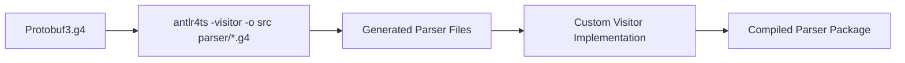
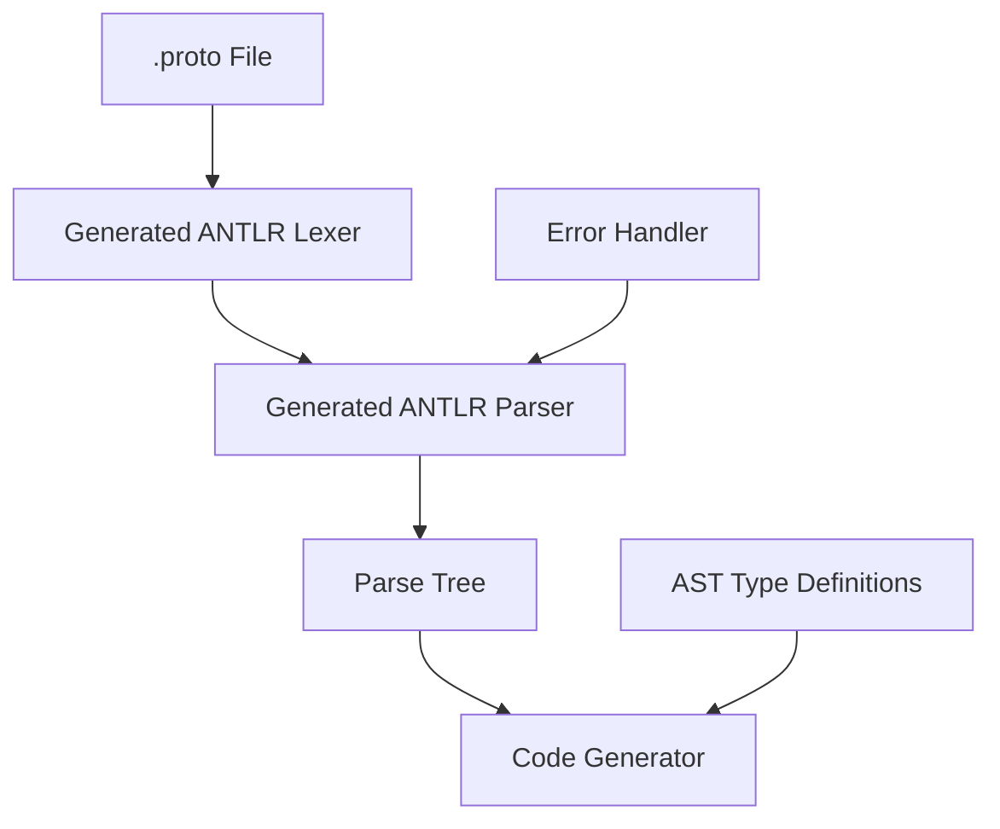

# Design Document

## Overview

Protobuf Parser는 ANTLR4TS를 사용하여 Protobuf 3 파일을 파싱하고, 코드 생성기에서 활용할 수 있는 구조화된 AST를 생성하는 핵심 컴포넌트입니다. 파서는 기존의 `Protobuf3.g4` 문법 파일을 기반으로 하며, `antlr4ts -visitor -o src grammar/*.g4` 명령어를 통해 TypeScript 파서 코드를 생성합니다. 생성된 코드는 타입 안전성을 보장하며, 비지터 패턴을 활용한 AST 변환을 지원합니다.

## Architecture

### Build Process



### High-Level Architecture



### Project Structure

```
packages/parser/
├── grammar/
│   └── Protobuf3.g4           # ANTLR grammar file
├── src/
│   ├── generated/             # Generated by antlr4ts command
│   │   └── grammar/
│   │       ├── Protobuf3Lexer.ts
│   │       ├── Protobuf3Parser.ts
│   │       ├── Protobuf3Listener.ts
│   │       └── Protobuf3Visitor.ts
│   ├── models/
│   │   └── ast.ts             # AST data models (구현 완료)
│   └── index.ts               # Main exports file (구현 완료)
├── tests/
│   └── parser.test.ts         # Unit tests using generated grammar
├── package.json
├── tsconfig.json
├── rollup.config.js
└── debug.ts
```

### 구현 상태

#### 완료된 컴포넌트:
1. **ANTLR Grammar Layer**: `Protobuf3.g4` 문법 파일 설정 완료
2. **Generated Parser**: ANTLR4TS로 Lexer, Parser, Visitor, Listener 생성 완료
3. **AST Data Models**: `src/models/ast.ts`에 모든 AST 타입 정의 완료
4. **Export Interface**: `src/index.ts`에서 모든 필요한 타입과 클래스 export
5. **Unit Tests**: 생성된 파서를 직접 사용하는 17개의 포괄적인 테스트 작성 완료

이 구현은 ANTLR이 생성한 Parse Tree를 직접 사용하는 방식으로, 별도의 AST 변환 없이도 Protobuf 파싱에 필요한 모든 정보에 접근할 수 있습니다.

### Component Layers

1. **Grammar Layer**: ANTLR 문법 파일 (`Protobuf3.g4`)
2. **Generated Layer**: ANTLR4TS로 생성된 렉서/파서/비지터
3. **Custom Layer**: 커스텀 비지터 및 AST 변환 로직
4. **Integration Layer**: Import 해결 및 타입 레지스트리 관리

## Components and Interfaces

### Core Parser Components

#### 1. ProtobufParser
```typescript
interface ProtobufParser {
  parseFile(filePath: string): Promise<ProtoFile>
  parseContent(content: string, fileName?: string): ProtoFile
  setImportResolver(resolver: ImportResolver): void
  getErrors(): ParseError[]
}
```

**책임:**
- 메인 파싱 인터페이스 제공
- ANTLR 파서 초기화 및 실행
- 에러 수집 및 관리

#### 2. ImportResolver
```typescript
interface ImportResolver {
  resolveImport(importPath: string, currentFile: string): Promise<string>
  getResolvedContent(importPath: string): Promise<string>
  addSearchPath(path: string): void
}
```

**책임:**
- Import 문 해결
- 파일 시스템 접근 추상화
- 순환 의존성 검사

#### 3. ASTVisitor
```typescript
interface ASTVisitor {
  visitProto(ctx: ProtoContext): ProtoFile
  visitService(ctx: ServiceDefContext): ServiceDefinition
  visitMessage(ctx: MessageDefContext): MessageDefinition
  visitEnum(ctx: EnumDefContext): EnumDefinition
  visitField(ctx: FieldContext): FieldDefinition
}
```

**책임:**
- ANTLR 파스 트리를 구조화된 AST로 변환
- 타입 정보 추출 및 검증
- 네임스페이스 해결

#### 4. TypeRegistry
```typescript
interface TypeRegistry {
  registerType(name: string, definition: TypeDefinition): void
  resolveType(name: string, context: string): TypeDefinition | null
  getFullyQualifiedName(name: string, packageName: string): string
  validateTypeReferences(): ValidationResult[]
}
```

**책임:**
- 타입 정의 등록 및 관리
- 타입 참조 해결
- 타입 검증

## Data Models

### Core AST Nodes

#### ProtoFile
```typescript
interface ProtoFile {
  syntax: string
  package?: string
  imports: ImportStatement[]
  options: OptionStatement[]
  services: ServiceDefinition[]
  messages: MessageDefinition[]
  enums: EnumDefinition[]
  extends: ExtendDefinition[]
  fileName: string
  dependencies: ProtoFile[]
}
```

#### ServiceDefinition
```typescript
interface ServiceDefinition {
  name: string
  methods: MethodDefinition[]
  options: OptionStatement[]
  location: SourceLocation
}

interface MethodDefinition {
  name: string
  inputType: TypeReference
  outputType: TypeReference
  inputStreaming: boolean
  outputStreaming: boolean
  options: OptionStatement[]
  location: SourceLocation
}
```

#### MessageDefinition
```typescript
interface MessageDefinition {
  name: string
  fields: FieldDefinition[]
  nestedMessages: MessageDefinition[]
  nestedEnums: EnumDefinition[]
  oneofs: OneofDefinition[]
  extensions: ExtendDefinition[]
  options: OptionStatement[]
  reserved: ReservedStatement[]
  location: SourceLocation
}
```

#### FieldDefinition
```typescript
interface FieldDefinition {
  name: string
  type: FieldType
  number: number
  label: FieldLabel
  options: OptionStatement[]
  location: SourceLocation
}

type FieldLabel = 'optional' | 'repeated' | 'required'

interface FieldType {
  kind: 'scalar' | 'message' | 'enum' | 'map'
  name: string
  keyType?: ScalarType  // map 필드용
  valueType?: FieldType // map 필드용
  fullyQualifiedName?: string
}
```

#### EnumDefinition
```typescript
interface EnumDefinition {
  name: string
  values: EnumValueDefinition[]
  options: OptionStatement[]
  location: SourceLocation
}

interface EnumValueDefinition {
  name: string
  number: number
  options: OptionStatement[]
  location: SourceLocation
}
```

### Supporting Types

#### TypeReference
```typescript
interface TypeReference {
  name: string
  fullyQualifiedName: string
  isBuiltin: boolean
  definition?: MessageDefinition | EnumDefinition
}
```

#### OptionStatement
```typescript
interface OptionStatement {
  name: string
  value: OptionValue
  isCustom: boolean
  location: SourceLocation
}

type OptionValue = string | number | boolean | OptionValue[] | Record<string, OptionValue>
```

#### SourceLocation
```typescript
interface SourceLocation {
  fileName: string
  line: number
  column: number
  endLine: number
  endColumn: number
}
```

## Error Handling

### Error Types

#### ParseError
```typescript
interface ParseError {
  type: 'syntax' | 'semantic' | 'import' | 'type'
  message: string
  location: SourceLocation
  severity: 'error' | 'warning'
  code: string
}
```

### Error Handling Strategy

1. **Syntax Errors**: ANTLR 파서에서 발생하는 문법 오류
   - 토큰 인식 실패
   - 문법 규칙 위반
   - 예상치 못한 EOF

2. **Semantic Errors**: AST 변환 중 발생하는 의미 오류
   - 중복 정의
   - 타입 참조 실패
   - 필드 번호 충돌

3. **Import Errors**: 파일 의존성 관련 오류
   - 파일을 찾을 수 없음
   - 순환 의존성
   - 접근 권한 문제

4. **Recovery Strategy**:
   - 가능한 한 파싱 계속 진행
   - 오류 위치 정확히 보고
   - 부분적 AST 제공

## Testing Strategy

### 현재 구현된 테스트

#### Unit Testing with Generated Grammar
현재 `tests/parser.test.ts`에서 생성된 ANTLR 파서를 직접 사용하여 다음 테스트들이 구현되어 있습니다:

1. **Basic Parsing Tests**
   - 최소한의 proto 파일 파싱
   - Package statement 파싱
   - Import statements (public, weak) 파싱

2. **Service Parsing Tests**
   - Service definition 파싱
   - Streaming RPC 파싱 (unary, server-stream, client-stream, bidi-stream)

3. **Message Parsing Tests**
   - Message definition 파싱
   - Nested messages 파싱
   - Map fields 파싱
   - Oneof fields 파싱
   - Reserved fields 파싱

4. **Enum Parsing Tests**
   - Enum definition 파싱
   - Enum with options 파싱

5. **Options Parsing Tests**
   - File options 파싱
   - Field options 파싱

6. **Listener Pattern Tests**
   - ParseTreeWalker를 사용한 트리 순회 테스트

7. **Error Recovery Tests**
   - Syntax error 처리 테스트

8. **Complex Proto Files Tests**
   - 모든 기능을 포함한 복잡한 proto 파일 파싱

```typescript
// 현재 구현된 테스트 예시
describe('Protobuf3Parser - Generated Code Tests', () => {
  function parseProto(content: string): ProtoContext {
    const inputStream = CharStreams.fromString(content);
    const lexer = new Protobuf3Lexer(inputStream);
    const tokenStream = new CommonTokenStream(lexer);
    const parser = new Protobuf3Parser(tokenStream);
    return parser.proto();
  }
  
  test('should parse service definition', () => {
    const proto = `
      syntax = "proto3";
      service Greeter {
        rpc SayHello (HelloRequest) returns (HelloReply);
      }
    `;
    const tree = parseProto(proto);
    const serviceDef = tree.topLevelDef(0).serviceDef()!;
    expect(serviceDef.serviceName().text).toBe('Greeter');
  });
})
```

### 향후 구현 예정 테스트

#### Integration Testing
- Import 해결 및 의존성 관리 테스트
- 패키지 및 네임스페이스 해결 테스트
- 타입 레지스트리 통합 테스트

#### Performance Testing
- 대용량 proto 파일 파싱 성능 테스트
- 메모리 사용량 모니터링
- 파싱 속도 벤치마크

#### Error Handling Tests
- 의미적 오류 검증 (중복 정의, 타입 참조 실패 등)
- Import 오류 처리
- 오류 복구 전략 테스트

## Implementation Status

### ✅ 구현 완료

Parser 패키지는 ANTLR4TS를 사용하여 Protobuf3 파일을 파싱하는 기능을 제공합니다. 생성된 Parse Tree를 직접 사용하는 방식으로 구현되어, 별도의 AST 변환 계층 없이도 효율적으로 동작합니다.

#### 주요 구현 사항:
1. **ANTLR Parser 생성**: Protobuf3.g4 문법 파일로부터 TypeScript 파서 자동 생성
2. **타입 정의**: AST 인터페이스 정의로 타입 안전성 보장
3. **테스트 커버리지**: 모든 Protobuf3 기능에 대한 포괄적인 테스트 작성
4. **빌드 시스템**: Rollup을 통한 효율적인 번들링

#### 사용 방법:
```typescript
import { 
  Protobuf3Parser, 
  Protobuf3Lexer, 
  CharStreams, 
  CommonTokenStream 
} from '@hallow/parser';

// Proto 파일 파싱
const input = CharStreams.fromString(protoContent);
const lexer = new Protobuf3Lexer(input);
const tokens = new CommonTokenStream(lexer);
const parser = new Protobuf3Parser(tokens);
const tree = parser.proto();

// Parse Tree 순회 및 정보 추출
const services = tree.topLevelDef()
  .filter(def => def.serviceDef())
  .map(def => def.serviceDef()!);
```

이 구현은 코드 생성기나 다른 도구에서 Protobuf 파일의 구조를 분석하는 데 필요한 모든 기능을 제공합니다.
